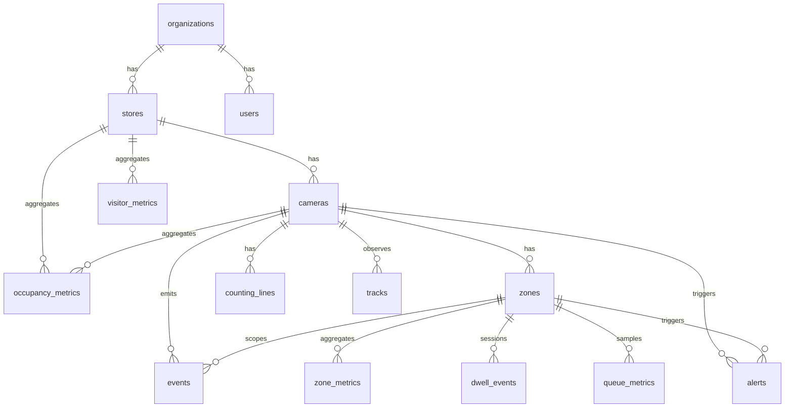

# Retail Analytics CV Platform — Project Status

**Last updated:** 2026-08-09 (Phase 3 multi-tenancy — background worker org-awareness + subprocess kill on org disable — DONE; Phase 2 organization status + CRUD + cascade delete — DONE; Phase 1 superadmins table + unified login — DONE; Phase 0 organization-scoping enforcement — DONE; user disable — DONE; reference-frame snapshots — shipped; batch-test flakiness deferred)
**Reference roadmap:** Retail_Analytics_Build_Roadmap.md

---

## 2026-08-09 — Phase 3: Multi-tenancy — background worker org-awareness + subprocess kill on org disable — DONE

Final phase of the multi-tenancy project. Disabling an organization now force-kills in-flight
recorded-video processing runs (not just blocks future logins and new run starts). Process handles
are tracked in-process so the kill path can terminate OS subprocesses and finalize DB rows.

### DONE

- **Recorded-video processing** (`backend/app/services/camera_process.py`) switched from
  `subprocess.run` to `subprocess.Popen`; the handle is now tracked in a new `_processing_procs`
  registry keyed by `camera_id`, guarded by the existing `_workers_lock`
- **New `kill_processing_runs_for_org(org_id)`** — finds in-flight processes belonging to a
  disabled org's cameras, terminates (then force-kills if needed) each one **outside** the lock,
  and marks the corresponding running `ProcessingRun` rows failed with message
  `"Cancelled: organization disabled"`
- **Wired into the org toggle endpoint** (`backend/app/routers/organizations_admin.py`) —
  disabling an org now actually kills its in-progress processing runs, not just blocks future
  logins/starts
- **`_finish_run` guarded against a race** between a naturally-completing worker thread and the
  kill path (checks `run.status != "running"` before writing — whichever writer legitimately wins
  based on real DB state, no lost updates)
- **Found and fixed a real Windows-specific bug during review:** `Popen.terminate()` / `.kill()`
  do **not** raise `ProcessLookupError` on Windows when the target has already exited (confirmed
  via real traceback — it's a silent no-op or, in a race, `PermissionError`); widened the catch
  to `OSError`
- **Per-target error isolation** in the kill loop so one failed termination doesn't abort killing
  the rest of an org's in-flight runs
- **Manually verified end-to-end** with a real subprocess: real PID captured, org toggled to
  disabled, DB row transitioned `running` → `failed` with the correct message, and `tasklist`
  confirmed the OS process was actually gone (`tests/scripts/verify_phase3_kill_processing.py`)
- **Full test suite:** no new failures (backend 122 passed / 3 pre-existing failures, inference
  211 passed / 1 pre-existing failure); `test_processing_runs.py` **7/7** passing with updated
  `Popen` mocks

### DOCUMENTATION CORRECTION

An earlier claim that `tests/scripts/run-events-demo.py` and the backend's recorded-video
processing share the same underlying execution path was found to be **inaccurate** during Phase
3 investigation — they share core analytics classes (`EventBus`, `AnalyticsEngine`,
`AnalyticsDbWriter`, detector/tracker) only when the demo is run with `--persist-db`, but have
genuinely different entry points: the backend's `inference/pipeline/process_recorded.py` always
reads geometry/thresholds from Postgres and always persists, while the demo reads from JSON
config and persists only when flagged.

### MULTI-TENANCY PROJECT: COMPLETE

All four phases done and verified:

- **Phase 0:** org-scoping enforcement
- **Phase 1:** superadmin auth
- **Phase 2:** organization CRUD
- **Phase 3:** background worker org-awareness

### NOTED FOR FUTURE WORK (explicitly deferred, not started)

**Unified pipeline entry point** — runs whichever analytics modules an admin has selected per
camera, working identically whether the camera is recorded or live — to be revisited once
continuous live analytics scoping begins. The relationship between `run-events-demo.py` (used
for early manual CV testing) and the backend's current `process_recorded.py` was clarified
during Phase 3 (see documentation correction above) but no consolidation work has been done.

### IN PROGRESS

None — multi-tenancy project fully closed.

### TODO (carried forward, unchanged)

- Continuous live analytics (unscoped — needs its own dedicated scoping conversation before any
  implementation)
- Superadmin frontend UI (unscoped)

### NEXT

Continuous live analytics scoping (unscoped — separate conversation before implementation).

---

## 2026-08-09 — Phase 2: Multi-tenancy — organization status + CRUD + cascade delete — DONE

Superadmin-only organization lifecycle management: create, list, get-by-id, toggle
(active/disabled), and irreversible cascade delete. Org-disabled state blocks login and new
processing-run starts (not in-flight runs — deferred to Phase 3). Org admin management reuses
existing user create/update/delete/disable endpoints via a new dual-caller auth dependency.

### DONE

- **`organizations.status` column** (migration `017_organization_status`, `active`/`disabled`
  convention matching `users.status`)
- **Superadmin-only organization CRUD** (`backend/app/routers/organizations_admin.py`, all routes
  via `Depends(get_current_superadmin)`): create, list, get-by-id, toggle (active/disabled), and
  full cascade delete
- **Cascade delete** (`backend/app/services/org_delete.py`) — deletes all org-scoped data in
  FK-safe order across 16 tables (`processing_runs`, `events`, `alerts`, `alert_rules`,
  `dwell_events`, `zone_metrics`, `queue_metrics`, `tracks`, `visitor_metrics`,
  `occupancy_metrics`, `zone_shapes`, `zones`, `counting_lines`, `cameras`, `stores`, `users`,
  then the org row). Irreversible, gated by a required `{"confirm": "<org_id>"}` body match — no
  soft-delete option. Verified end-to-end with real before/after row counts across all 16 tables,
  zero FK violations
- **Org-disabled state blocks login** (**401** `account_disabled`, checked in both `login` and
  `get_current_user`) and **blocks starting new processing runs** for that org's cameras — does
  not kill already-running processes (deferred to Phase 3 by design, no Popen-handle/kill
  mechanism exists yet)
- **Org admin management reuses the existing user create/update/delete/disable mechanism** — no
  new mechanism invented. New `require_user_admin_or_superadmin` dependency
  (`backend/app/auth.py`) allows either an org-scoped admin or a superadmin to call
  `create_user`/`update_user`/`delete_user`; superadmin bypasses `org_id` scoping and the
  self-delete guard, org admin behavior unchanged
- **Route change:** the org-user organization list moved from `GET /api/organizations` to
  `GET /api/organizations/scoped` (bare path now serves superadmin CRUD); confirmed via grep
  that only `frontend/lib/api/stores.ts` and `tests/test_api_extended.py` were affected callers,
  both updated
- **Store CRUD:** confirmed already complete from earlier work (PUT/DELETE existed, POST already
  validates `org_id` against caller's org) — the "store CRUD fixes needed" item from the original
  Phase 2 scope was based on stale documentation and required no new work
- **Manually verified:** org create/list/get via superadmin token, org-user token correctly gets
  **403** on superadmin routes, toggle disables/re-enables login and processing-run start (real
  HTTP responses captured both ways), cascade delete leaves zero orphaned rows across all touched
  tables, confirm-field mismatch on delete correctly rejected

### KNOWN INERT DETAIL (harmless, documented, not a bug to fix)

The **409** `org_disabled` check added in `cameras_extended.py`'s `process_recorded_video` is
currently unreachable — `get_current_user` already blocks disabled-org requests with **401**
before that code path is reached. Left in place as defense-in-depth; not causing any incorrect
behavior.

### NOT IN SCOPE for Phase 2 (explicitly deferred, not forgotten)

**Superadmin frontend UI** — currently only a "not yet available" placeholder exists on
superadmin login; all Phase 2 work was verified via API calls and scripts, not through an
actual screen. This is a future item, not part of Phase 2's original scope.

### IN PROGRESS

None — Phase 2 fully closed.

### TODO (carried forward, unchanged)

- Continuous live analytics (unscoped)
- Superadmin frontend UI (new item, unscoped)

### NEXT

**Phase 3** — background worker org-awareness + subprocess-kill mechanism, so disabling an org
actually force-kills in-progress processing runs (currently the Popen handle isn't even stored —
confirmed net-new work).

---

## 2026-08-09 — Phase 1: Multi-tenancy — superadmins table + unified login — DONE

Platform-level **superadmin** accounts live in a separate table with a unified login flow.
Org-scoped API routes are unchanged; superadmin JWTs are rejected at the auth layer before
any org-scoped lookup runs.

### DONE

- **superadmins table** (migration `016_superadmins`, model in `database/models.py`) — `id`,
  `name`, `email` (unique), `password_hash`, `status`
- **Unified `/api/auth/login`** — checks `users` then `superadmins`, generic **401** if neither
  match (no leak of which table)
- **`TokenPayload` / `UserInfo.org_id`** now `str | None`; new `account_type`:
  `"org_user" | "superadmin"` discriminator field, legacy tokens default to `"org_user"`
- **`get_current_user`** and **`_user_from_raw_token`** (MJPEG/snapshot `?token=` path) both
  reject superadmin tokens with **403** `superadmin_token_not_allowed` before any org-scoped
  lookup runs
- **New `get_current_superadmin` dependency** for future superadmin-only routes (Phase 2)
- **Cross-table email uniqueness** enforced on user creation (**409** if email matches an
  existing superadmin)
- **Zero changes** to the 20+ files that read `current_user.org_id` for org scoping — confirmed
  untouched
- **Frontend:** superadmin login shows a "not yet available" notice instead of crashing on the
  org-scoped redirect (`AuthContext`, `login/page.tsx`, `mappers.ts`, `client.ts`, `auth.ts`)
- **Frontend:** fixed stale-session bug where logging in as superadmin after an org-admin
  session left `AuthContext.user` set, causing silent **403**s and a blank redirect
- **Frontend:** fixed silently-swallowed user create/update errors in the admin panel — both now
  surface real backend error messages (**409** duplicate email, **422** validation) in the modal
  instead of failing silently; modal only closes on success
- **Seed script:** `tests/scripts/seed_superadmin_manual_test.py` (idempotent, real password
  hashing)
- **Manually verified end-to-end:** superadmin login/notice, org-admin login unaffected, direct
  **403** on org-scoped endpoints with a superadmin token, generic **401** for unknown email,
  **409** on duplicate email during user creation (both create and edit paths), no stale-session
  leakage

### KNOWN NON-ISSUES (verified during this phase, do not re-investigate)

- `test_recorded_camera_health.py` and
  `test_processing_runs.py::test_video_range_request_returns_206` failures seen in one full-suite
  run did not reproduce in isolation on current code; likely batch-run flakiness, not caused by
  superadmin changes. Folded into the existing general test-suite batch flakiness TODO.

### IN PROGRESS

None — Phase 1 fully closed.

### NEXT

**Phase 2** — organization CRUD, org admin management, org disable/delete, store CRUD fixes
(POST currently has no real org check).

---

## 2026-08-08 — Phase 0: Organization-scoping enforcement — DONE

Multi-tenant **org isolation** is now enforced on backend data APIs: list/query endpoints filter
by the authenticated user's `org_id`; resource-by-ID access returns **404** (not 403) when the
row belongs to another org or is genuinely missing — same outward response in both cases.

### What shipped

- **`backend/app/services/org_scope.py`** — `require_*_in_org()` helpers, org-filtered query
  builders (`stores_for_org_stmt`, `cameras_for_org_stmt`, `alerts_for_org_stmt`, etc.),
  `require_analytics_scope()` for analytics/reports parameters
- **Routers updated** — stores, cameras, cameras_extended, zones, lines, events, alerts,
  alerts_extended, alert_rules_admin, analytics, reports, processing_runs, users
- **Migration `015_alert_rules_org_id`** — adds `alert_rules.org_id` with backfill from
  store/zone/camera chains
- **Cross-org POST guards** — foreign `org_id` on store/user create returns **404**
  (`org_not_found`), matching missing-org semantics

### Org isolation — verified on real Postgres

| File | Result | Scope |
|------|--------|-------|
| `tests/test_org_scoping.py` | **13 passed, 0 failed** | Two-org isolation (stores, cameras, zones, users, analytics scope, alert rules); single-org regression; **new** store-level occupancy alert regression (below) |

Run against live Postgres (`docker compose` on port 5433, migration `015` applied). This is the
authoritative proof that org B's data is invisible to org A.

### Regression fixed during this phase — store-level `OCCUPANCY_THRESHOLD` alerts

Initial org-scoping made **store-level occupancy alerts invisible**:

- `database/writer.py` `_insert_alert()` creates `OCCUPANCY_THRESHOLD` rows with
  **`camera_id=None`**, **`zone_id=None`**, store context only in **`metadata_["store_id"]`**
- First-pass `alerts_for_org_stmt()` / `require_alert_in_org()` only resolved org via camera/zone
  FKs → both-null alerts excluded from list and unreachable by ID (**404**)

**Fix:** org resolution now also checks `metadata_["store_id"]` and resolves org via
`store → org`, same as everywhere else. Regression test:
`test_store_level_occupancy_alert_org_scoped` in `test_org_scoping.py`.

### Other fixes bundled in this phase

| Item | What happened |
|------|----------------|
| **`sample-data/checkout.mp4`** | Accidentally deleted from the **working tree** (not intentionally removed — only commit touching the file is Module 1 ingestion). Restored via `git checkout HEAD -- sample-data/checkout.mp4`. Required by recorded-camera health/process tests and demos. |
| **`test_analytics_modules` gating** | Tests called `GET /api/analytics/queues` without `store_id` → **422** before module-disabled **403** could run. **Test fixed** to send `store_id` — matches real frontend usage (`frontend/lib/api/analytics.ts` always includes `store_id` on queue requests). |
| **`test_report_module_scope` gating** | `reports.py` enforced org scope on `camera_id` but did not call `require_camera_module()` at the router layer for camera-scoped reports. **Gap closed** — `require_camera_module(camera, REPORT_TYPE_MODULE[report_type])` added to JSON + export handlers when `camera_id` is set. |
| **`cameras_extended.py` missing imports** | `TokenPayload`, `require_admin`, `require_camera_in_org`, `require_store_in_org` were used but not imported → FastAPI treated `admin` as a required **query** param (**422** on `PUT`/`DELETE`/`POST` camera admin routes). **Fixed**; resolved dependent failures in `test_api.py` (soft-delete, status toggle, OpenAPI schema) and all of `test_processing_runs.py` as a side effect. |

### Tests — final verification run (2026-08-08)

Backend venv (targeted API/DB suite against real Postgres):

- **144 passed**, 6 failed, 1 error (132s)
- **Green for this phase:** all of `test_org_scoping`, `test_processing_runs`, `test_analytics_modules`, `test_report_module_scope`, `test_recorded_camera_health`, `test_user_disable`, and item-6 camera API tests (`test_delete_camera_is_soft_delete…`, `test_put_status_disable…`, `test_openapi_lists_endpoints`)
- Inference venv (non-API suite, same Postgres): **213 passed**, 1 skipped (138s)

**Acceptable / pre-existing failures (not introduced by org-scoping):**

- `test_zones_queue_exclusion` — **2** tests (`test_camera_level_excludes_queue_zones`,
  `test_store_level_excludes_queue_zones`) — `UniqueViolation` on `uq_zone_metrics_zone_hour`
  (test fixture collides with seed/demo `zone_metrics` rows). Third test in that file passes.
  Documented historically; unchanged by this phase.

**Other failures in the final run** (`test_export_csv` CSV shape, `test_camera_offline_duration_alerts` assert `2==1`, connection-pool `too many clients already` on snapshot/alert_rules tests) align with the **deferred batch pytest flakiness** section below — scattered under repeated full-suite load, not org-scoping logic bugs. **Not new; not blocking this phase.**

**Status:** **DONE** — org isolation enforced and proven; store-level alert regression closed.

---

## 2026-08-07 — User disable — bug + business rules — DONE

### Symptom (reproduced via admin UI)

Disabling a user returned **`422 Unprocessable Content`** and the user was **not** disabled.
Observed on **`PUT /api/users/user_admin`** when using the admin Users page disable control
(`/admin/users`, `frontend/lib/api/users.ts` → backend `backend/app/routers/users.py`).

### Root cause — confirmed

Frontend sent display label **`status: "Disabled"`**; backend `UserUpdate` enum only accepts
**`"active"`** / **`"disabled"`** — **422** on mismatch. Status was also not mapped, sent, or
persisted end-to-end (no `users.status` column, `UserResponse`/`mapBackendUser` always showed
Active).

**Pattern note:** same bug class as the earlier zone-editor **Save-after-Delete** issue
(frontend sending a display value where backend expects an internal enum) — worth recognizing
this pattern if similar **422**s appear elsewhere in the admin UI.

### Fix — shipped, manually verified

- Migration **`014_user_status`** (`database/alembic/versions/014_user_status.py`) — adds
  `users.status` (`"active"` default, `"disabled"` for disable)
- Backend: `UserUpdate` / `UserResponse` schemas, `PUT /api/users/{id}` handler, `authenticate_user`,
  `get_current_user`, `POST /api/auth/login` (`account_disabled` **401**)
- Frontend: label mapping in `frontend/lib/api/mappers.ts` (`frontendStatusToBackend` /
  `backendStatusToFrontend`), `frontend/lib/api/users.ts` (send mapped `status` on PUT),
  `frontend/app/admin/users/page.tsx` (self-disable → immediate `logout()`)

### Business rules — implemented and manually verified

All three product requirements below are **implemented** and **manually verified end-to-end**
(not test-level only):

1. **Admin-only reactivation** — a disabled user can only be reactivated by an **admin** (via
   admin Users UI / `PUT /api/users/{id}`). **No self-service reactivation path** exists (no
   "re-enable my account" flow; password-reset does not flip active status).

2. **Self-disable → immediate logout** — if the **currently logged-in admin** disables **their
   own** account, the UI **auto-logs out immediately** (`logout()` on save when
   `updated.status === "Disabled"`). Backend `get_current_user` re-read rejects disabled users on
   subsequent requests (parity with deleted-user handling).

3. **Login blocked for all disabled users** — any disabled user (**admin or regular user**) is
   **unable to log in** until an admin reactivates them. `POST /api/auth/login` returns **401**
   with code **`account_disabled`** and message *"Account disabled"* — **not** generic
   `invalid_credentials`.

### Follow-up bug — login error message (fixed separately, manually verified)

During manual verification of rule 3: backend correctly returned the distinct **`account_disabled`**
code, but the frontend login form showed the generic invalid-credentials message anyway.

**Fix:** `getLoginErrorMessage()` in `frontend/lib/api/auth.ts`; login page
(`frontend/app/login/page.tsx`) surfaces *"This account has been disabled. Contact an
administrator."* for `account_disabled`; wrong-password case unchanged.

### Tests

| File | Result | Scope |
|------|--------|-------|
| `tests/test_user_disable.py` | **4 passed** (migration applied cleanly) | PUT disable → GET confirms `disabled`; disabled login → `account_disabled`; self-disable token rejected on next request; regression — raw `"Disabled"` → **422** |
| `frontend/lib/api/auth.test.ts` | **3 passed** | `getLoginErrorMessage()` — disabled vs invalid-credentials vs unknown |

All flows above **manually verified end-to-end** in the admin UI and login form.

### Related — resolved, NOT part of this item

| Area | Status | Notes |
|------|--------|-------|
| **Password reset** | **Resolved / working** | Investigated separately; confirmed correct — persisted `password_hash` is honored at login (2026-08-03 audit fix). **Not** part of this disable bug. |
| **Role mapping** | **DONE** (separate work) | Frontend display roles collapsed to **System Administrator** + **Retail Analyst** (two roles only); backend `admin`/`user` RBAC gating aligned. Documented as completed in the role-mapping / Module 16 user-admin work — same general auth area as this bug, but **out of scope** for the disable fix. |

**Status:** **DONE** — shipped 2026-08-07; manually verified.

---

## 2026-08-07 — Reference-frame snapshots + recorded-camera status — shipped

### Reference-frame snapshots — shipped, manually verified

**Unified snapshot mechanism** across three admin/analytics consumers — no duplicated capture or
serving logic:

| Consumer | File | Behavior |
|----------|------|----------|
| Test Camera modal | `frontend/components/admin/test-camera-modal.tsx` | `` on success via `getCameraSnapshotUrl()` |
| Zone/line editor canvas | `frontend/components/admin/zones-lines/zones-lines-canvas.tsx` | Snapshot drawn as canvas background behind existing shape rendering |
| Heatmap page background | `frontend/components/heatmap/heatmap-canvas.tsx` | Plain photo behind unchanged heat-blob + zone overlay layers |

All three call the same endpoint: **`GET /api/cameras/{camera_id}/snapshot`**
(`backend/app/routers/cameras.py`). Frontend URL helper: `getCameraSnapshotUrl()` in
`frontend/lib/api/cameras.ts` (JWT via `?token=` for `` tags, same pattern as MJPEG stream).

**Live cameras (`source_type=live`):**
- One fresh JPEG per request — **no caching, no persistence**
- Reuses the **Module 16 fast-fail reconnect profile** unchanged:
  `STREAM_RTSP_RECONNECT_KWARGS` in `backend/app/services/camera_stream.py` (passed into
  `create_stream_source()` / `capture_snapshot_jpeg()`)
- Reuses the process-wide **`opencv_io()` lock** in `backend/app/services/opencv_io.py` — no new
  timeout or concurrency mechanism was invented for this feature

**Recorded cameras (`source_type=recorded`):**
- Serves the cached preview frame from the most recent **`processing_runs` row with
  `status='completed'`** (`get_latest_completed_processing_run()` in
  `backend/app/services/camera_process.py` — separate from unfiltered
  `get_latest_processing_run()` used by process-status polling)
- New column **`preview_frame_path`** (nullable `str`) on `processing_runs`; migration
  **`013_preview_frame_path`** (`database/alembic/versions/013_preview_frame_path.py`)
- Frame extracted **unconditionally** during `inference/pipeline/process_recorded.py`'s existing
  first-frame read in the main loop — **not gated on `MODULE_HEATMAP`** or
  `heatmap_engine.set_reference_frame()` (that in-memory path remains for pipeline overlay only)
- Saved to disk at **`data/frame-previews/{camera_id}/{run_id}.jpg`** (same
  `{root}/{camera_id}/...` convention as heatmap hour buckets under `data/heatmaps/`)
- Subprocess passes `--run-id`; `camera_process._finish_run()` persists `preview_frame_path` from
  JSON stdout via `_parse_subprocess_result()`
- **No completed run yet** (or null/missing `preview_frame_path`, or file gone from disk) →
  **404** with code **`preview_not_available`** and message *"Preview not available yet — process
  this camera first"*
- **No fallback** extraction from the raw source video on snapshot request — deliberate
  simplification, consistent with the create/delete-only design philosophy for this feature area
  (same rationale as geometry snapshot-at-run-start, not at-request-time)

**Heatmap page scope boundary (explicitly NOT merged into this feature):**
- Background change is **only** the plain camera photo behind the existing SVG layers
- **Left untouched:** SVG heat-blob rendering (`heatmap-canvas.tsx` overlay layer),
  zone-boundary overlay, and `analytics/heatmaps/engine.py`'s separate reference-frame /
  overlay-compositing logic used **only** by the standalone `tests/scripts/run-heatmap-demo.py`
  script — not wired into the web heatmap page

### Recorded-camera status via health worker — shipped, manually verified

**Previously:** recorded cameras were **skipped entirely** by the background health worker and
by `apply_probe_to_camera()` / `refresh_camera_status()` (`camera_health.py` returned early for
`source_type=recorded`) — status stayed whatever it was set to at creation and never updated.

**Now:** the same background loop (`_camera_health_worker` in `backend/app/main.py`) calls
`refresh_all_recorded_camera_statuses()` alongside `refresh_all_live_camera_statuses()` on each
interval (`settings.camera_health_interval_seconds`, default 120s).

**Status rule** (existence-only, same path resolution as `camera_test.py` /
`recorded_source_file_exists()` in `backend/app/services/camera_test.py` — `_resolve_local_path()`
+ `Path.is_file()`, no decode/corruption check):
- Resolved source file **exists** → `status="online"`
- **Missing** → `status="error"`

**Authority / skip rules** (same pattern as live-camera manual-disable protection):
- **`status="disabled"`** — never overwritten by automatic file-existence checks
- **`status="processing"`** — also excluded defensively (`_HEALTH_SKIP_STATUSES` in
  `camera_health.py`), though **nothing in the codebase currently sets `processing` on the
  `cameras` row** today (only appears as a possible value in `CameraTestResponse.camera_status`
  schema)
- `GET /api/cameras/{id}/status` and `POST /api/cameras/{id}/test` also refresh recorded-camera
  status on read (parity with live probe-on-status)

### UI snapshot hints — shipped, manually verified

**Shared hint logic:** `frontend/lib/snapshot-preview-hint.ts` + pill component
`frontend/components/cameras/snapshot-preview-hint.tsx` (bottom overlay, `pointer-events-none`,
does not block drawing or heatmap interaction).

| Condition | Exact hint text |
|-----------|-----------------|
| `camera.status === "error"` (snapshot unavailable) | **Camera source unavailable** |
| Recorded + `online` + no completed-run snapshot yet | **Process this camera to see a real camera view here.** |

Applied on **zone/line editor** and **heatmap page** when snapshot load fails — previously both
silently fell back to the decorative placeholder with no explanation. Zone editor refreshes camera
meta via `getCameraMeta()` on camera switch so hints reflect current health-worker status.

**Test Camera modal** (`test-camera-modal.tsx`): success-state preview uses the same hint
wording; recorded-camera **error** state uses *"Camera source unavailable"* instead of generic
RTSP troubleshooting copy (live cameras keep RTSP troubleshooting).

### Manual verification (confirmed working this session)

- Live snapshot on Test Camera modal
- Recorded snapshot after a completed processing run (`preview_frame_path` populated)
- **"Process first"** hint state (recorded, online, no completed run) on Test Camera / zone
  editor / heatmap page
- **"Source unavailable"** hint state (missing file → `error` status) on same surfaces
- Disabled recorded camera **not** overwritten by health-worker file check
- Zone soft-delete + **"(deleted)"** labeling (carried from 2026-08-06 entry) still correct
- End-to-end recorded processing with a **single uvicorn worker** (not multi-stacked reload
  workers)

### Tests added (automated; separate from manual verification above)

| File | Coverage |
|------|----------|
| `tests/test_camera_snapshot.py` | Live JPEG capture, recorded 200/404 `preview_not_available`, reconnect profile + `opencv_io()` |
| `tests/test_process_recorded_preview.py` | Subprocess JSON `preview_frame_path` parsing |
| `tests/test_process_recorded_soft_delete.py::TestProcessRecordedPreviewFrame` | Preview file written without heatmap module |
| `tests/test_recorded_camera_health.py` | online/error/disabled/processing skip + worker refresh |
| `tests/test_snapshot_hint_resolution.py` | Hint decision table (mirrors frontend TS) |

**Supersedes** the "Known limitations" bullets below that still say admin Test Camera / zone-line
editor have no still-frame preview and need a frame-capture endpoint — that gap is now closed.
Those older bullets are left in place per doc policy (no deletion); this entry is authoritative
for snapshot status as of 2026-08-07.

---

### Known issue — batch pytest flakiness — TODO, deliberately deferred (NOT blocking ship)

**Observed during** repeated **full-batch** `pytest` invocations only — **not** in isolated
test runs, **not** in normal running-app usage. Manual app testing completed successfully on a
single uvicorn dev server despite this being unresolved.

**Symptoms (scattered, unrelated modules, different failures on different runs):**

| Test / area | Observed frequency (investigation stopped early) |
|-------------|--------------------------------------------------|
| `test_processing_runs::test_list_and_detail_endpoints` | **1 failure in 7** complete batch runs; **0** in subsequent 5 repeat runs; traceback **never captured** |
| `test_camera_offline_duration_alerts::test_creates_alert_when_down_past_threshold` | **3 of 5** repeat batch runs |
| `test_analytics_comparison` (3 tests) | **1 batch run** only |
| Unexplained **4 errors** in one batch run | Output truncated — details not captured |

**Stable pre-existing failures** (still present; unchanged by org-scoping work — re-confirmed
2026-08-08 after Phase 0 ship):
- `test_zones_queue_exclusion::test_camera_level_excludes_queue_zones` and
  `test_store_level_excludes_queue_zones` — `UniqueViolation` on `uq_zone_metrics_zone_hour`
  (seed/demo row collision). Third test in that file (`test_single_zone_query_not_affected_by_queue_filter`) passes.

~~`test_analytics_modules` queue gating tests~~ — **resolved 2026-08-08** (Phase 0): tests now
send required `store_id`; `reports.py` module gating gap closed. No longer listed here.

Typical full-batch totals when only the two stable `zones_queue` failures fire: **2 failed** +
pass count varies. Intermittent extras below add on some runs.

**Also consistent with this bucket (NOT new, NOT caused by org-scoping):**
- Postgres **`too many clients already`** under repeated full-suite runs (connection-pool
  exhaustion from stacked `TestClient` / `session_scope` lifetimes)
- **`test_camera_offline_duration_alerts`** assert `created == 1` getting `2` — likely DB row
  pollution across repeated runs
- `test_export_csv` — CSV export shape vs exclusion rows (product/test mismatch; predates Phase 0)

**What was ruled out (with evidence gathered before investigation was stopped):**
- This session's new tests (`test_recorded_camera_health.py`, `test_snapshot_hint_resolution.py`)
  run **after** `test_processing_runs.py` in the fixed batch file order — they cannot pollute
  `test_list_and_detail_endpoints` via DB rows left behind in that ordering
- `test_recorded_camera_health` + `test_list_and_detail_endpoints` in sequence: **pass**
- **No confirmed root cause** for the single `test_list_and_detail_endpoints` batch failure —
  no `-v --tb=long` traceback was captured on a failing run

**Working hypothesis (NOT confirmed):** same class of **shared-resource contention** under
repeated full-suite load as the two issues fixed earlier on 2026-08-06 (health-worker thread
leak, `AnalyticsDbWriter` per-event session exhaustion) — scattered failures across unrelated
modules is that pattern's signature, not evidence of a logic bug in any one test or in the
snapshot feature.

**Explicitly NOT blocking:** only reproduces under repeated full pytest-suite batch runs stacking
multiple `TestClient(app)` lifetimes / shared Postgres state — not observed affecting the running
app.

**Deliberately deferred** — do not investigate further until explicitly requested. **When
resumed, highest-value first step:** capture one actual failure with **full `-v --tb=long`** (not
yet done). Repeated blind batch reruns were attempted (including a 15-run loop started) and
stopped early as unproductive — do not repeat that approach without a captured traceback first.

---

## 2026-08-06 — Zone / line soft delete + processing fixes — shipped

### Soft delete — shipped

**Schema — migration `012_zone_line_soft_delete.py` (Alembic `012_zone_line_soft_delete`):**
Adds `status` column to `zone_shapes`, `zones`, and `counting_lines`. Same field pattern as
`Camera`:

| Model | Field | Type | Default | Disable value |
|-------|-------|------|---------|---------------|
| `Camera` | `status` | `str` (`max_length=32`) | `"offline"` | `"disabled"` |
| `ZoneShape` | `status` | `str` (`max_length=32`) | `"offline"` | `"disabled"` |
| `Zone` | `status` | `str` (`max_length=32`) | `"offline"` | `"disabled"` |
| `CountingLine` | `status` | `str` (`max_length=32`) | `"offline"` | `"disabled"` |

`DELETE /api/zones/{id}` and `DELETE /api/lines/{id}` set `status="disabled"` on both the
shape/line row and the paired analytics row (`zones` / `counting_lines`) — **no hard delete**,
so FK children (`zone_metrics`, `dwell_events`, `events`, `alerts`, etc.) stay attached to the
original id. `PUT` on a disabled row returns **404** (same as disabled cameras).

**Backend routers:**
- `backend/app/routers/zones_config.py` — soft delete; `GET /api/zones` excludes disabled by
  default; `include_disabled=true` opt-in (same pattern as `GET /api/cameras`)
- `backend/app/routers/lines.py` — same for counting lines

**Two separate zone-loading code paths in the pipeline** (duplicated filter logic, not shared):
1. **Path (a)** — `claim_processing_run()` in `backend/app/services/camera_process.py` snapshots
   zones/lines at run start (`status != "disabled"`)
2. **Path (b)** — `process_recorded_camera()` in `inference/pipeline/process_recorded.py` loads
   zones/lines for live analytics (`status != "disabled"`)

Both paths verified by tests — path (b) specifically, not just the snapshot path:
- `tests/test_api_extended.py::test_processing_run_excludes_disabled_zone` / `test_processing_run_excludes_disabled_line` (snapshot path)
- `tests/test_process_recorded_soft_delete.py` (analytics path via mocked pipeline)

**Frontend `include_disabled` / `includeDisabled` audit:**

| Call site | Purpose | `include_disabled` | Category |
|-----------|---------|-------------------|----------|
| `frontend/lib/api/stores.ts` — `getOrganization()` | Global scope tree (Store → Camera → Zone) | `true` | Historical filter — shows "(deleted)" in zone names |
| `frontend/components/dashboard/scope-selector.tsx` | Analytics scope bar zone dropdown | via org tree | Historical filter |
| `frontend/lib/scope/use-scope-selector.ts` | Page-level analytics scope | via org tree | Historical filter |
| `frontend/app/alerts/page.tsx` → `AlertFilters` | Alert history zone filter | via org tree | Historical filter |
| `frontend/lib/api/alerts.ts` | Alert row camera/zone name maps | `true` | Historical display |
| `frontend/lib/api/analytics.ts` — `findZoneName()`, zone performance | Analytics labels / filters | `true` | Historical display |
| `frontend/lib/api/reports.ts` | Report camera/zone name maps | `true` | Historical display |
| `frontend/components/alert-thresholds-modal.tsx` | Label text on **existing** rules (read-only list) | `true` | Historical display — **not** a zone picker |
| `frontend/app/admin/zones-lines/page.tsx` | Admin editor shape list after delete | `includeDisabled: true` | Admin view-only — disabled shapes shown read-only |
| `frontend/lib/api/cameras.ts` — admin camera overlays | Live overlay geometry on admin cameras | default (`false`) | Active config only — correct |
| `frontend/lib/api/zones.ts` — `getAllShapes()` default | Zone create / sync paths | default (`false`) | Active config only — correct |

**Admin zone/line editor (`/admin/zones-lines`):**
- Disabled entities remain visible **read-only**, labeled **"(deleted)"** via `status === "disabled"`
  in `shapes-sidebar.tsx`; excluded from canvas editing (`editableCameraShapes` filter)
- **No re-enable path** — zones/lines remain create/delete only by design (unlike cameras, which
  can be re-enabled via `PUT status=offline`)

**`formatHistoricalEntityName()`** (`frontend/lib/api/mappers.ts`) — appends `" (deleted)"` when
`status === "disabled"`. Applied to historical zone names in alerts, analytics, reports, and
scope selectors. **First session this labeling was applied to disabled cameras in those displays
too** (not just zones) — e.g. `mapAlert()` camera column, `reports.ts` camera name map.

**No creation-time zone picker exists anywhere in the app** (confirmed this session): alert
thresholds modal only edits existing seeded rules (`PUT` only; no `POST /api/admin/alert-rules`);
zones/lines are created by drawing on the admin canvas (`POST /api/zones`, `POST /api/lines`),
not by picking from a dropdown. The `include_disabled=true` change to historical scope filters
does **not** leak into any "create new thing, pick a zone" flow.

### Bugs found and fixed during this work

**Orphaned `processing_runs` rows blocking further processing:**
After a backend restart, any `processing_runs` row still at `status='running'` is orphaned (no
worker survives restart). The partial unique index
`uq_processing_runs_one_running_per_camera` treats it as still active → subsequent
`POST /api/cameras/{id}/process` returns **409** (`processing_run_active`). Symptom in manual
testing: processing appeared to do nothing; preview kept showing the last **completed** run.

**Fix:** `reconcile_orphaned_processing_runs()` in `backend/app/services/camera_process.py`
marks all `running` rows `failed` with message `"interrupted by server restart"` on backend
startup (`backend/app/main.py` `@app.on_event("startup")`). Regression:
`tests/test_processing_runs.py::test_reconcile_orphaned_processing_runs_marks_stale_running_as_failed`.

**Frontend:** `camera-table.tsx` now surfaces **409** from `POST /process` (`ApiClientError`)
and `failed` poll status as visible errors (previously only `completed` updated UI).

**`DetachedInstanceError` on `CountingLine.direction` in `process_recorded.py`:**
`DbCountingLine` was fetched inside `session_scope()` but `_line_from_db()` was called **after**
the session closed → `sqlalchemy.orm.exc.DetachedInstanceError` on every run for cameras with a
counting line. **Fix:** build `CountingLine` inside the session block before exit.

**Save-after-Delete in zone/line editor:**
Deleting a zone/line (soft delete) succeeded, but `handleDeleteShape` refetched with
`includeDisabled: true` into both `shapes` and `savedShapes`. Save then called `syncCameraShapes()`,
which issued **PUT** against shapes present in both current and baseline — disabled rows correctly
**404**, surfacing a confusing error after delete had already succeeded.

**Fix:** `syncCameraShapes()` (`frontend/lib/api/zones.ts`) filters to active shapes only
(`status !== "disabled"`) before diffing; soft-deleted shapes are excluded from PUT batches.

### TODO — next priority fix (blocks reliable repeated processing; not implemented yet)

**`AnalyticsDbWriter` per-event DB sessions (`database/writer.py` line 128):**
Opens a new `session_scope()` **per analytics event** during processing, not one session per
run. Measured during this session: a single inference subprocess spiked Postgres connections
from **~1 to 86 in ~64 seconds** (with backend still running). Connections **do release** when
the run completes (`conn_after=1` observed — not a permanent leak), but with `max_connections=100`
this leaves very little headroom and routinely exhausts the pool during a single run.

**This is NOT just a dev-environment issue under heavy manual testing.** Initially framed partly
as aggravated by stacked `uvicorn --reload` workers; subsequent manual testing disproved that as
the primary story. Processing the **same video three times in a row** (two source videos, three
total runs) hit connection exhaustion **every time**, consistently — each run required a **Postgres
restart** before the next run would succeed. This blocks **normal repeated use** of "process a
recorded camera", not only concurrent or stress scenarios.

**Related symptom (likely same root cause, not confirmed as a separate bug):** an
`OperationalError` from a **query-invoked autoflush** was observed during manual testing under
this condition — very likely autoflush attempting a query when no connection is available in the
pool, i.e. a direct consequence of the exhaustion above rather than an independent defect.

**Fix approach (scoped, intentionally deferred — pick up next):** refactor `AnalyticsDbWriter` in
`database/writer.py` to use **one session per processing run** (or equivalent batching) instead of
one `session_scope()` per individual analytics event. **Not implemented yet** — deferred to ship
soft-delete and processing-run fixes first, not forgotten or deprioritized.

**Dev-environment aggravator (secondary, not root cause):** multiple stacked `uvicorn --reload`
worker processes multiply pool usage (each: `pool_size=10 + max_overflow=10`). Three reload
workers were observed during earlier investigation (PIDs 14100, 17192, 20384). Prefer one worker
when testing, but fixing `AnalyticsDbWriter` session usage is required regardless. The
camera-health worker singleton/shutdown fix from the processing_runs ship entry remains intact —
this is **not** a regression of that leak.

### Test results (this session)

| Suite | Result |
|-------|--------|
| `tests/test_processing_runs.py` | **7 passed** (incl. startup reconciliation test) |
| `tests/test_api_extended.py` | **48 passed** |
| Inference venv (`--ignore` API/fastapi-dependent test files) | **201 passed, 1 skipped** |
| `tests/test_process_recorded_soft_delete.py` | **1 passed** |
| `test_zones_queue_exclusion` (3) + `test_analytics_modules` (2) | **5 failed** — unchanged, stash-verified pre-existing |

**Real clean end-to-end processing run (DB evidence):**
- Run id: **`run_066f8cbab308`** — `status=completed`, `source_path=sample-data/town.mp4`,
  `finished_at=2026-08-06 11:08:10 UTC`, message `Video processed successfully`
- **44 new `events` rows** written (ids 18770–18813; `ENTRY` / `EXIT` / `ZONE_ENTER` for
  `cam_recorded_00151028_68a33e`)
- **`zone_metrics` rows updated** during the run
- `GET /api/cameras/{id}/processing-runs` returns `run_066f8cbab308` as the first **completed**
  run → "Preview last processed" shows this run, not older `run_ef78067020c1`

**Supersedes:** `2026-08-06 — Zone delete bug` section below (investigation + rejected
cascade-delete); Module 15 "Zone lifecycle integration" bullet describing hard delete is now
stale — zones/lines use soft delete per this entry.

---

## 2026-08-06 — zone_shapes/zones PUT sync fix

### Bug — `PUT /api/zones/{id}` left analytics geometry stale

`zone_shapes` (UI / Live Cameras overlay source of truth via `GET /api/zones`) and `zones`
(analytics pipeline source of truth, read by `process_recorded.py`) are paired rows sharing the
same `id`. `POST /api/zones` (create) and `DELETE /api/zones/{id}` already kept both tables in
sync. **`PUT /api/zones/{id}` updated only `zone_shapes`** — after any update, the UI would show
the new polygon while the pipeline continued running against the old `zones.polygon_coords`
indefinitely (nothing else re-synced the analytics row).

**Fix:** `update_zone` (`backend/app/routers/zones_config.py`) now mirrors `name`, `type`
(mapped to `zone_type` via `_shape_type_to_zone_type`), and `polygon_points` → `polygon_coords`
on the matching `zones` row when present. No coordinate transform — both tables store pixel
coords in JSONB (confirmed on create path and in investigation).

**Counting lines:** single-table only (`counting_lines` — used by both `/api/lines` CRUD and
`process_recorded.py`). No split table; not affected.

**Regression tests added:** `tests/test_api_extended.py::TestZoneShapes` —
`test_update_keeps_analytics_zone_in_sync` (create → PUT → assert both tables match via DB query);
`test_delete_removes_analytics_zone` (delete already removed both rows — regression guard).

**Pre-existing, unrelated (confirmed via `git stash` before/after):** 5 failures in
`test_analytics_modules.py` (2: expected `403`, got `422` on queue-disabled camera API calls) and
`test_zones_queue_exclusion.py` (3: `UniqueViolation` on `uq_zone_metrics_zone_hour` during test
fixture inserts, plus `assert len(buckets) == 1` got 17). Identical failures with and without
this fix in the working tree — not caused by the zone sync change.

**Frontend `PUT` exposure (defensive fix — limited live UI path):** `updateZone()` exists in
`frontend/lib/api/zones.ts` and is called from `syncCameraShapes()` when Save is clicked on
`/admin/zones-lines` for shapes that already existed in the last-saved baseline (re-upsert path,
not geometry-edit). The admin canvas (`zones-lines-canvas.tsx`) does **not** expose editing
existing polygon/line geometry — only draw-new (→ `POST`) and delete (→ `DELETE`). To change
geometry in practice an admin would delete and redraw (new id → `POST`, not `PUT`). So the bug
was primarily an API/integrity gap (direct `PUT` or save-resync could desync tables); there is no
dedicated "edit zone geometry" UI control, but **Save still issues `PUT` for every unchanged
pre-existing shape** on that camera whenever the admin saves after create/delete-only edits.

---

## 2026-08-06 — Preview last processed (processing_runs) — shipped

### What was built

**Schema — migration `011_processing_runs.py` (Alembic `011_processing_runs`):**
`processing_runs` table with `id` (string PK), `camera_id` (FK → `cameras`), `status`
(`running` | `completed` | `failed`), `started_at`, `finished_at` (nullable), `message`
(nullable), `source_path`, `zones_snapshot` (JSONB), `lines_snapshot` (JSONB). Partial unique
index `uq_processing_runs_one_running_per_camera` on `(camera_id) WHERE status = 'running'`
(via Alembic `op.create_index(..., postgresql_where=sa.text("status = 'running'"))`).

**Geometry snapshot timing:** zones/lines geometry is snapshotted at run **start** (not
completion). Zones/lines are UI-immutable in the admin editor (create/delete only, no edit) —
start-of-run is the only correct snapshot point.

**Backend job state — replaces in-memory `_jobs` entirely:**
`backend/app/services/camera_process.py` now persists runs to Postgres (`claim_processing_run`
inserts a `running` row with geometry snapshots, then spawns the subprocess thread). `GET
/process-status` and other readers use `get_process_job()` against the latest `processing_runs`
row. `camera.last_processed_at` is still set on real subprocess success (unchanged behavior;
not the run's source of truth going forward).

**TOCTOU fix (folded into same work):** duplicate `POST /api/cameras/{id}/process` while a run
is already `running` for that camera now returns **409** (partial unique index +
`ProcessingRunActiveError`), subprocess is **not** spawned. Regression test mocks subprocess
spawn and counts invocations — not just HTTP status codes
(`tests/test_processing_runs.py::test_concurrent_process_returns_409_and_spawns_one_subprocess`).

**New API endpoints** (`backend/app/routers/processing_runs.py`):
- `GET /api/cameras/{camera_id}/processing-runs` — list, most recent first
- `GET /api/cameras/{camera_id}/processing-runs/{run_id}` — detail including JSONB snapshots
- `GET /api/cameras/{camera_id}/processing-runs/{run_id}/video` — auth same as stream
  (`Authorization` header or `?token=`); Starlette **`FileResponse`** (native Range support —
  verified **206** + `Content-Range` in tests); **404** with   `error.code = source_video_unavailable` and explicit message if the file at `source_path` no longer exists

**Accepted risk — explicitly not a bug:** `source_path` stores the file path only, not a copy
of the video. `cameras.rtsp_url` is mutable and processing never copies the source file — a
later path/file change can make old-run playback 404 or show different content than what was
actually processed. **Decision:** accepted for now (recorded sources expected to be small/stable
demo clips). Do **not** add file-copy semantics unless explicitly requested.

**Frontend:**
- `ProcessingRunPlayer` (`frontend/components/cameras/processing-run-player.tsx`) — sibling to
  `CameraFrame`, reuses `OverlayToggles` unmodified; `<video>` pointed at the video endpoint
- Geometry from run detail JSONB snapshots, converted via
  `mapProcessingRunSnapshotsToOverlays()` / exported `normalizePolygonPoints()` in
  `frontend/lib/api/mappers.ts` (same percentage-space as live overlays)
- Shared modal: `ProcessingRunPreviewModal` (`frontend/components/admin/processing-run-preview-modal.tsx`)
- **Entry points (both use the same modal — no duplicate player/modal):**
  1. Admin camera-edit modal (`camera-modal.tsx`) — "Preview last processed" when completed runs exist
  2. Main Admin → Cameras list (`camera-table.tsx`) — replaced the old "Analytics →" link with
     "Preview last processed" (same eligibility: recorded camera with `lastProcessedAt` set)

### Related bug found and fixed during this work (not originally scoped)

**Camera-health worker connection leak (`backend/app/main.py`):**
`_camera_health_worker` had **no singleton guard** and **no shutdown handler** — every app or
`TestClient` startup spawned a new infinite-loop daemon thread that never stopped, each opening
`session_scope()` immediately and every 120s. Combined with SQLAlchemy pool sizing, this caused
`FATAL: sorry, too many clients already` when multiple API test modules ran in one pytest
process. **Also a real production concern:** reload/multi-worker setups could accumulate workers
over time.

**Fix:** singleton guard (`_start_camera_health_worker` only starts one thread per process);
shutdown handler (`_stop_camera_health_worker` via `threading.Event` + `join(timeout=5)` on app
shutdown). API test fixtures updated to `client.close()` **before** `reset_engine()` so shutdown
runs before pool dispose.

**Also in `camera_process.py` (production correctness):** worker thread registry,
`join_processing_worker()`, unified `finally` in `_run_subprocess` so `_finish_run` always runs
and the worker is unregistered.

### Tests and migration

- New: `tests/test_processing_runs.py` (6 tests: snapshots, delete-zone snapshot isolation,
  concurrent 409 + spawn count, Range 206, missing-file 404, list/detail)
- Full backend API suite (single combined invocation): **95 passed, 5 failed, 3 skipped** at
  time of ship (one additional failure vs earlier 92-pass run was intermittent
  `test_camera_stream` connection exhaustion under full-suite load; passes alone)
- Inference venv full suite (API tests excluded): **193 passed, 1 skipped**
- **5 pre-existing failures** verified via `git stash` before/after — unrelated to this work:
  `test_analytics_modules.py` (2: expected `403`, got `422`) and
  `test_zones_queue_exclusion.py` (3: `UniqueViolation` on `uq_zone_metrics_zone_hour` during
  test INSERTs)
- Alembic: `alembic -c database/alembic.ini upgrade head` applies `011_processing_runs` cleanly
  (partial unique index confirmed in Postgres)

**Supersedes:** the 2026-08-03 audit row flagging in-memory `_jobs` and TOCTOU on
`POST /process` (see table under "General API-correctness audit") — that follow-on is now done.

---

## 2026-08-06 — Zone delete bug — DONE (soft-delete shipped; see entry above)

### Bug found (reproduced with evidence)

`DELETE /api/zones/{id}` failed with **HTTP 500** when dependent analytics rows existed:

```
ForeignKeyViolation: zone_metrics_zone_id_fkey
DETAIL: Key (id)=(...) is still referenced from table "zone_metrics"
```

**Not specific to queue/checkout `zone_type`** — any zone with rows in `zone_metrics` (or other
FK children) fails. Queue/checkout zones fail more often in practice because they accumulate more
`zone_metrics` / `queue_metrics` / `dwell_events` rows (demo seed + analytics pipeline), while
newly created plain zones with no metrics delete fine.

**Pre-delete cleanup in handler (before this investigation):** only `alert_rules`, analytics
`zones`, and `zone_shapes`. **Missing:** `zone_metrics`, `dwell_events`, `queue_metrics`,
`events`, `alerts` (all have FK → `zones.id`). Failure is a raw FK violation at commit — **not**
swallowed; UI `deleteZone()` throws on non-success (no fake 204).

**UI zone types:** checkout/queue zones send `type: checkout_queue` from the frontend
(`frontend/lib/api/zones.ts`); backend maps to `zones.zone_type = 'queue'`.

### First fix attempt — REJECTED (do not build on this)

A **cascade-delete** implementation was written (`_delete_zone_dependent_rows` in
`zones_config.py` — delete `zone_metrics`, `dwell_events`, `queue_metrics`, `events`, `alerts`
before deleting the zone row), with regression test
`test_delete_removes_zone_metrics_for_queue_zone`.

**Product decision: REJECTED.** Silently destroying `zone_metrics` / `dwell_events` /
`queue_metrics` / `events` / `alerts` history along with the zone is wrong — e.g. re-drawing a
zone in a new position later should not wipe analytics history tied to the old zone id/geometry.

**Status of that code:** treated as **abandoned / pending revert** — **do not resume from the
cascade-delete implementation**. Next work starts from soft-delete design fresh.

### Resolution — DONE (2026-08-06)

**Implemented** — full ship details in `2026-08-06 — Zone / line soft delete + processing fixes —
shipped` (top of file). Summary:

- Migration `012_zone_line_soft_delete`; `status: str` field on `zone_shapes`, `zones`,
  `counting_lines` (default `"offline"`, disable value `"disabled"` — same as `Camera`)
- `DELETE` sets `status="disabled"` instead of hard-deleting; `GET` excludes disabled by default,
  `include_disabled=true` opt-in
- Counting lines included; UI **(deleted)** labeling for zones **and cameras** in historical
  displays; admin editor read-only for disabled shapes; no re-enable path for zones/lines
- Processing-run startup reconciliation, `DetachedInstanceError` fix, Save-after-Delete fix (see
  shipped entry)

**Explicit constraint (unchanged):** zones/lines remain create/delete only (no geometry edit).
Soft delete does **not** reopen edit or undelete/re-enable for zones/lines the way cameras can be
re-enabled — a disabled zone/line stays disabled permanently.

### Connection to `test_zones_queue_exclusion` pre-existing failures

The 3 failures in `test_zones_queue_exclusion.py` (`UniqueViolation` on
`uq_zone_metrics_zone_hour` when tests INSERT fixture metrics for `floor_main` / `queue_lane`) are
**related to the same `zone_metrics` table** but are a **test data collision** issue (demo/seed
data already has rows for those `(zone_id, metric_date, hour)` tuples) — **not** fixed by either
the cascade-delete attempt or the planned soft-delete work. Still classified pre-existing at
time of processing-runs ship; may need separate test-isolation fix.

**Supersedes / contradicts:** Module 15 bullet at "Zone lifecycle integration" below previously
described `DELETE /api/zones/{id}` as hard delete — **now stale**; see
`2026-08-06 — Zone / line soft delete + processing fixes — shipped` for current behavior.

---

## 2026-08-03 — Camera disable/delete bugs + API-correctness audit

### Bug 1 — Disabling a camera worked inconsistently

**Diagnosed cause: (c)/(d) — not the race condition, not a request-ordering race.**
The toggle-enable/disable button (`camera-table.tsx` → `handleToggleEnabled`) called
`updateCamera(id, { enabled })`, but `updateCamera` (`frontend/lib/api/cameras.ts`) had no
mapping from `enabled` to any PUT body field, and the backend `CameraUpdate` schema had no
`status`/`enabled` field at all. Every toggle click sent `PUT /api/cameras/{id}` with an
**empty body** — a real request, that got a real 200 response, that changed nothing. It
looked inconsistent because the *only* code path that actually changed `status` was the trash
"Delete" button (`DELETE /api/cameras/{id}` → soft `disabled`) — so disabling "worked" only
when the user happened to use delete instead of the toggle.

Race condition (a) was a real *latent* gap once the toggle was fixed (a manual disable
landing mid-probe could be clobbered by a slower in-flight health check), so it was fixed too,
even though it wasn't the original reported symptom. In-flight-request ordering (b) and a
silent validation rejection (d) were not present as separate bugs — no other disable entry
point exists (no camera detail page action, no bulk actions).

**Fix:**
- `CameraUpdate` (`backend/app/schemas/extended/cameras.py`) now accepts `status: "offline" | "disabled"` — a manual admin enable/disable switch. `online`/`error` stay probe-only (rejected with 422 if sent).
- `PUT /api/cameras/{id}` (`backend/app/routers/cameras_extended.py`) applies `body.status` when present.
- **Decision (race condition, item a):** manual admin status writes are authoritative. `camera_health.refresh_camera_status()` and the `POST /.../test` probe now re-read the camera row (`session.refresh`) immediately before persisting a probe result, and skip the write if the camera became `disabled` while the probe's network I/O was in flight. A disabled camera stays disabled until the *next* explicit re-enable — an automatic health-check poll can never silently re-enable or re-disable it.
- Frontend `updateCamera` now maps `enabled: false/true` → `status: "disabled"/"offline"`.

### Bug 2 — Deleted camera reappeared after reload

**Diagnosed cause: (a), exactly as predicted.** `DELETE /api/cameras/{id}` was already a
correct soft delete (`status="disabled"`, per the original Module 12.5 spec — historical
analytics data is preserved). The bug was that `GET /api/cameras` (list) returned **every**
camera regardless of status, so a reload always brought the "deleted" camera straight back.
Compounding it, the admin page's delete handler removed the row from local state with a plain
`filter()`, which is exactly the "reappears after reload" pattern — nothing was actually wrong
server-side, the UI was just lying about what a reload would show.

**Decision:** kept soft delete (recoverable, preserves history) rather than switching to a hard
delete — hard-deleting would either orphan or cascade-delete historical events/metrics tied to
`camera_id`, which the original spec explicitly did not want. "Disable" (Bug 1's toggle) and
"Delete" (trash button) now both funnel into the same underlying `status="disabled"` state
(there's no meaningful third state to distinguish them without adding a new column), so a
deleted camera is really just a disabled one that can be brought back via the enable toggle.

**Fix:**
- `GET /api/cameras` now excludes `status="disabled"` cameras **by default**, with an opt-in `include_disabled=true` query param.
- Every non-admin consumer (`getLiveCameras`, zone/line camera pickers, report camera filter, analytics scope, org/store camera mapping) uses the new default and now correctly excludes disabled cameras — previously they didn't filter at all.
- The admin cameras page passes `include_disabled=true` (it needs to show disabled cameras so they can be re-enabled) and now updates the row **in place** to the real `disabled` camera returned by `DELETE`, instead of removing it from local state — the UI now shows exactly what a reload will show.

Regression tests: `tests/test_api.py::TestCameras::test_delete_camera_is_soft_delete_excluded_from_default_list`, `test_put_status_disable_and_reenable_camera`, `test_put_status_rejects_probe_derived_values`.

### General API-correctness audit

Pattern used for every row: perform the action → hard-reload / re-fetch from the raw API →
compare to actual DB/API state, not the UI's optimistic state.

| Endpoint(s) | Result | Discrepancy found | Fix |
|---|---|---|---|
| `PUT /api/cameras/{id}` (disable/enable) | ❌→✅ Fixed | Bug 1 — no-op PUT body (see above) | Added `status` field end-to-end |
| `DELETE /api/cameras/{id}` | ❌→✅ Fixed | Bug 2 — list endpoint didn't exclude disabled cameras; UI removed row optimistically | `include_disabled` filter + in-place UI update |
| `POST /api/cameras` (create) | ✅ Pass | — | — |
| `POST /api/cameras/{id}/test` | ⚠️→✅ Fixed | Same TOCTOU probe-vs-manual-disable race as Bug 1(a) | Re-check status via `session.refresh` before persisting probe result |
| `POST/PUT/DELETE /api/zones`, `/api/lines` | ⚠️→✅ Fixed | Create/update correctly persist and survive reload (confirmed still holding since the earlier fix). But `deleteZone`/`deleteCountingLine` caught their own errors and returned `false`, and callers (`handleDeleteShape`, `syncCameraShapes`) never checked that return value — a failed `DELETE` (4xx/5xx) still removed the shape from local state, so it would silently reappear after reload exactly like Bug 2 | `deleteZone`/`deleteCountingLine` now throw on failure instead of swallowing it, so callers correctly keep the shape and surface an error instead of pretending it was deleted |
| `PATCH /api/alerts/{id}` | ✅ Pass | Acknowledge/resolve already waits for the real response before updating state; `GET /api/alerts` correctly reflects it after reload. Minor: the nav alert-count badge fetches once per mount rather than after every PATCH, so it can be stale *within a session* until the next navigation/reload (not a persistence bug — full reload is correct) | Not changed — noted for a future pass, not a data-correctness bug |
| `POST/PUT/DELETE /api/users`, `reset-password` | ❌→✅ Fixed | **Critical:** `authenticate_user` (`backend/app/auth.py`) ignored `password_hash` entirely and only checked the global `API_DEFAULT_PASSWORD` — every created user's password and every `reset-password` call was persisted correctly but had **zero effect on login**, since login never checked it. Separately, `get_current_user` only decoded the JWT and never re-checked the DB, so a deleted user's outstanding token kept working until it naturally expired | `authenticate_user` now verifies `password_hash` when a user has one (seed/demo users with no hash still fall back to the shared default password); `get_current_user` now re-reads the user row on every request and rejects the token immediately if the user no longer exists (also refreshes role/org_id from the DB instead of trusting stale JWT claims) |
| `DELETE /api/users/{id}` | ✅ Pass (by design) | Hard delete, not soft — no `status`/`deleted_at` column exists. A fresh login after delete already correctly fails (see above fix for the *existing-token* half of this) | — |
| `POST /api/cameras/{id}/process` (recorded video) | ⚠️ Documented, not fixed this pass | Job status is in-memory only (`camera_process.py`'s `_jobs` dict) — a backend restart mid-run loses the job state and `GET /process-status` reports `idle` even if the subprocess is still running or already finished. Also a TOCTOU race lets two concurrent `POST /process` calls both spawn a subprocess for the same camera. Normal (no-restart) success/failure reporting is correct — `last_processed_at` is set only on real success, and failures correctly report `failed` rather than getting stuck on `running` | Not fixed — would need job state persisted in Postgres (a real schema change) rather than an in-process dict; flagged for a follow-up pass rather than folded into this one |
| `PUT /api/cameras/{id}` `analytics_modules` | ❌→✅ Fixed | Edits persist and reload shows the real saved list (backend `PUT` does a correct full replace). But new cameras were created with an empty module list on the frontend (`camera-modal.tsx`'s `buildEmptyForm`) even though the backend's own default for an omitted field is "all modules" — so a freshly created camera silently had every analytics module disabled until an admin manually checked all the boxes | New-camera form now defaults to all modules, matching the backend's actual default |
| `GET /api/reports/{type}`, `/export` | ✅ Pass | Backend is fully stateless/DB-driven — same params always return the same aggregate data on re-request, no server-side session/cache to go stale. Minor: the frontend always requests `compare=true` (no UI toggle exists for it) while the backend's own default is `false` when the param is omitted — deterministic either way, just worth deciding intentionally in a future pass | Not changed — no reload-inconsistency, just a product question about whether a compare toggle should exist |

**Pre-existing, unrelated:** `tests/test_api.py::TestAnalytics::test_traffic` and `test_queues_empty`
were already failing before this pass (confirmed via `git stash`) — they come from the
in-progress, uncommitted analytics-comparison/report-module-scope work already in the tree
before this session started, not from anything touched here. Left alone since they're outside
this task's scope, but flagging so they aren't mistaken for a regression introduced by these
fixes.

---

## Status Overview

| # | Module | Status |
|---|--------|--------|
| 0 | Environment & Repository Setup | ✅ Done |
| 1 | Video Ingestion Layer | ✅ Done |
| 2 | Person Detection | ✅ Done |
| 3 | Multi-Object Tracking | ✅ Done |
| 4 | Entry/Exit Counting Lines | ✅ Done |
| 5 | Occupancy Analytics | ✅ Done |
| 6 | Zone Management & Zone Analytics | ✅ Done |
| 7 | Dwell-Time Analytics | ✅ Done |
| 8 | Heatmap Generation | ✅ Done |
| 9 | Queue Analytics | ✅ Done |
| 10 | Event Architecture & Analytics Engine | ✅ Complete |
| 11 | Database & Event Storage | ✅ Complete |
| 12 | Backend REST API | ✅ Complete |
| 12.5 | Extended REST API (frontend seam) | ✅ Complete |
| 13 | Frontend Web Dashboard | ✅ Complete (UI + live API via `lib/api/*`) |
| 14 | Reports (CSV/PDF export) | ✅ Complete (frontend export wired in 13.5 pass 2) |
| 15 | Alerting | ✅ Complete |
| 16 | System Administration | ✅ Complete (admin still-frame preview + role-gate mapping outstanding — see Known Limitations; Live Cameras MJPEG delivered in Phase 1a) |
| 17 | Dockerization & Deployment | ⬜ Not started |
| 18 | Testing, Evaluation & Accuracy Validation | ⬜ Not started |
| 19 | Scalability & Path to Multi-Camera/Multi-Store | ⬜ Not started |
| 20 | Final Demo Script | 🟡 In progress (demo DB seed) |

---

## REST API — All Endpoints (Modules 12 + 12.5)

Base URL: `http://127.0.0.1:8000` · Swagger: **`/docs`** · OpenAPI: **`/openapi.json`**

**Auth legend:** `—` = no JWT · `JWT` = any logged-in user · `admin` = admin role only

| Method | Path | Auth | Description |
|--------|------|------|-------------|
| `GET` | `/health` | — | Liveness check |
| `POST` | `/api/auth/login` | — | Obtain JWT (`email` + `password`) |
| `GET` | `/api/auth/me` | JWT | Current user profile + org store list |
| `GET` | `/api/organizations` | JWT | Organization(s) with nested stores |
| `GET` | `/api/stores` | JWT | List stores |
| `POST` | `/api/stores` | admin | Create store |
| `GET` | `/api/cameras` | JWT | List cameras (`?store_id=` optional) |
| `POST` | `/api/cameras` | admin | Create camera (server assigns `id`; `source_type`: `live` \| `recorded`) |
| `GET` | `/api/cameras/{id}/status` | JWT | Camera health + occupancy snapshot (+ recorded processing state) |
| `PUT` | `/api/cameras/{id}` | admin | Update camera |
| `DELETE` | `/api/cameras/{id}` | admin | Soft delete (`status=disabled`) |
| `POST` | `/api/cameras/{id}/test` | admin | Test stream connectivity (live cameras) |
| `POST` | `/api/cameras/{id}/process` | admin | Process recorded video → analytics DB (background thread) |
| `GET` | `/api/cameras/{id}/process-status` | admin | Poll recorded-video processing job status |
| `GET` | `/api/cameras/{id}/stream` | JWT (`Authorization: Bearer` **or** `?token=` query param) | Live-camera MJPEG preview (`source_type=live` only; multipart/x-mixed-replace) |
| `GET` | `/api/zones` | JWT | List zone **geometry** (`?camera_id=`) — `zone_shapes` table |
| `POST` | `/api/zones` | admin | Create zone shape |
| `PUT` | `/api/zones/{id}` | admin | Update zone shape |
| `DELETE` | `/api/zones/{id}` | admin | Delete zone shape |
| `GET` | `/api/lines` | JWT | List counting lines (`?camera_id=`) |
| `POST` | `/api/lines` | admin | Create counting line |
| `PUT` | `/api/lines/{id}` | admin | Update counting line |
| `DELETE` | `/api/lines/{id}` | admin | Delete counting line |
| `GET` | `/api/analytics/traffic` | JWT | Hourly entries/exits (`store_id`, `from`, `to`) |
| `GET` | `/api/analytics/occupancy` | JWT | Occupancy trend (`camera_id` **or** `store_id`) |
| `GET` | `/api/analytics/zones` | JWT | Zone **metrics** (`zone_id`, `from`, `to`) — `zone_metrics` table |
| `GET` | `/api/analytics/dwell` | JWT | Dwell sessions (`zone_id`, `from`, `to`) |
| `GET` | `/api/analytics/heatmap` | JWT | Heatmap grid (`camera_id`, `date`, `from_time?`, `to_time?`) |
| `GET` | `/api/analytics/queues` | JWT | Queue samples (`zone_id`, `from`, `to`) |
| `GET` | `/api/events` | JWT | Raw events (`from`, `to`, `camera_id?`, `event_type?`) |
| `GET` | `/api/alerts` | JWT | List alerts (`status?`, `severity?`) |
| `PATCH` | `/api/alerts/{id}` | JWT | Acknowledge/resolve alert (`status`) |
| `GET` | `/api/admin/alert-rules` | admin | List all `alert_rules` rows (thresholds/severity/enabled) |
| `PUT` | `/api/admin/alert-rules/{id}` | admin | Update `threshold` (`>0`), `severity`, `enabled` |
| `GET` | `/api/reports/{type}` | JWT | JSON report (`type`: traffic\|occupancy\|zones\|dwell\|queues) |
| `GET` | `/api/reports/{type}/export` | JWT | CSV/PDF export (`format=csv\|pdf`) |
| `GET` | `/api/users` | admin | List users |
| `POST` | `/api/users` | admin | Create user |
| `PUT` | `/api/users/{id}` | admin | Update user |
| `DELETE` | `/api/users/{id}` | admin | Delete user |
| `POST` | `/api/users/{id}/reset-password` | admin | Reset user password |

**40 endpoints total** (1 public health, 1 public login, 38 JWT-protected, of which 2 — `/api/admin/alert-rules` GET/PUT — are admin-only).

**RBAC (two tiers):** `admin` and `user`. All `POST`/`PUT`/`PATCH`/`DELETE` except `PATCH /api/alerts/{id}` require **admin**. All `GET` routes + alert status updates are open to any authenticated user.

**Naming note:** `GET /api/zones` = polygon config (`zone_shapes`). `GET /api/analytics/zones` = hourly analytics (`zone_metrics`). Different resources.

---

## ✅ Module 0 — Environment & Repository Setup — DONE

**Environment:** Windows, PowerShell, VS Code

### What was actually done

1. **Project folder created** at `retail-analytics/` (via `mkdir` + `cd`), confirmed with `pwd`.
2. **Git initialized** (`git init`), confirmed with `git status`.
3. **Folder structure created** exactly per plan:
frontend/ backend/ inference/ analytics/ database/
docker/ tests/ sample-data/ docs/
4. **README.md created** with a project structure table (module → purpose) and a simple architecture flow (Frontend → Backend API → Inference Engine → Analytics Engine → Database).
5. **.gitignore created**, covering Python (`__pycache__/`, `.venv/`), Node (`node_modules/`), `.env`, `.vscode/`, logs, and OS files (`.DS_Store`, `Thumbs.db`).
6. **Separate virtual environments created** (per the modularity/independent-maintainability reasoning from the roadmap):
   - `backend/.venv` — verified Python 3.11.x
   - `inference/.venv` — verified Python 3.11.x
7. **`inference/requirements.txt` created** with:
opencv-python
ultralytics
numpy
Installed inside `inference/.venv` via `pip install -r requirements.txt`. Confirmed via `pip list` that `opencv-python`, `numpy`, `ultralytics`, `torch`, and `torchvision` are present (torch/torchvision pulled in automatically as Ultralytics dependencies).
8. **Frontend scaffolded** with `npx create-next-app@latest .` inside `frontend/`, using:
   - TypeScript: Yes
   - ESLint: Yes
   - Tailwind: Yes
   - `src/` directory: No
   - App Router: Yes
   - Turbopack: Yes
   - Import alias: No
   Verified `npm run dev` serves the default app at `http://localhost:3000`.
9. **Backend placeholder created**: `backend/app/` with `api/`, `models/`, `services/`, `schemas/` subfolders and an empty `main.py`.
10. **Analytics skeleton created**: `analytics/zones/`, `analytics/dwell/`, `analytics/occupancy/`, `analytics/queues/`, `analytics/heatmaps/`.
11. **Database skeleton created**: `database/migrations/`, `database/schema/`.
12. **Docker folder created** with empty placeholders: `docker-compose.yml`, `Dockerfile.backend`, `Dockerfile.inference`, `Dockerfile.frontend` (not yet filled in — that's Module 17).
13. **Tests folder created**: `tests/scripts/`, `tests/videos/`.
14. **Sample videos added** to `sample-data/`:
    - `entrance.mp4`
    - `store-floor.mp4`
    - `checkout.mp4`
    - **⚠️ Note: all three sample videos are 30fps.** Flagging this now because it matters downstream:
      - Module 1 (Video Ingestion) frame-skipping/throttling logic should be calibrated against this actual 30fps source rate, not assumed.
      - Module 2's CPU Reality Check assumed a target processing rate of ~10fps — at 30fps source, that means skipping roughly every 3rd frame (process 1 of every 3).
      - If any sample video turns out to be variable frame rate (common with downloaded stock footage), confirm actual fps with `cv2.VideoCapture(...).get(cv2.CAP_PROP_FPS)` per file rather than trusting metadata alone, since Module 1's throttle logic reads this value directly.
15. **First commit made**: `git commit -m "Module 0: Initial project structure"`.
16. **Pushed to GitHub**: remote added, pushed to `main`.

### Deviations from the roadmap's original Module 0 instructions

- Roadmap originally suggested either per-service venvs or a single shared venv as an option — **per-service venvs were used** (`backend/.venv`, `inference/.venv`), consistent with the updated Module 0 guidance in the roadmap doc.
- Frontend was scaffolded with **Next.js** (App Router, Turbopack) as per the roadmap/PRD's recommended stack — no deviation here.
- No `analytics/.venv` was created separately; analytics code will run inside the same process/environment as `inference/` for now (this wasn't explicitly specified either way in Module 0 — worth deciding explicitly before Module 6).

### ✅ Test Checkpoint 0 — Verified

- [x] `git log` shows the initial commit with full folder structure.
- [x] `python --version` inside `inference/.venv` shows 3.11.x.
- [x] Sample video opens successfully via OpenCV (`cv2.VideoCapture`) — returns `True` and a valid frame shape.

---

## ✅ Module 1 — Video Ingestion Layer — DONE

A single `VideoSource` abstraction over files / RTSP / webcam so every downstream
module (detect, track, analytics) consumes one interface and never branches on
where the frame came from. This is the seam PRD §9 mandates.

### What was actually done

1. **`inference/video/` package** with a clean separation of concerns:
   - `base.py` — `VideoSource` ABC, `CameraState` enum (PRD §8), and the two
     cross-cutting helpers the task demanded live *here, not downstream*:
     - **Target-FPS throttling** — `compute_frame_interval(source_fps, target_fps)`
       picks which frames to hand off (30fps source / 10fps target → keep every
       3rd). Skipped frames use cheap `cv2.grab()` instead of a full decode.
     - **Downscale** — `resize_long_side(frame, 640)` via `cv2.INTER_AREA`.
   - `file_source.py` — `FileVideoSource` (mp4/avi/mov, `cv2.CAP_FFMPEG`,
     optional `loop=True` for dev).
   - `rtsp_source.py` — `RTSPVideoSource` with the full reconnect state machine:
     N consecutive failed reads → exponential backoff reopen → state
     `ONLINE→ERROR→PROCESSING→ONLINE`; after a full cycle is exhausted, retries
     on a cooldown so a recovering NVR is picked up. FFMPEG timeout options set
     so a dead NVR fails a read instead of hanging the pipeline. `read()` never
     raises on transient drops (real CCTV/NVR behavior, per PRD §8).
   - `webcam_source.py` — `WebcamVideoSource` (device index; `CAP_DSHOW` on
     Windows for faster opens).
   - `factory.py` — `create_video_source(spec)` routes by spec type (int →
     webcam, `rtsp(s)://`/`rtmp://` → RTSP, else → file). Downstream code never
     branches on source type.
   - `__init__.py` + `README.md` (public API + usage examples).
   - **Authoritative timestamps (2026-07-28)** — `get_last_timestamp()` returns
     media time for files (`source_frame_index / source_fps`) and wall clock for
     live sources. `get_effective_fps()` reports measured throughput;
     `get_media_duration()` on file sources. Downstream must not assume
     `kept_count / target_fps`.

2. **Tests** — `tests/test_video_source.py` + `tests/conftest.py`, **23 passed,
   1 skipped** (the live-RTSP test is gated behind an `RTSP_TEST_URL` env var
   since there's no NVR hardware here). Covers: known fps/resolution per sample
   file, downscale contract (long side ≤ 640, aspect preserved), throttle
   cadence (kept indices differ by exactly `interval`), factory routing, the
   `OFFLINE→PROCESSING→ONLINE→OFFLINE` state machine, EOF semantics, context
   manager, and the RTSP reconnect state machine (recover-from-drops,
   stays-in-error-on-exhaustion, recovers-after-cooldown, open-failure-raises).
   RTSP reconnect is unit-tested against an injected fake `VideoCapture` — no
   network needed. (Re-verified after Module 2's opencv downgrade — see
   Module 2's deviations below.)

3. **Smoke script** — `tests/scripts/smoke_video_source.py` (CLI over any
   source: file path / device index / `rtsp://` URL; prints fps, source vs
   output resolution, state transitions, mean/p95 read latency, effective fps).

4. **`inference/requirements.txt`** — added `pytest`.

### Verified against the real sample videos (not just unit tests)

| Video | Source fps | Source res | Output res (640 cap) | read() mean |
|---|---|---|---|---|
| entrance.mp4 | 29.97 | 2560×1440 | 640×360 | ~70 ms |
| store-floor.mp4 | 30.00 | 1920×1080 | 640×360 | ~37 ms |
| checkout.mp4 | 30.00 | 1920×1080 | 640×360 | ~34 ms |

Throttle scaling confirmed empirically: `--fps 5` (every 6th frame) → read()
mean ~74 ms; `--fps 30` (every frame) → read() mean ~14 ms.

### Decisions made

- **Target FPS default = 10** (PRD §33 says 10–15; chose the conservative end).
  At the verified ~30fps source rate, that's **process every 3rd frame** —
  exactly the heuristic flagged in Module 0's notes.
- **Long-side downscale default = 640px** (CPU reality check). `entrance.mp4`'s
  1440p and the 1080p clips all come out at 640×360, well under detection's
  needs and cheap to decode.
- **FFMPEG backend** for both file and RTSP sources — confirmed working in
  Module 0 and consistent across source types. If RTSP proves flaky on a real
  NVR, only `RTSPVideoSource._build_capture()` needs to swap to `CAP_GSTREAMER`
  or `ffmpeg-python`; no downstream module changes.
- **RTSP transport = TCP** by default (avoids UDP packet-loss tearing over
  Wi-Fi); 15s read timeout so a dead NVR can't hang the pipeline.
- **`CameraState` enum mirrors PRD §8** exactly (`Disabled/Offline/Error/
  Processing/Online`). The ingestion layer is the source of truth for the
  *true* state; Module 16's DB/UI will read `get_state()`.
- **Source-fps fallback = 30.0** when a stream reports 0/NaN (stock footage and
  some NVR exports do this).

### Deviations from the original Module 1 instructions

- Added a `retry_after_exhaustion` cooldown to RTSP: the task said "attempt to
  reopen with backoff" on N failures, but stopping permanently after one
  exhausted cycle would leave a briefly-offline NVR stuck in `Error` forever.
  Added a periodic post-exhaustion retry so a recovering NVR is picked up.
  Behavior is covered by `test_rtsp_recovers_after_exhaustion_cooldown`.
- Exposed `get_source_resolution()` in addition to the specified
  `get_resolution()` — downstream still sees the downscaled frame via the
  latter, but diagnostics / zone config (Module 6) will want the native size.

### Not in scope (deferred)

- DB persistence / full camera management UI → Module 16.
- Detection / tracking / zones → Modules 2+.
- Hardware/GPU decode acceleration → Module 17.

### ✅ Test Checkpoint 1 — Verified

- [x] `python -m pytest tests/` → 23 passed, 1 skipped.
- [x] Smoke script reads all 3 sample videos end to end (frames flow, correct
      fps/resolution, `Processing → Online` transition).
- [x] RTSP reconnect state machine unit-tested with no network (4 dedicated tests).

---

## ✅ Module 2 — Person Detection — DONE

A swappable-model person detection layer (PRD §10) so downstream modules
(tracking, counting, zones) call `detect(frame)` and never depend on whether
the model is PyTorch-YOLOv8n or an ONNX export.

### What was actually done

1. **`inference/detection/` package**, mirroring Module 1's layout for
   consistency:
   - `types.py` — `Detection` (frozen, slotted dataclass: `bbox`, `confidence`,
     `class_id`, `class_name`, `timestamp`, `camera_id` — PRD §10's full return
     contract) + `DetectionBackend` enum (`ULTRALYTICS`, `ONNX`).
   - `base.py` — `PersonDetector` ABC. Cross-cutting policy lives here, not in
     either backend: **person-only filtering** (COCO class 0, on by default —
     CCTV footage triggers on carts/mannequins/reflections otherwise) and
     **timestamp/camera_id stamping** (caller-authoritative, defaults to
     `time.time()`). `DEFAULT_CONF_THRESHOLD=0.4`, `DEFAULT_IOU_THRESHOLD=0.5`,
     `DEFAULT_INPUT_SIZE=640`.
   - `ultralytics_detector.py` — `UltralyticsDetector`, the reference backend
     (PyTorch via `ultralytics.YOLO`, CPU). Also owns `export_onnx()`, used
     once to produce the ONNX weights.
   - `onnx_detector.py` — `ONNXDetector`, the full hand-rolled pipeline
     (letterbox resize → normalize/NCHW → `session.run()` → decode the
     `(1,84,8400)` output grid → confidence filter → class filter → XYXY →
     `cv2.dnn.NMSBoxes`), running on ONNX Runtime's CPU execution provider.
   - `factory.py` — `create_detector(backend=..., model_path=..., ...)`, the
     single entry point. Resolves default model paths under
     `inference/models/` (gitignored) per backend.
   - `__init__.py` + `README.md`.

2. **Tests** — `tests/test_detection.py`, **21 passed** (13 fast, 8 gated
   behind `@pytest.mark.detection`). Covers: `Detection` immutability +
   derived properties (`center`, `width`, `height`); the ABC's filtering
   contract via a fake `_raw_infer` (person-only on/off, timestamp/camera_id
   stamping, empty-frame handling, context-manager release); factory routing
   + unknown-backend error; real inference on all 3 sample videos (both
   backends); a nearest-confidence backend-parity check (chosen over
   index-based pairing after confirming near-tied detections can swap sort
   rank between backends — same boxes, different order); and an end-to-end
   smoke test over 20 frames.

3. **`detection` pytest marker** registered in `tests/conftest.py` alongside
   Module 1's `slow`/`webcam`/`rtsp` markers.

4. **Demo/benchmark script** — `tests/scripts/run-detection-demo.py`.
   `--backend {ultralytics,onnx}`. Runs all 3 sample videos, draws
   bbox+class+confidence per frame, writes annotated mp4s to `tests/videos/`,
   and logs FPS to `tests/videos/detection_baseline.txt`. Reports two FPS
   numbers per video: **`infer_fps`** (`detector.detect()` only — the number
   that matters for downstream modules) and **`pipeline_fps`** (detect +
   annotation drawing + mp4 encoding — this script's own wall-clock cost, not
   representative of production). Runs one throwaway `detect()` call before
   timing starts so PyTorch/ONNX Runtime's first-call kernel-autotune /
   session-warmup cost doesn't skew whichever video happens to run first.

### Verified against the real sample videos (not just unit tests)

Detection counts, both backends, all 3 clips (warmed-up runs):

| Video | Frames | PyTorch detections (avg/frame) | ONNX detections (avg/frame) |
|---|---|---|---|
| entrance.mp4 | 197 | 253 (1.3) | 252 (1.3) |
| store-floor.mp4 | 113 | 1060 (9.4) | 1086 (9.6) |
| checkout.mp4 | 336 | 1123 (3.3) | 1093 (3.3) |

**Backend parity confirmed at both the single-frame and full-video level.**
On a single busy `store-floor.mp4` frame: both backends returned the same
11 detections, confidences within ~0.02 of each other, and bounding boxes
within ~1px once matched (a naive index-by-index diff falsely flagged 4 of
the 11 as mismatched — those were near-tied-confidence detections that swap
sort rank between backends; the actual boxes line up almost exactly). Across
full videos, total detection counts differ by ≤3% between backends.

**FPS baseline (CPU, warmed-up, `imgsz=640`):**

| Video | PyTorch infer FPS | ONNX infer FPS | PyTorch pipeline FPS* | ONNX pipeline FPS* |
|---|---|---|---|---|
| entrance.mp4 | 7.6 | 7.3 | 4.8 | 5.1 |
| store-floor.mp4 | 6.9 | 7.0 | 5.1 | 5.4 |
| checkout.mp4 | 7.3 | 6.9 | 5.3 | 5.4 |

\* *pipeline FPS includes annotation drawing + mp4 encoding from the demo
script itself and is not representative of production — downstream modules
only pay the infer-FPS cost.*

**⚠️ Target vs. measured: we're aiming for at least 10 FPS on CPU; measured
inference-only throughput is ~7 FPS (6.9–7.6 across backends/videos), a real
gap, not a measurement artifact** (confirmed after isolating and removing a
first-call warmup cost that had been skewing `entrance.mp4` low in earlier
runs). Likely contributing factors, not yet individually isolated:
- `imgsz=640` is the single biggest lever on CPU inference time for a nano
  model; it was pinned to 640 to match Module 1's downscale cap (no extra
  resize step), which is a deliberate design choice, not an oversight.
- CPU thread-pool sizing (`torch.set_num_threads`, ONNX Runtime's
  `intra_op_num_threads`) hasn't been explicitly tuned — both are currently
  running on library defaults, which may not be optimal for this hardware.
  Flagged as an unexplored, low-risk lever rather than a confirmed cause.
- ~7 FPS for YOLOv8n@640 on CPU is within the normal range for consumer
  hardware; the gap may partly reflect the 10 FPS target being optimistic
  for CPU-only inference at this resolution.

This gap is **not being closed in Module 2**. Per the original plan,
GPU/half-precision optimization is explicitly scoped to Module 17, and
threshold/accuracy tuning against real footage is scoped to Module 18 — both
are more appropriate places to revisit the 640px/CPU tradeoff with real
data than guessing at it here.

### Decisions made

- **Model: YOLOv8n** (nano) — per task spec, fast baseline on CPU.
- **Defaults: `conf_threshold=0.4`, `iou_threshold=0.5`, `person_only=True`,
  `input_size=640`.** Conf threshold intentionally left at a conservative
  starting point; precision/recall tuning against real footage is Module 18's
  job, not Module 2's.
- **Person-only filtering and timestamp/camera_id stamping live in the ABC**,
  not either backend — this is the actual swappability seam: changing model
  or backend never touches this shared logic.
- **`opencv-python` pinned to `4.10.0.84`** (was auto-upgraded to `5.0.0` at
  some point; downgraded as a Module 2 setup step since Module 1's FFMPEG/
  DirectShow wrapping was built and tested against 4.x). Module 1's full test
  suite (23 tests) was re-run after the downgrade to confirm no regression —
  still green.
- **`onnxruntime` (~1.27.0) added** as a runtime dependency for the ONNX
  backend. **`onnx` + `onnxslim` added as export-time-only dependencies** —
  needed to *produce* the `.onnx` file via `export_onnx()`, not to *run* the
  ONNX backend day-to-day. Kept this distinction explicit in
  `inference/requirements.txt` so the runtime dependency list doesn't grow
  unnecessarily.
- **Standardized on `create_detector()`** as the only supported construction
  path, including in tests and the demo script. Direct instantiation
  (`UltralyticsDetector()`/`ONNXDetector()` with no explicit path) resolves
  model paths relative to the *process's current working directory*, not
  `inference/models/`, which caused an exported `.onnx`/`.pt` to land in the
  repo root during initial testing until manually relocated. `create_detector()`
  routes through `factory.py`'s `DEFAULT_MODELS_DIR` resolution and avoids this
  entirely.
- **Corrected the ONNX backend's docstring speed claim.** It originally stated
  ONNX Runtime is "typically 20–40% faster than raw PyTorch on CPU" — the
  measured numbers above don't support that (ONNX is roughly on par with
  PyTorch on this hardware, sometimes marginally faster, sometimes marginally
  slower, per video). Docstring updated to point at the measured baseline
  above instead of a general claim.

### Deviations from the original Module 2 instructions

- `tests/conftest.py` was found to have been edited externally (added
  `from dotenv import load_dotenv` + a call to it) before Module 2 work
  started, which broke test collection entirely since `python-dotenv` wasn't
  installed. Made the import defensive (`try/except ImportError`) so the test
  suite doesn't hard-depend on it — this was necessary to unblock both the
  Module 1 regression check and Module 2's own tests, not an intentional
  Module 2 change.
- The demo/benchmark script required a warmup call (one throwaway `detect()`
  before timing starts) that wasn't in the original plan — without it, the
  first video processed absorbed PyTorch/ONNX Runtime's one-time kernel-
  autotune/session-warmup cost and looked artificially slower than the other
  two, independent of actual per-frame content or detection count.

### Not in scope (deferred)

- Quantitative precision/recall evaluation and confidence-threshold tuning
  against real footage → Module 18 (explicitly deferred there in the original
  task).
- Closing the ~7 FPS → 10 FPS gap: GPU/half-precision → Module 17;
  CPU thread-pool tuning and any `imgsz` tradeoff investigation → also
  reasonable to revisit in Module 17 or Module 18 once real accuracy data
  exists to weigh against a resolution reduction.
- Tracking, counting, zones → Modules 3–9.

### ✅ Test Checkpoint 2 — Verified

- [x] `pytest tests/test_detection.py` → 21 passed (fast suite, no model load).
- [x] `pytest tests/test_detection.py -m detection` → 8 passed (real inference,
      parity, smoke — gated).
- [x] `pytest tests/test_video_source.py` → 23 passed, 1 skipped (Module 1
      regression check after the opencv downgrade — clean).
- [x] `run-detection-demo.py` produced 3 annotated mp4s per backend (6 total)
      + FPS baseline log entries for both backends.
- [x] Manual eyeball review of annotated videos — [fill in after review:
      box tracking quality on entrance ~frame 13–15, store-floor ~frame 4–106,
      checkout ~frame 45].

---

## ✅ Module 3 — Multi-Object Tracking — DONE

Assigns temporary, anonymous track IDs to detected people so downstream modules
(counting, dwell, zones, heatmaps) reason about *individuals*, not per-frame
detection blobs (PRD §11).

### What was actually done

1. **`inference/tracking/` package**:
   - `types.py` — `PositionRecord` + `TrackedObject` (frozen, slotted:
     `track_id`, `bbox`, `class_id`, `class_name`, `confidence`, `camera_id`,
     `timestamp`, `position_history` capped at 30 frames).
   - `tracker.py` — `Tracker` wrapping `trackers.ByteTrackTracker` (Roboflow's
     maintained successor to deprecated `supervision.ByteTrack`). Pre-tracking
     confidence filter + IoU NMS via `supervision.Detections.with_nms()`.
     Confirmation gate (`min_confirmation_frames=2`) filters single-frame
     flicker. Per-track position deque for line-cross / dwell (Modules 4 & 7).
   - `__init__.py` + `README.md` (API, PRD §11 failure modes, known MVP
     limitations).

2. **Tests** — `tests/test_tracking.py`, **22 passed** fast + **5 passed**
   gated (`@pytest.mark.tracking`). Covers: type immutability + derived
   properties; pre-tracking NMS; synthetic motion (stable IDs, confirmation
   gate, history growth/cap, reset, multi-person); real detect+track on all 3
   sample videos.

3. **Demo script** — `tests/scripts/run-tracking-demo.py`. Runs detect +
   track over all 3 sample videos, draws bbox + track ID, writes annotated
   mp4s to `tests/videos/`.

4. **`inference/requirements.txt`** — added `supervision` + `trackers`.

### Decisions made

- **Algorithm: ByteTrack** via `trackers.ByteTrackTracker` — motion + IoU +
  Kalman filter only, no re-ID embedding model. CPU overhead on top of
  detection is negligible.
- **`track_buffer=30`** (lost-track memory) — tuned starting point for brief
  occlusions behind shelving; at Module 1's 10fps throttle that's ~3s wall
  time.
- **`min_confirmation_frames=2`** — tracks must appear in 2 consecutive
  processed frames before being returned. Positions from `tracker_id=-1`
  (pre-confirmation) frames are buffered and merged into history when the real
  ID appears, so early crossings are not lost.
- **`history_length=30`** — position buffer on each `TrackedObject` for
  line-crossing direction (Module 4) and dwell (Module 7).
- **Re-ID after long occlusion: documented, not solved** — ByteTrack may
  assign a new ID; full re-ID is Phase 2, per task spec.

### Known limitations (MVP)

1. No cross-camera re-ID — one `Tracker` per camera.
2. ID swap after occlusion longer than `track_buffer` processed frames.
3. Module 1's frame-skipping means the tracker sees every 3rd source frame at
   10fps; fast motion increases association errors.
4. **Low-resolution / heavily compressed CCTV** — tracking performance degrades
   when person detections are intermittent (common on noisy or low-bitrate
   feeds), causing more frequent ID switches and shorter track lifetimes.
   Detection and tracking thresholds will be evaluated and tuned across a
   representative dataset in Module 18.

### Not in scope (deferred)

- BoT-SORT / DeepSORT backends → future if ByteTrack accuracy insufficient.
- Appearance-based re-ID → Phase 2.
- DB persistence of tracks → Module 11.

### ✅ Test Checkpoint 3 — Verified

- [x] `pytest tests/test_tracking.py` → 18 passed (fast suite).
- [x] `pytest tests/test_tracking.py -m tracking` → 5 passed (real inference).
- [x] `pytest tests/test_detection.py tests/test_video_source.py` → Module 1/2
      regression clean (RTSP live test excluded — env-dependent).

---

## ✅ Module 4 — Entry/Exit Counting Lines — DONE

Virtual counting lines that emit structured **ENTRY** / **EXIT** events when
tracked people cross them (PRD §12). First structured analytics event — seeds
the PRD §27 schema for Module 10.

### What was actually done

1. **`analytics/counting/` package**:
   - `types.py` — `CountingLine` (two endpoints + `inside_side` flag in frame
     coords), `CrossingEvent` + `EventType` (`ENTRY`/`EXIT`) with
     `to_dict()` matching PRD §27 shape; JSON save/load.
   - `geometry.py` — tracking point (85% bbox height, tuned for low-res CCTV),
     foot-point helper, segment intersection, inside/outside side tests,
     `movement_crosses_line()` with endpoint margin + proximity tolerance.
   - `counter.py` — `LineCounter.update(tracks)` → `list[CrossingEvent]`.
     Scans every **new** consecutive pair in `position_history` each frame
     (bootstrap on first sight; rolling-buffer safe at 30-frame maxlen).
     Per-track debounce — first crossing accepts either direction (`ANY`), then
     alternates ENTRY/EXIT.
   - `line_editor.py` — MVP OpenCV click-to-define editor (2 endpoints + inside
     side click). Downscales to 640px long side; green tint shows inside side.
     Full admin UI → Module 16.
   - `__init__.py` + `README.md`.

2. **Line configs** — `tests/videos/entrance_line.json`,
   `tests/videos/CMMentrance_line.json` (drawn with `line_editor`; `camera_id`
   must match the video stem when using `--line-config`).

3. **Tests** — `tests/test_counting.py`, **16 passed** (15 fast + 1 gated
   `@pytest.mark.counting`). Covers: JSON roundtrip, geometry, ENTRY/EXIT
   direction, debounce, camera filter, reset, history-pair scan, `track_id=0`,
   full detect+track+count pipeline.

4. **Demo script** — `tests/scripts/run-counting-demo.py`. Runs detect +
   track + count; accepts `--line-config` JSON from the editor. `camera_id`
   comes from the line JSON when `--line-config` is set.

5. **Tracker integration** — `Tracker` pre-confirmation buffer (Module 3)
   merged so crossings during the 2-frame confirmation window are retained in
   `position_history`.

### Decisions made

- **Tracking point at 85% bbox height** — on low-res / compressed CCTV the
  bbox bottom lags the doorway; strict foot-point (100%) under-counted. 0.85
  balances foot accuracy with catching crossings when the upper body has passed
  the line. `foot_point_from_bbox()` kept for tests / future tuning.
- **Custom geometry** (not `supervision.LineZone`) — keeps the PRD §27 event
  schema and debounce logic explicit; same pattern will extend to zones.
- **Frame coordinates** — lines drawn on Module 1's downscaled frames (640px
  long side).
- **Debounce state machine** — per track: first crossing since track appeared
  may be ENTRY or EXIT; thereafter alternates (no duplicate ENTRY until EXIT).

### Known limitations (MVP)

1. **Line placement matters** — counting fires on geometric line crossing, not
   "person appeared near the door." The line must span where tracked footpaths
   actually cross; use `line_editor` green tint to confirm inside side.
2. **Not every visible person gets a track ID** — on `entrance.mp4` ByteTrack
   assigns 4 IDs; a 5th person in frame may never receive a confirmed track.
3. **Low-res CCTV** — intermittent detections and ID switches (Module 3 #4)
   still affect who gets counted; threshold tuning deferred to Module 18.

### Not in scope (deferred)

- Occupancy rollup → **Module 5** (`analytics/occupancy`).
- Event bus / DB persistence → Modules 10–11.
- Multi-line admin UI → Module 16.

### ✅ Test Checkpoint 4 — Verified

- [x] `pytest tests/test_counting.py` → 16 passed (15 fast + 1 gated).
- [x] Synthetic ENTRY/EXIT + debounce + `track_id=0` tests green.
- [x] End-to-end detect+track+count on `entrance.mp4` + `entrance_line.json`
      → **4 ENTRY** (tracks 0–3), 1 EXIT (track 2).

---

## ✅ Module 5 — Occupancy Analytics — DONE

First **pure analytics** module — dashboard metrics from Module 4 ENTRY/EXIT
events, no computer vision (PRD §13). Preview of the Analytics Engine
(Module 10).

### What was actually done

1. **`analytics/occupancy/` package**:
   - `types.py` — `OccupancyScope` (`camera` / `store` / `zone` for Module 6),
     `OccupancySnapshot` with PRD §13 fields + `to_dict()`.
   - `tracker.py` — `OccupancyTracker`: `current_occupancy = entries − exits`
     (floored at 0), `today_visitors`, `today_exits`, `peak_occupancy`,
     `peak_occupancy_time`; automatic midnight rollover (UTC default, IANA tz
     when `tzdata` installed).
   - `aggregator.py` — `StoreOccupancyAggregator` rolls up multiple entrance
     cameras to store-level metrics + store peak occupancy.
   - `__init__.py` + `README.md`.

2. **Tests** — `tests/test_occupancy.py`, **9 passed** (8 fast + 1 gated
   `@pytest.mark.occupancy`). Hand-worked event sequence, negative floor,
   midnight rollover, store rollup, counting-pipeline integration.

3. **Counting demo** — `run-counting-demo.py` prints final occupancy snapshot
   when crossing events are produced.

### Decisions made

- **In-memory counters** until Module 11 persistence; midnight rollover resets
  daily metrics (assumes empty store at local midnight for MVP).
- **Floor at zero (MVP)** — `current_occupancy` never negative when EXITS arrive
  without prior ENTRYs (people already inside when a clip/stream starts).
- **Sample clips vs live** — on offline sample videos, `current_occupancy` is an
  *event-derived estimate*, not ground truth. `today_visitors` / `today_exits`
  and peak are reliable relative to the clip. On live cameras, call
  `occupancy.reset()` when the stream starts on an empty store so occupancy
  tracks real people inside.
- **Store + zone extensibility** — per-camera trackers + store aggregator;
  `OccupancyScope.ZONE` reserved for Module 6 (not hardcoded single-camera).

### Known limitations (MVP)

1. No DB persistence — counters lost on process restart (Module 11).
2. Non-UTC store timezones require `pip install tzdata` on Windows.
3. Zone-level occupancy deferred to Module 6.

### Not in scope (deferred)

- Event bus / API exposure → Modules 10–12.
- Persisted daily rollups / historical peaks → Module 11.

### ✅ Test Checkpoint 5 — Verified

- [x] Hand-worked ENTRY/EXIT sequence → occupancy, peak, today's visitors match
      expected values.
- [x] Orphan EXITS floor `current_occupancy` at 0 (never negative).
- [x] `pytest tests/test_occupancy.py` → 9 passed (8 fast + 1 gated).

---

## ✅ Module 6 — Zone Management & Zone Analytics — DONE

Polygon-based zones with entry/exit/presence detection and analytics computed
from those events (PRD §14–§15). Generalizes Module 4's line-crossing pattern
into arbitrary regions — foundation for dwell-time (Module 7) and heatmaps
(Module 8).

### What was actually done

1. **`analytics/zones/` package**:
   - `types.py` — `Zone` (zone_id, zone_name, camera_id, polygon_coordinates,
     zone_type, analytics_enabled), `ZoneConfig` (multi-zone per camera),
     `ZoneEvent` + `ZoneEventType` (`ZONE_ENTER`/`ZONE_EXIT`/`ZONE_PRESENCE`).
   - `geometry.py` — `point_in_polygon()` via `cv2.pointPolygonTest()`, foot-point
     from bbox bottom-center.
   - `detector.py` — `ZoneDetector.update(tracks)` evaluates **all** enabled
     zones per camera per track per frame; mirrors `LineCounter` history-pair
     scan + debounce + **hysteresis buffer** (`hysteresis_frames=2` default —
     consecutive inside/outside readings required before confirming ENTER/EXIT).
   - `analytics.py` — `ZoneAnalytics` + `MultiZoneAnalytics`: zone visitors,
     current occupancy (via `OccupancyTracker` scope `ZONE`), total visits,
     avg/max/min dwell (ENTER→EXIT duration), traffic by hour.
   - `verify.py` — transition timeline extraction, event-type counts, flapping
     detection (rapid ENTER↔EXIT within N frames).
   - `polygon_editor.py` — MVP OpenCV click-to-define polygon editor (merge
     into `ZoneConfig` JSON). Full admin UI → Module 16.
   - `__init__.py` + `README.md`.

2. **Zone configs** — `tests/videos/town_zones.json` (store1 + store2 polygons
   on `town.mp4`, drawn with `polygon_editor`).

3. **Tests** — `tests/test_zones.py`, **24 passed** (23 fast + 1 gated
   `@pytest.mark.zones`). Covers: JSON roundtrip, point-in-polygon, enter/exit/
   presence, debounce, hysteresis (delayed enter + single-frame boundary
   suppression), multi-zone per camera, disabled zones, analytics (visitors,
   dwell, hourly traffic), flapping helper, full detect+track+zone pipeline.

4. **Demo script** — `tests/scripts/run-zones-demo.py`. Runs detect + track +
   zone detection + analytics; accepts `--zone-config` JSON from the editor.
   Flags for verification: `--transitions-only` (skip PRESENCE flood),
   `--hysteresis-frames`, `--flap-window`, per-type event counts, per-track
   ENTER/EXIT timeline, flapping warnings.

### Verified against real footage (not just unit tests)

Ran on `town.mp4` + `tests/videos/town_zones.json` (two overlapping store
polygons). Pipeline produced ~1030 zone events dominated by `ZONE_PRESENCE`
(people already inside zones when tracked); analytics summary confirmed
ENTER/EXIT transitions fired correctly:

| Zone | Visitors | Visits | Avg dwell | Current occ |
|------|----------|--------|-----------|-------------|
| store1 | 9 | 10 | 48.5s | 0 |
| store2 | 12 | 13 | 38.4s | 3 |

Use `--transitions-only` on the demo to inspect per-track ENTER/EXIT timelines
instead of the first 20 PRESENCE events.

### Tuning note — `shop.mp4` / `floor_main` (manual verification)

`run-zones-demo.py` on `shop.mp4` + `tests/videos/shop_zones.json` reported
**4 ENTER↔EXIT flapping pairs within &lt;1s** (tracks 1 and 2 showed sub-second
"visits"). Likely **polygon boundary jitter** — foot-points straddling the
`floor_main` edge at the default `hysteresis_frames=2`, not real floor visits.

**Mitigation:** re-run with higher hysteresis as the demo suggests:

```powershell
python tests/scripts/run-zones-demo.py sample-data/shop.mp4 --camera-id shop `
  --zone-config tests/videos/shop_zones.json --transitions-only `
  --hysteresis-frames 3
# or --hysteresis-frames 4 if flapping persists
```

Also consider redrawing `floor_main` **inset** from the frame edge so tracks
don't graze the polygon boundary. `run-zones-demo.py` exposes
`--hysteresis-frames`; dwell/queue/events demos currently hardcode `2` in
`ZoneDetector` — tune on zones-demo first, then mirror the value in those
scripts if flapping affects downstream metrics.

### Decisions made

- **Foot-point (100% bbox height)** for zone tests — PRD §14 specifies foot-
  point; line crossing (Module 4) uses 85% for CCTV slop but zones are area-
  based so strict foot-point is appropriate.
- **All zones per camera per frame** — one `ZoneDetector` takes a list of zones;
  each track is checked against every enabled zone on that camera (overlapping
  zones supported, e.g. Electronics + Checkout slice).
- **`ZONE_PRESENCE` with `dwell_delta`** — emitted on inside→inside history
  pairs for Module 7 to consume directly; completed visit dwell stats use
  ENTER→EXIT wall time in `ZoneAnalytics`.
- **Reuses `OccupancyTracker`** with `OccupancyScope.ZONE` for entries-minus-
  exits occupancy — same pattern as Module 5, not a parallel counter.
- **Hysteresis default = 2 frames** — matches the tracker's confirmation gate;
  suppresses boundary flapping when a foot-point briefly straddles a polygon
  edge. Tunable via `--hysteresis-frames` on the demo / `ZoneDetector(...,
  hysteresis_frames=N)`.

### Known limitations (MVP)

1. Dwell stats only finalize on `ZONE_EXIT` — people still inside at clip end
   are not counted in avg/max/min until they exit (e.g. store2 `current_occupancy=3`
   on `town.mp4` clip end).
2. ~~Demo timestamps use frame index as epoch seconds~~ **Fixed 2026-07-28** —
   demos use `VideoSource.get_last_timestamp()` (source media time for files,
   wall clock for live). `target_fps` only caps which frames are processed;
   faster GPU throughput does not inflate dwell or zone timing.
3. No DB persistence — counters lost on restart (Module 11).
4. Polygon editor saves one zone at a time (merges into config); multi-zone
   batch editing → Module 16.

### Not in scope (deferred)

- Heatmaps → **Module 8**
- Event bus / API exposure → Modules 10–12

### ✅ Test Checkpoint 6 — Verified

- [x] Synthetic ZONE_ENTER/EXIT/PRESENCE + debounce + multi-zone tests green.
- [x] Hysteresis delays ENTER and suppresses single-frame boundary blips.
- [x] Zone analytics: visitors, occupancy, dwell, hourly traffic match expected.
- [x] `pytest tests/test_zones.py` → 24 passed (23 fast + 1 gated).
- [x] `town.mp4` + `town_zones.json` end-to-end — visits/visitors/dwell plausible;
      `--transitions-only` confirms ENTER/EXIT timeline per track.

---

## ✅ Module 7 — Dwell-Time Analytics — DONE

Individual dwell sessions and per-zone aggregates from Module 6 zone events
(PRD §16). Direct consumer of `ZONE_ENTER` / `ZONE_EXIT` / `ZONE_PRESENCE` —
mostly arithmetic once Module 6 is solid.

### What was actually done

1. **`analytics/dwell/` package**:
   - `types.py` — `DwellEvent` (maps to PRD §31 DwellEvents entity),
     `DwellThresholdEvent` (`DWELL_THRESHOLD`, PRD §27), `DwellAggregatesSnapshot`,
     histogram buckets (`0-30s` / `30-60s` / `1-3min` / `3-10min` / `10min+`).
   - `tracker.py` — `DwellTracker`: records sessions on `ZONE_ENTER`, closes on
     `ZONE_EXIT` with `dwell_seconds = exit − enter`, updates `last_seen` on
     `ZONE_PRESENCE`, `close_stale_sessions()` for track-loss approximation.
   - `aggregates.py` — `DwellAggregator`: avg / median / max + distribution
     from completed dwell events.
   - `__init__.py` + `README.md`.

2. **Tests** — `tests/test_dwell.py`, **13 passed** (12 fast + 1 gated
   `@pytest.mark.dwell`). Covers: dwell event on exit, avg/median/max across
   known durations, histogram buckets, track-loss timeout, threshold fires once
   per visit (not every frame), zone-pipeline integration.

3. **Demo script** — `tests/scripts/run-dwell-demo.py`. Full detect + track +
   zone + dwell pipeline; `--dwell-threshold` for manual alert testing,
   `--lost-track-timeout` and `--target-fps` tunable.

4. **Demo timestamp fix (2026-07-28)** — initial demos used `timestamp =
   frame_idx` (1 per processed frame), so a 30 s clip at 10 fps looked like
   ~300 s. All pipeline demos now call `src.get_last_timestamp()` after each
   `read()` — media time from the file (`frame_index / source_fps`), not
   `kept_count / target_fps`.

### Verified against `town.mp4` (manual run)

First run used frame-index timestamps (misleading dwells up to 79 "seconds" on a
30 s clip). After the fix, dwell values match source media time regardless of
processing throughput (e.g. 79 frames at 30 fps source ≈ 2.6 s media time).

### Decisions made

- **ENTER→EXIT wall time** for completed `DwellEvent.dwell_seconds` — same as
  Module 6 zone analytics; `ZONE_PRESENCE` `dwell_delta` used only for live
  threshold checks and Module 7 incremental state.
- **Track-loss policy** — if no zone event for `lost_track_timeout_seconds`
  (default **5 s**), close session at `last_seen_timestamp` with
  `close_reason: track_lost`. Documented as approximation for tracking failures,
  not a real exit. Slightly above ByteTrack `track_buffer` at 10 fps (~3 s).
- **`DWELL_THRESHOLD` fires once per visit** — `threshold_fired` flag reset on
  next `ZONE_ENTER`; checked on `ZONE_PRESENCE` when `dwell >= threshold`.
- **Per-zone thresholds** via `dwell_thresholds={zone_id: seconds}` dict —
  event built now for Module 15 (Alerting); no alert UI yet.
- **Demo timestamps = source media time** — `VideoSource.get_last_timestamp()`
  after each kept frame. All `dwell_seconds` and `dwell_threshold_seconds` are
  in real seconds; `target_fps` is a sampling cap only.

### Known limitations (MVP)

1. Open dwells at clip end need `close_stale_sessions()` or remain in
   `active_sessions` until timeout — demo calls both per-frame and at EOF.
2. No DB persistence — dwell events lost on restart (Module 11).
3. Threshold only evaluated on `ZONE_PRESENCE` — requires person to generate
   presence events while inside (normal once hysteresis confirms ENTER).

### Not in scope (deferred)

- Alert delivery UI → **Module 15**
- DwellEvents DB persistence → **Module 11**
- Dashboard distribution charts → **Module 13**

### ✅ Test Checkpoint 7 — In progress

Automated tests green (`pytest tests/test_dwell.py` → 13 passed).

- [ ] Stand in a defined zone for a known duration (stopwatch); confirm computed
      dwell within ~2 s of real time — **re-run `run-dwell-demo.py` after
      timestamp fix** (prior run inflated dwells by ~10× on 10 fps clips).
- [x] Confirm avg/median/max across several visits — unit tests with known
      durations (30 / 120 / 180 s → median 120 s).
- [x] `DWELL_THRESHOLD` fires once per visit, not every frame —
      `test_threshold_fires_once_per_visit` green; manual threshold re-test on
      `town.mp4` pending after timestamp fix (`--dwell-threshold 30` = 30 real
      seconds now, not 30 frames).

---

## ✅ Module 8 — Heatmap Generation — DONE

Visual heatmaps from foot-point density and trajectory paths, filterable by
camera / date / time range, overlaid on a static reference frame (PRD §17).
First purely visual analytics output.

### What was actually done

1. **`analytics/heatmaps/` package**:
   - `types.py` — `HeatmapFrameSpec`, `HourBucketKey` (camera + local date + hour).
   - `accumulator.py` — `HeatmapAccumulator`: foot-point density grid + trajectory
     raster at 1/4 frame resolution (`grid_scale=4` default); frame coords map to
     grid cells, upsampled on render for alignment.
   - `renderer.py` — Gaussian blur → normalize 0–255 → `COLORMAP_JET` density +
     `COLORMAP_HOT` trajectories → alpha-blend over reference BGR frame; rejects
     reference/ spec size mismatch.
   - `storage.py` — `HeatmapStore`: file-backed `.npz` hour buckets
     `{root}/{camera}/{YYYY-MM-DD}/{HH}.npz`; `merge_range()` sums buckets for
     time-window queries without reprocessing video.
   - `engine.py` — `HeatmapEngine`: `set_reference_frame()`, `update(tracks, ts)`,
     `flush()`, `render(start, end)`.
   - `__init__.py` + `README.md`.

2. **Tests** — `tests/test_heatmaps.py`, **11 passed** (10 fast + 1 gated
   `@pytest.mark.heatmaps`). Covers: grid mapping, merge, save/load, time-range
   filter produces different overlays, reference alignment, engine flush,
   video pipeline overlay.

3. **Demo script** — `tests/scripts/run-heatmap-demo.py`. File, RTSP, or webcam
   (`0`); `--duration` for live runs; `--preview-every` for periodic overlay.

### Decisions made

- **Foot-point** (bbox bottom-center) for density — same as zones (Module 6);
  centroid available on `TrackedObject` but feet are better for floor traffic.
- **1/4 resolution grid** — cheaper accumulation; upsampled to full reference
  size before blend so overlay aligns with no offset/scaling bug.
- **Hour buckets on disk** — not per-frame (PRD §31); query
  “Camera 3, Tuesday 2–4pm” = sum relevant `.npz` files.
- **Reference frame** — static empty-store still per camera, must match processed
  frame dimensions exactly; first demo frame used as placeholder until Module 16
  admin capture workflow exists.
- **UTC without tzdata** — `datetime.timezone.utc` fallback on Windows, same as
  Module 5/7.

### Known limitations (MVP)

1. Reference frame = first video frame in demo (not a dedicated empty-store
   capture workflow).
2. File-backed buckets under `data/heatmaps/` — not DB (Module 11).
3. Trajectory lines are rasterized into a grid (faint on render), not vector
   paths — sufficient groundwork for Phase 2 customer flow.

### Not in scope (deferred)

- Customer flow analytics → Phase 2 (PRD §18)
- Dashboard heatmap widget → **Module 13**
- DB-backed bucket storage → **Module 11**

### ✅ Test Checkpoint 8 — Ready for manual verification

- [x] Overlay shape matches reference frame; size mismatch raises error (unit test).
- [x] Lunch-hour vs full-day merge produces visibly different images (unit test).
- [ ] Eyeball overlay alignment on real footage (`run-heatmap-demo.py`).
- [ ] Confirm high-traffic areas match where people actually walked in sample video.

---

---

## ✅ Module 9 — Queue Analytics — DONE

Checkout/service queue metrics from Module 6 zone events (PRD §19). Queue zones
reuse polygon geometry — the novelty is interpreting zone occupancy as queue
length and deriving wait-time estimates from historical dwell.

### What was actually done

1. **`analytics/queues/` package**:
   - `types.py` — `QueueMetricsSnapshot`, `QueueThresholdEvent` (`QUEUE_THRESHOLD`,
     PRD §27), `is_queue_zone()`, `QUEUE_ZONE_TYPES`.
   - `aggregates.py` — `QueueLengthAggregator` (avg/max from occupancy samples).
   - `tracker.py` — `QueueTracker`: occupancy-based length, episode duration,
     estimated wait from completed dwells, length/duration thresholds.
   - `__init__.py` + `README.md` (includes PRD §34 camera placement note).

2. **`ZoneType.QUEUE`** added to `analytics/zones/types.py`; `checkout` and
   `waiting` types also qualify as queue zones.

3. **Tests** — `tests/test_queues.py`, **11 passed** (10 fast + 1 gated
   `@pytest.mark.queues`). Covers: length from enter/exit, avg/max samples,
   estimated wait, episode duration, length/duration thresholds, integration.

4. **Demo** — `tests/scripts/run-queues-demo.py` (file / RTSP / webcam).

### Decisions made

- **Queue zone = zone** — no parallel geometry layer; `zone_type` in
  `{queue, checkout, waiting}` selects queue analytics.
- **Current queue length** — `OccupancyTracker` entries−exits (Module 5/6).
- **Estimated wait (MVP)** — average completed dwell in the queue zone;
  documented as approximation; position-in-queue → Phase 2 (PRD §37).
- **Queue duration** — continuous non-empty episode (length > 0).
- **Thresholds** — mirror Module 7 dwell pattern; length resets when count
  drops below threshold; duration resets when queue clears.
- **Camera placement** — explicit in `analytics/queues/README.md`: queue must
  be fully visible; out-of-frame waiters undercount by design (PRD §34).

### Known limitations (MVP)

1. Estimated wait is historical average dwell, not position-in-queue.
2. No DB persistence — metrics lost on restart (Module 11).
3. Multi-lane = multiple zones per camera; no automatic cross-lane dedup.
4. No alert delivery UI (Module 15).

### Not in scope (deferred)

- Position-in-queue wait estimation → Phase 2 (PRD §37)
- API `GET /api/analytics/queues` → Module 12 ✅
- Dashboard queue widgets → Module 13

### ✅ Test Checkpoint 9 — Ready for manual verification

- [x] Unit tests green (`pytest tests/test_queues.py` → 11 passed).
- [ ] Draw queue polygon on `checkout.mp4`; confirm length rises when people
      stand in zone (`run-queues-demo.py`).
- [ ] `--length-threshold` / `--duration-threshold` fire `QUEUE_THRESHOLD` once
      per episode as expected.

---

## Module 10 — Event Architecture & Analytics Engine ✅

**PRD:** §27 (event types), §28 (pipeline diagram — Analytics Engine seam)

### What was built

1. **`analytics/events/`** — canonical event schema and bus:
   - `types.py` — `AnalyticsEvent` (Pydantic), `AnalyticsEventType` enum
   - `bus.py` — in-process `EventBus` (`queue.Queue` + sync subscribers)
   - `adapters.py` — convert module events → `AnalyticsEvent`
   - `engine.py` — `AnalyticsEngine` (single metric consumer)
   - `publisher.py` — `PersonDetectionSampler` (sampled `PERSON_DETECTED`)

2. **Producers refactored to emit on the bus:**
   - `LineCounter` — optional `event_bus` → `ENTRY` / `EXIT`
   - `RTSPVideoSource` — optional `event_bus` + `camera_id` → `CAMERA_OFFLINE` on reconnect exhaustion
   - Zone / dwell / queue thresholds published by `AnalyticsEngine.process_zone_event`

3. **Analytics Engine** reuses Modules 5–9 aggregation logic internally but is the
   only component demos/API should read metrics from.

### ✅ Test Checkpoint 10

- [x] Unit tests green (`pytest tests/test_events.py`)
- [x] Engine occupancy/zone/dwell/queue numbers match direct module trackers
- [x] `CAMERA_OFFLINE` fires when RTSP reconnect exhausts retries (unit test)
- [ ] Full pipeline demo on file: `run-events-demo.py` on `shop.mp4` + line/zone configs
- [ ] **Live camera full pipeline (pending — manual verification later):**
      `run-events-demo.py rtsp://… --camera-id shop-cam --line-config tests/videos/shop_line.json --zone-config tests/videos/shop_zones.json --duration 0 --log-events`
      — confirm all event types on bus and metrics match file-based runs
- [ ] **Live RTSP disconnect (pending):** disconnect camera/NVR during the run
      → confirm `CAMERA_OFFLINE` appears in event summary
- [ ] **`shop.mp4` zone tuning:** if `run-zones-demo` reports ENTER↔EXIT
      flapping on `floor_main`, try `--hysteresis-frames 3` or `4` before
      trusting dwell/queue metrics (see Module 6 tuning note above)

---

---

## ✅ Module 11 — Database & Event Storage — DONE

**PRD:** §31 (entities), §22 (historical analytics), §35 (retention / no raw detections)

### What was built

1. **`database/` package** — SQLModel schema, Alembic migrations, session helpers:
   - `models.py` — all PRD §31 entities (`organizations` … `alerts`)
   - `writer.py` — `AnalyticsDbWriter` subscribes to the event bus, persists raw
     analytics events, and rolls up `visitor_metrics`, `occupancy_metrics`,
     `zone_metrics`, `dwell_events`, `queue_metrics`, `alerts`
   - `cleanup.py` — scheduled pruning of raw `events` rows (default 90 days)
   - `seed.py` — demo org/store/cameras/zones + yesterday's hourly visitor pattern
   - `alembic/versions/001_initial_schema.py` — trackable initial migration
   - Time-range indexes: `(camera_id, timestamp)`, `(zone_id, timestamp)`,
     `(store_id, metric_date, hour)`

2. **Analytics Engine integration** — optional `db_writer` on
   `AnalyticsEngineConfig`; dwell completions and queue samples persist even when
   not on the bus.

3. **Docker** — `docker/docker-compose.yml` with `postgres:16` on **host port 5433**
   (avoids conflict with local PostgreSQL on 5432).

4. **Demo** — `run-events-demo.py --persist-db` writes to Postgres and prints row
   counts + "visitors by hour yesterday" query preview (Module 13 chart).

5. **Tests** — `tests/test_database.py` (**8 tests**, `@pytest.mark.database`).

6. **Dev ergonomics** (post-initial implementation):
   - `.env.example` — `DATABASE_URL`, `RAW_EVENT_RETENTION_DAYS`, optional `STORE_TIMEZONE`
   - `database/config.py` loads `.env` via `python-dotenv`
   - Root `README.md` — Module 11 quick-start (Docker, migrate, seed, `--persist-db`)
   - `database/writer.py` — Windows-safe timezone via `_normalize_timezone` (UTC without `tzdata`)
   - `AnalyticsDbWriter._reload_occupancy_from_db()` — restores counters from latest `occupancy_metrics` on startup
   - Tests use isolated ids / deltas for shared dev DB re-runs

### Database schema (14 tables)

PostgreSQL database: `retail_analytics`. All tables defined in `database/models.py`,
created via Alembic migration `001_initial_schema`.

#### Entity relationships



#### Reference / configuration tables

| Table | Primary key | Stores | Written by |
|-------|-------------|--------|------------|
| `organizations` | `id` | Tenant name (multi-store retail group) | `database.seed` (Module 16 admin later) |
| `stores` | `id` | Store name, address; belongs to one org | Seed / admin |
| `users` | `id` | Name, email, role (`admin`, `viewer`, …); belongs to one org | Seed / Module 16 |
| `cameras` | `id` | Camera name, location, RTSP URL **or** video file path (`rtsp_url`), `source_type` (`live` \| `recorded`), `last_processed_at`, type, resolution, fps, online status (`status`), `status_changed_at` (wall-clock transition timestamp for offline-duration alerting); belongs to one store | Seed (fixed ids) / `POST /api/cameras` (auto `cam_{slug}_{suffix}`) |
| `zones` | `id` | Polygon coordinates (JSON), zone type, analytics on/off; belongs to one camera | Seed / `polygon_editor` JSON |
| `counting_lines` | `id` | Line endpoints (`point_a`, `point_b`), crossing direction; belongs to one camera | Seed / `line_editor` JSON |

**FK chain:** `organizations` → `stores` → `cameras` → `zones` / `counting_lines` / `tracks` / `events`

#### Analytics event & session tables

| Table | Primary key | Stores | Written by |
|-------|-------------|--------|------------|
| `tracks` | `id` (auto) | Anonymous track id per camera, `first_seen`, `last_seen` (unique per `camera_id` + `track_id`) | `AnalyticsDbWriter` on bus events with `track_id` |
| `events` | `id` (auto) | Raw analytics bus events: `event_type`, `timestamp`, optional `zone_id` / `track_id`, JSON `metadata` | `AnalyticsDbWriter` on every bus event except `PERSON_DETECTED` |
| `dwell_events` | `id` (auto) | Completed zone visit: `enter_ts`, `exit_ts`, `dwell_seconds`, anonymous `track_id` | `AnalyticsDbWriter.on_dwell_event` (zone EXIT / track-lost) |
| `alerts` | `id` (auto) | Threshold / camera-offline alerts: `alert_type`, `severity`, `status`, JSON `metadata` | `AnalyticsDbWriter` on pipeline threshold events + `CAMERA_OFFLINE`; camera health worker on `CAMERA_OFFLINE_DURATION` (live cameras down past `alert_rules` threshold) |

**Retention:** `events` rows pruned after 90 days (`RAW_EVENT_RETENTION_DAYS`). All other tables kept.

#### Aggregated metric tables (dashboard-facing)

| Table | Grain | Stores | Written by |
|-------|-------|--------|------------|
| `visitor_metrics` | store × date × hour | Hourly `entries` / `exits` (foot traffic through counting lines) | ENTRY / EXIT bus events |
| `occupancy_metrics` | camera or store × timestamp | Point-in-time `current_occupancy` snapshot (append-only time series) | ENTRY / EXIT bus events |
| `zone_metrics` | zone × date × hour | Hourly `visitors`, rolling `avg_dwell` / `max_dwell` / `min_dwell`, `dwell_count` | ZONE_ENTER + completed dwells |
| `queue_metrics` | zone × timestamp | `queue_length`, `estimated_wait` samples | Queue zone events via engine |

**Unique constraints:** one row per `(store_id, date, hour)` in `visitor_metrics`; one row per `(zone_id, date, hour)` in `zone_metrics`.

#### What is *not* stored

- Raw frame-level detections (`PERSON_DETECTED` skipped by default — PRD §35)
- Video files (file paths only in `cameras.rtsp_url` for dev samples)
- Customer identity / biometrics

#### Seed data (dev)

**Minimal test fixture** (used by `tests/test_api*.py` — non-destructive upsert):

```powershell
python -m database.seed
```

Inserts `org_demo` → `store_main` → cameras `entrance`, `town`, `shop`; zones/lines from `tests/videos/*.json`; 24 hours of synthetic `visitor_metrics` for **yesterday** only.

**Demo dashboard dataset** (**destructive** — truncates all application tables, then reloads):

```powershell
python -m database.seed --demo
```

Equivalent: `python -m database.seed_demo`.

- **Wipes** all rows from `organizations`, `stores`, `cameras`, `zone_shapes`, `counting_lines`, `zones`, `events`, `visitor_metrics`, `occupancy_metrics`, `zone_metrics`, `dwell_events`, `queue_metrics`, `alerts`, `users`, `tracks` (schema/migrations untouched).
- **Reloads** `org_demo` with **3 stores** (`store_main`, `store_west`, `store_east`), **8 cameras** (`live` + `recorded` `source_type`), zone shapes + counting lines, and **~3 calendar months** of hourly metrics through **today (UTC)**.
- **Date range** is computed at run time: first day of the month three months before the current month → today. Example when run on 2026-08-03 UTC: **`2026-05-01` through `2026-08-03`** (inclusive).
- **Users** (password = `API_DEFAULT_PASSWORD`, default `demo`): `admin@demo-retail.local` (admin), `user@demo-retail.local` (user), `analyst@demo-retail.local` (user, scoped to `store_east`).
- **Idempotent:** running twice yields the same row counts (no duplicates). Observed runtime on dev hardware: **~30–90 s** (DB metrics + synthetic heatmap NPZ buckets).
- **Synthetic Module 8 heatmaps:** also writes `data/heatmaps/{camera_id}/{YYYY-MM-DD}/{HH}.npz` for every seeded camera across the same date range, using `HeatmapStore.save()` (same NPZ schema as real inference). Density is concentrated near zone/line hotspots and scaled from that hour’s `visitor_metrics` entries — **not real CV output**; do not treat it as validated detection/tracking accuracy.
- **Most recent seeded date** (for heatmap date picker / “today”): printed at end of seed run as `most recent heatmap date` (= `date_range.end`, UTC today when the script runs).

Pipeline runs with `--persist-db` append live `events`, `dwell_events`, etc. on top of whichever seed was loaded last.

### Decisions made

- **Store aggregates, not raw detections** — `PERSON_DETECTED` skipped by default.
- **String ids** for cameras/zones match pipeline configs (`entrance`, `town`, `store1`).
- **Raw event retention** — 90 days via `RAW_EVENT_RETENTION_DAYS`; hourly/daily
  metric tables kept indefinitely.
- **Occupancy time-series** — append row per ENTRY/EXIT (camera + store scope).
- **Writer reloads occupancy** from latest `occupancy_metrics` rows on startup so
  post-restart persistence stays consistent with historical state.
- **Docker host port 5433** — avoids conflict with a local PostgreSQL install (e.g.
  `postgresql-x64-18` on Windows binding 5432).

### Dev environment notes

- If Alembic fails with `password authentication failed for user "retail"`, another
  Postgres is likely bound to port 5432 — use Docker on **5433** and `copy .env.example .env`.
- Recreate container after port change: `docker compose -f docker/docker-compose.yml down && docker compose -f docker/docker-compose.yml up -d`
- Pipeline + DB writes use `inference/.venv`; Module 12 backend uses `backend/.venv`.

### ✅ Test Checkpoint 11 — Verified

Requires local Postgres (`docker compose -f docker/docker-compose.yml up -d` on port **5433**).
Copy `.env.example` → `.env` for `DATABASE_URL`.

```powershell
alembic -c database/alembic.ini upgrade head
python -m database.seed
python tests/scripts/run-events-demo.py sample-data/town.mp4 --camera-id town `
  --zone-config tests/videos/town_zones.json --persist-db
pytest tests/test_database.py -v   # 8 passed
```

- [x] Full pipeline → rows in `events`, `dwell_events`, `zone_metrics`, `occupancy_metrics`
- [x] Kill/restart pipeline — historical data survives, new events append
- [x] Manual SQL / `visitors_by_hour_yesterday` returns sensible numbers
- [x] `pytest tests/test_database.py` — 8/8 passed (including occupancy reload on restart)

---

## ✅ Module 12 — Backend REST API — DONE

**PRD:** §32 (documented APIs), §6 (roles — Store Manager vs System Administrator), §44 (Visibility Vision integration seam)

### What was built

1. **`backend/` package** — FastAPI service on Module 11 PostgreSQL via SQLModel:
   - `app/main.py` — app factory, CORS, OpenAPI at `/docs`, health at `/health`
   - `app/config.py` — settings from `.env` (`JWT_SECRET_KEY`, `API_DEFAULT_PASSWORD`, `HEATMAP_DATA_DIR`, …)
   - `app/auth.py` — JWT login, role hierarchy (`viewer` < `manager` < `admin`)
   - `app/exceptions.py` — consistent `{ error: { code, message, details } }` 4xx responses
   - `app/deps.py` — DB session, ISO date/datetime parsing, `from`/`to` range validation
   - `app/routers/` — stores, cameras, analytics, events, alerts, auth
   - `app/schemas/` — Pydantic request/response models with field descriptions for Swagger
   - `app/services/heatmap.py` — lightweight NPZ reader for Module 8 hour-bucket files (no OpenCV dep)

2. **Auth (MVP)** — `POST /api/auth/login` returns JWT; all other `/api/*` routes require
   `Authorization: Bearer <token>`. Demo credentials: `admin@demo-retail.local` / `demo`
   (`API_DEFAULT_PASSWORD` in `.env`).

3. **Tests** — `tests/test_api.py` (**21 tests**, `@pytest.mark.api` + `@pytest.mark.database`).

4. **Dev ergonomics:**
   - `backend/requirements.txt` — FastAPI, uvicorn, httpx, sqlmodel, numpy (no inference stack)
   - `.env.example` — `JWT_SECRET_KEY`, `API_DEFAULT_PASSWORD`
   - Root `README.md` — Module 12 quick-start (venv, uvicorn, pytest)
   - `database/__init__.py` — lazy import of `AnalyticsDbWriter` so backend venv stays lightweight

### API endpoints

See **[REST API — All Endpoints (Modules 12 + 12.5)](#rest-api--all-endpoints-modules-12--125)** for the full catalog (36 routes). Module 12 delivered PRD §32 core routes.

**Query conventions:**
- `from` / `to` — ISO date (`YYYY-MM-DD`) or datetime (`YYYY-MM-DDTHH:MM:SS+00:00`); date-only expands to start/end of day (UTC).
- `from_time` / `to_time` (heatmap) — `HH:MM` or `HH:MM:SS`.
- Malformed input → **400** (`invalid_date_range`, `invalid_datetime`, …); missing entities → **404**; validation failures → **422** with structured error body (no stack traces).

### Decisions made

- **Read aggregates, don't recompute** — analytics endpoints query Module 11 rollup tables (and Module 8 heatmap files), not raw event replay.
- **JWT session auth for MVP** — password checked against `API_DEFAULT_PASSWORD` env var; user role loaded from `users` table for RBAC.
- **Role gates** — all mutating endpoints = admin; all reads (+ `PATCH /api/alerts/{id}`) = any authenticated user.
- **Lightweight backend venv** — no `supervision` / OpenCV; heatmap endpoint reads NPZ directly; `database.writer` lazy-imported.

**Update (2026-07-30) — two-tier RBAC:** Collapsed `viewer` / `manager` / `admin` to **`admin`** and **`user`** only. Alembic `002_normalize_user_roles` maps existing `viewer`/`manager` rows to `user`. **Role gates — all mutating endpoints (POST/PUT/PATCH/DELETE) = admin only; all reads = any authenticated user.** (`POST /api/cameras` is now admin-only; was manager+.)
- **OpenAPI-first** — every endpoint has summary, description, and typed response models for `/docs` handoff to frontend (Module 13) and Visibility Vision (PRD §44).

### Dev environment notes

```powershell
# Setup (once)
copy .env.example .env
docker compose -f docker/docker-compose.yml up -d
python -m venv backend\.venv
backend\.venv\Scripts\pip install -r backend\requirements.txt -r database\requirements.txt
alembic -c database/alembic.ini upgrade head
python -m database.seed

# Optional: live pipeline data
python tests/scripts/run-events-demo.py sample-data/town.mp4 `
  --camera-id town --zone-config tests/videos/town_zones.json --persist-db

# Run API
backend\.venv\Scripts\uvicorn backend.app.main:app --reload --port 8000
# → Swagger: http://127.0.0.1:8000/docs
```

### ✅ Test Checkpoint 12 — Verified

Requires local Postgres + seeded data (`docker compose … up -d`, `python -m database.seed`).

```powershell
backend\.venv\Scripts\python -m pytest tests/test_api.py -v   # 22 passed
```

- [x] Every PRD §32 endpoint responds with real data from Module 11 DB (not mocks) when queried against seed / `--persist-db` dataset
- [x] Swagger UI at `/docs` lists all endpoints with request/response schemas
- [x] Malformed requests (bad date ranges, non-existent camera IDs, invalid RTSP URLs) return clear 4xx errors, not stack traces
- [x] `pytest tests/test_api.py` — 22/22 passed

---

## ✅ Module 12.5 — Extended REST API — DONE

**Context:** Endpoints identified as missing after frontend mock-API integration. All additions live in **new** routers/schemas/services — existing Module 12 files under `app/routers/{stores,cameras,analytics,events,alerts,auth}.py` were not modified.

### What was built

1. **Alembic `003_module_12_5`** — `zone_shapes` table; `counting_lines.name` + `created_at`; `users.store_id` + `users.password_hash`.

2. **New routers** (`backend/app/routers/`):
   - `auth_me.py` — `GET /api/auth/me`
   - `organizations.py` — `GET /api/organizations`
   - `zones_config.py` — zone geometry CRUD (`zone_shapes` table)
   - `lines.py` — counting line CRUD (`counting_lines` table)
   - `cameras_extended.py` — `PUT/DELETE /api/cameras/{id}`, `POST /api/cameras/{id}/test`
   - `alerts_extended.py` — `PATCH /api/alerts/{id}`
   - `reports.py` — `GET /api/reports/{type}`, `GET /api/reports/{type}/export`
   - `users.py` — user admin CRUD + password reset

3. **Services** — `services/reports.py` (aggregate rollups), `services/report_export.py` (CSV/PDF rendering), `services/camera_test.py` (lightweight stream probe), `services/passwords.py`.

4. **Seed** — `zone_shapes` populated from `town_zones.json` / `shop_zones.json`; counting line seed includes `name` + `created_at`.

5. **Tests** — `tests/test_api_extended.py` (**26 tests**, `@pytest.mark.api_extended`).

**Export format (2026-07-30):** CSV exports use `#`-comment metadata headers, a separated `metric,value` KPI block, and a rectangular data table via Python's `csv` module. PDF exports use ReportLab (header bar, KPI summary table, optional matplotlib trend chart, striped paginated detail table, footer with page numbers). Dependencies: `reportlab`, `matplotlib` (replaced `fpdf2`).

### New endpoints

See **[REST API — All Endpoints (Modules 12 + 12.5)](#rest-api--all-endpoints-modules-12--125)** — Module 12.5 added rows marked with geometry/config, reports, users, and camera admin extensions.

### Dev notes

```powershell
alembic -c database/alembic.ini upgrade head
python -m database.seed
backend\.venv\Scripts\pip install -r backend\requirements.txt
backend\.venv\Scripts\python -m pytest tests/test_api_extended.py -v
```

---

## ✅ Module 13 — Frontend Web Dashboard — COMPLETE

**Integration status (2026-07-31):** All `frontend/lib/api/*.ts` modules now call the live FastAPI backend at `http://127.0.0.1:8000` (override via `NEXT_PUBLIC_API_BASE_URL`). JWT auth stored in `localStorage` under `auth_session`. See **`frontend/PROJECT_STATUS.md`** for per-function live vs client-side notes.

**Login:** `admin@demo-retail.local` / `demo` (admin) · `user@demo-retail.local` / `demo` (user)

### What was built (summary)

1. **Full Next.js App Router dashboard** pasted into `frontend/` — 16 page routes, 51 component files under `components/`, shared `lib/types.ts` + `lib/constants.ts`, 10 `lib/api/*.ts` mock modules, 11 `lib/*-data.ts` internal generators (plus `lib/scope-data.ts` for org hierarchy).

2. **Stack (verified in `package.json`):** Next.js 16.2.6 · React 19 · TypeScript 5.7 · Tailwind CSS 4 · Recharts 3 · Lucide icons · Geist fonts · `@/` path alias.

3. **Runtime architecture** (preserved from frontend design):
   - `app/layout.tsx` → `Providers` (`AuthProvider` → `AuthGuard` → `ScopeProvider`)
   - Pages wrap content in `DashboardShell` (top nav, scope bar, theme toggle)
   - **Data flow rule:** `app/` + `components/` → `lib/api/*` only; mock generators in `lib/*-data.ts` are internal to the API layer
   - **State:** React Context for auth + scope; page-local state elsewhere; no Redux/Zustand
   - **Route protection:** client-side `AuthGuard` (not Next.js middleware); `/admin/*` gated by `role === "System Administrator"` in `app/admin/layout.tsx`

4. **Features implemented (all mock-backed):**
   - Overview (6 KPI cards + 3 charts)
   - Live Cameras grid (MJPEG streams for `source_type=live`, zone/line overlays, modal expand — Phase 1a)
   - 5 analytics pages via shared `AnalyticsPageLayout` (traffic, occupancy, zones, dwell time, queues)
   - Visual analytics: heatmap (SVG), zone performance standalone, customer flow placeholder
   - Reports (form → simulated delay → `ReportPreview`; CSV/PDF buttons are `alert()` stubs)
   - Alerts (filterable list, acknowledge/resolve)
   - Login (`localStorage` session, password hardcoded to `"demo"`)
   - Admin: users CRUD, cameras CRUD, zones & lines canvas editor

5. **Scope selector wired** on 10 pages (overview, 5 analytics, live cameras, 3 visual analytics). Reports, alerts, and admin pages use their own pickers/filters.

### Route map

| Route | Access | Notes |
|-------|--------|-------|
| `/login` | Public | Email + password (`demo`) |
| `/` | JWT (mock session) | Overview dashboard |
| `/live-cameras` | Authenticated | Scope-filtered camera grid |
| `/analytics/traffic` | Authenticated | `AnalyticsPageLayout` |
| `/analytics/occupancy` | Authenticated | `AnalyticsPageLayout` |
| `/analytics/zones` | Authenticated | `AnalyticsPageLayout` |
| `/analytics/dwell-time` | Authenticated | `AnalyticsPageLayout` |
| `/analytics/queues` | Authenticated | `AnalyticsPageLayout` |
| `/visual-analytics/heatmap` | Authenticated | Per-page camera dropdown within scope |
| `/visual-analytics/zone-performance` | Authenticated | Zone metrics table + chart |
| `/visual-analytics/customer-flow` | Authenticated | Placeholder trajectories — no API |
| `/reports` | Authenticated | Own store/camera form pickers |
| `/alerts` | Authenticated | Own camera/zone filters |
| `/admin/cameras` | System Administrator | Camera CRUD + test modal |
| `/admin/users` | System Administrator | User CRUD + password reset |
| `/admin/zones-lines` | System Administrator | Canvas editor; Save logs to console |

### Discrepancies: `FRONTEND_PROJECT_STATUS.md` vs actual code

| Claim in frontend status doc | Actual codebase |
|------------------------------|-----------------|
| “60+ components” | **51** files under `frontend/components/` |
| “10 `lib/*-data.ts` generators” | **11** `*-data.ts` files (+ `lib/scope-data.ts` for hierarchy, not counted in doc) |
| Module 0 scaffold: “Import alias: No” | Pasted frontend uses **`@/`** import alias throughout |
| `TestCameraModal` bypasses `testCamera()` API | **Confirmed** — inline timeout logic in `components/admin/test-camera-modal.tsx` |
| Zones/lines Save logs to console | **Confirmed** — `app/admin/zones-lines/page.tsx` loads shapes via API module on mount but Save does not call `createZone` / `createCountingLine` |
| Export = “toast only” | **Partially true** — `ReportForm` CSV/PDF buttons call `alert()`, not toasts; JSON preview uses `getReport()` mock |
| Seed org/store/camera IDs | Frontend uses `org-northwind`, `store-downtown`, `cam-entrance`, etc. — **does not match** backend seed (`org_demo`, `store_main`, `entrance`, …) |
| Four user roles | Frontend: Store Manager / Operations Manager / Retail Analyst / System Administrator — backend RBAC is **`admin` / `user` only** |
| `npx tsc --noEmit` → 0 errors | Not re-verified in monorepo paste; run locally before swap |

### `lib/api/*.ts` → backend endpoint map

**Now wired (2026-07-31).** See **`frontend/PROJECT_STATUS.md`** for the current per-function matrix. Summary below retained for architecture reference.

Base URL when wired: `http://127.0.0.1:8000`. All calls will need `Authorization: Bearer <JWT>` except login.

#### `lib/api/auth.ts`

| Function | Target endpoint | Notes |
|----------|-----------------|-------|
| `login(email, password)` | `POST /api/auth/login` | Mock checks hardcoded `"demo"`; real API returns `{ access_token, token_type, expires_in, user }` |
| `loginByRole(role, password)` | *(no direct endpoint)* | Map to login after resolving email from user list |
| `logout()` | *(client-only)* | Clear JWT from storage |
| `getCurrentUser()` | `GET /api/auth/me` | Mock reads `localStorage`; real `MeResponse` adds `org_id`, `store_id`, `store_ids[]` |

#### `lib/api/stores.ts`

| Function | Target endpoint | Notes |
|----------|-----------------|-------|
| `getOrganization()` | `GET /api/organizations` + compose | Backend returns flat `stores[]` (id, name, address) — **no nested cameras/zones**; must fan out to cameras + zone_shapes |
| `getStores()` | `GET /api/stores` | Backend includes `org_id`; frontend `Store` type expects nested `cameras[]` |
| `getOrganizations()` | `GET /api/organizations` | Deprecated in frontend; returns one-element array |

#### `lib/api/analytics.ts`

| Function | Target endpoint | Notes |
|----------|-----------------|-------|
| `getTraffic({ store_id, from, to })` | `GET /api/analytics/traffic` | Map `TrafficResponse.buckets[]` → `DataRow[]` (`label`, `current`, `prior`) |
| `getOccupancy({ camera_id?, store_id? })` | `GET /api/analytics/occupancy` | Map `OccupancyResponse.trend[]` → `DataRow[]`; mock ignores `from`/`to` |
| `getZones({ zone_id, from, to })` | `GET /api/analytics/zones` | Map `ZoneAnalyticsResponse.buckets[]`; mock also attaches `ZoneRow` performance — **not in API** |
| `getDwell({ zone_id, from, to })` | `GET /api/analytics/dwell` | Map `DwellResponse.sessions[]` → chart/table rows |
| `getHeatmap({ camera_id, date, from_time, to_time })` | `GET /api/analytics/heatmap` | Map `density[][]` grid → `HeatBlob[]` / canvas rendering |
| `getQueues({ zone_id, from, to })` | `GET /api/analytics/queues` | Map `QueueAnalyticsResponse.samples[]` |
| `getOverviewKpis({ store_id? })` | **Composed** | No single endpoint — aggregate traffic + occupancy + queue endpoints |
| `getVisitorsByHour({ store_id? })` | `GET /api/analytics/traffic` | Derive hourly visitors from `entries` buckets |
| `getEntriesExits({ store_id? })` | `GET /api/analytics/traffic` | Map `entries` / `exits` per bucket |
| `getOccupancyTrend({ store_id? })` | `GET /api/analytics/occupancy` | Map `trend[].current_occupancy` |
| `fetchTrafficData/Stats(range)` | `GET /api/analytics/traffic` | `DateRangeKey` → `{ from, to }` via `date-range.ts`; stats computed client-side from buckets |
| `fetchOccupancyData/Stats(range)` | `GET /api/analytics/occupancy` | Same date-range mapping |
| `fetchZonesData/Stats(range)` | `GET /api/analytics/zones` | Requires `zone_id` from scope |
| `fetchDwellTimeData/Stats(range)` | `GET /api/analytics/dwell` | Requires `zone_id` |
| `fetchQueuesData/Stats(range)` | `GET /api/analytics/queues` | Requires `zone_id` |
| `fetchIntervalLabel(range)` | *(client-only)* | No backend call |
| `getHeatmapCameras()` | `GET /api/cameras?store_id=` | Map to `{ id, label }` |
| `getZonePerformance({ store_id?, zone_id? })` | **No direct endpoint** | Must aggregate multiple `GET /api/analytics/zones` calls or add backend rollup |

#### `lib/api/events.ts`

| Function | Target endpoint | Notes |
|----------|-----------------|-------|
| `getEvents({ camera_id?, event_type?, from?, to? })` | `GET /api/events` | Map `EventListResponse.events[]`; wrap `metadata_` → `metadata`; **no UI consumer yet** |

#### `lib/api/alerts.ts`

| Function | Target endpoint | Notes |
|----------|-----------------|-------|
| `getAlerts({ status?, severity? })` | `GET /api/alerts` | Map `AlertListResponse.alerts[]`; see shape gaps below |
| `updateAlert(id, patch)` | `PATCH /api/alerts/{id}` | Backend only allows `status: acknowledged \| resolved` |

#### `lib/api/reports.ts`

| Function | Target endpoint | Notes |
|----------|-----------------|-------|
| `getReport(type, { format, from, to, store_id })` | `GET /api/reports/{type}` when `format=json` | Map `ReportPayload` → `ReportData`; type slug `dwell-time` → `dwell` |
| *(not in API module yet)* | `GET /api/reports/{type}/export?format=csv\|pdf` | Wire `ReportForm` export buttons to blob download |

#### `lib/api/cameras.ts`

| Function | Target endpoint | Notes |
|----------|-----------------|-------|
| `getCameras()` | `GET /api/cameras` | Map `CameraResponse[]` → `AdminCamera` |
| `getLiveCameras()` | `GET /api/cameras` + `GET /api/cameras/{id}/status` | Compose status/occupancy; overlays/bboxes **have no backend source** |
| `getCameraStatus(id)` | `GET /api/cameras/{id}/status` | |
| `createCamera(data)` | `POST /api/cameras` | No `id` in request — server returns generated id in response |
| `updateCamera(id, data)` | `PUT /api/cameras/{id}` | |
| `deleteCamera(id)` | `DELETE /api/cameras/{id}` | Soft-delete → `status=disabled` |
| `testCamera(id)` | `POST /api/cameras/{id}/test` | Modal does not call this yet |

#### `lib/api/zones.ts`

| Function | Target endpoint | Notes |
|----------|-----------------|-------|
| `getAllShapes()` | `GET /api/zones` (per camera) | Fan out by camera; merge zone + line shapes |
| `getCamerasList()` | `GET /api/cameras` | |
| `getZoneShapes(camera_id)` | `GET /api/zones?camera_id=` | Map `polygon_points` ↔ `Point[]`; type enum mapping |
| `createZone(data)` | `POST /api/zones` | |
| `updateZone(id, data)` | `PUT /api/zones/{id}` | |
| `deleteZone(id)` | `DELETE /api/zones/{id}` | |

#### `lib/api/lines.ts`

| Function | Target endpoint | Notes |
|----------|-----------------|-------|
| `getCountingLines(camera_id)` | `GET /api/lines?camera_id=` | Map `point_a`/`point_b` + `direction` ↔ `insideSide` |
| `createCountingLine(data)` | `POST /api/lines` | |
| `updateCountingLine(id, data)` | `PUT /api/lines/{id}` | |
| `deleteCountingLine(id)` | `DELETE /api/lines/{id}` | |

#### `lib/api/users.ts`

| Function | Target endpoint | Notes |
|----------|-----------------|-------|
| `getUsers()` | `GET /api/users` | Admin only |
| `createUser(data)` | `POST /api/users` | Requires `org_id`; frontend sends `assignedStore` string |
| `updateUser(id, data)` | `PUT /api/users/{id}` | |
| `deleteUser(id)` | `DELETE /api/users/{id}` | |
| `resetPassword(id, newPassword)` | `POST /api/users/{id}/reset-password` | Body: `{ new_password }` |

### Known integration gaps (mapper logic needed during swap)

These are shape / semantics mismatches between mock return types and Module 12 + 12.5 API responses:

1. **Auth & roles** — Frontend `UserRole` has 4 display roles; backend JWT carries `admin` \| `user`. Admin layout checks `"System Administrator"` — map `admin` → that role (or change gate). Login stores session object; real flow stores JWT + calls `/api/auth/me`.

2. **Organization / scope tree** — Frontend `Organization.stores[].cameras[].zones[]` is a nested mock tree. Backend `GET /api/organizations` returns stores only; cameras via `GET /api/cameras?store_id=`; zone options via `GET /api/zones?camera_id=` (geometry `zone_shapes`, not analytics `zones` table). Scope `zone_id` for analytics may need analytics zone IDs from seed (`store1`, `store2`), not shape IDs.

3. **ID namespace** — Frontend seed IDs (`org-northwind`, `cam-entrance`) ≠ backend seed (`org_demo`, `store_main`, `entrance`). Scope selector and forms will show empty/wrong data until IDs align or mappers translate.

4. **Analytics page data model** — ~~mappers must compute prior-period series client-side~~ **Done (2026-08-03):** `compare=true` on analytics endpoints returns `prior_*` series + `comparison` metadata; frontend maps index-aligned `DataRow.prior` and wires comparison toggle to refetch.

5. **Occupancy params** — ~~`getOccupancy()` mock ignores date range~~ **Partially done:** occupancy endpoint accepts optional `from`/`to` + `compare=true`; still returns `current_occupancy` ints, not percentages.

6. **Heatmap** — Mock returns `HeatBlob[]` + `FloorZone[]` (SVG-friendly percentages). Backend returns `density[][]` float grid + `trajectory[][]` + `spec` — rendering layer must convert grid → blobs or redraw canvas from grid.

7. **Zone performance page** — Mock `ZoneRow` includes `trend` / `trendPct` / `occupancy` %. Backend zone analytics buckets have `visitors`, `avg_dwell`, `dwell_count` — no trend % or occupancy % fields.

8. **Alerts** — Frontend `Alert.id: string`, `camera`/`zone` display names, `timestamp: Date`, `type: AlertType`. Backend `AlertResponse.id: number`, `camera_id`/`zone_id`, `alert_type: string`, ISO `timestamp`. Nav badge uses hardcoded `OPEN_ALERT_COUNT = 3` — should query `GET /api/alerts?status=open`.

9. **Reports** — Frontend `ReportType` includes `"dwell-time"`; backend path uses `dwell`. Mock `ReportData` has formatted KPI strings + `change` %; backend `ReportPayload.kpis[]` has `{ key, label, value: number }`. Export buttons not connected to `GET /api/reports/{type}/export`.

10. **Admin cameras** — Frontend `AdminCamera` has `store` (name), `analyticsModules[]`, `enabled`, `resolution: "1080p"\|"2k"\|"4k"`, `rtspUrl` camelCase. Backend `CameraResponse` includes `analytics_modules[]` (snake_case API: `entry_exit`, `occupancy`, `zones`, `dwell`, `heatmap`, `queues`). Camera `enabled` toggle still maps to `status=disabled` via soft-delete endpoint only — no `enabled` field on PUT.

11. **Zone shapes** — Frontend zone `type: "checkout"`; backend `ZoneShapeType` uses `"checkout_queue"`. Line `insideSide: "left"\|"right"` ↔ backend `direction: "left_is_inside"\|"right_is_inside"`. Polygon coords: frontend `Point {x,y}` 0–100 % vs backend `polygon_points: [[x,y],…]` (verify coordinate space in seed).

12. **Users admin** — Frontend `assignedStore` (display name) + `status: Active\|Disabled`; backend `store_id` + no disabled flag on `UserResponse`. Create user requires `org_id` + `id` slug pattern.

13. **Live cameras** — Live grid now streams MJPEG for `source_type=live` cameras (Phase 1a, 2026-08-05). Still no real-time inference overlay API (bounding boxes / track IDs). Zone/line geometry hydrated from `GET /api/zones` + `GET /api/lines`. Occupancy/entries/exits on tiles are status-snapshot only.

14. **Errors** — Backend returns `{ error: { code, message, details } }` on 4xx; frontend mocks throw plain `Error` strings.

15. **Pagination** — Backend event/alert lists return `count` + array; no cursor pagination. Frontend mocks return full in-memory lists.

### Frontend needs with no backend endpoint (even after 12.5)

| Need | Gap |
|------|-----|
| Real-time CV overlays (bounding boxes, track IDs) | No inference overlay API — Phase 1a delivers video + zone/line geometry only |
| Customer flow trajectories | Placeholder only — no path analytics endpoint |
| Zone performance rollup (all zones for a store) | Must fan out `GET /api/analytics/zones` per zone or add aggregate endpoint. **Resolved as intentional design** (2026-08-04): confirmed as the permanent approach, not a gap — see "Shared ScopeSelector Component" Bug 2b below. |
| Overview KPI single call | Must compose multiple analytics endpoints |
| List analytics zones (inference `zones` table) | Only `zone_shapes` geometry at `GET /api/zones`; analytics `zone_id` values come from seed/DB, not a list endpoint |
| Nav open-alert count | Use `GET /api/alerts` filtered client-side (no `/count` shortcut) |
| Camera `enabled` toggle | Not a separate schema field — disable via `DELETE /api/cameras/{id}` (`status=disabled`); re-enable needs explicit status PUT (not yet exposed) |

### Architecture decisions worth preserving

- **`lib/api/` as the sole swap surface** — components never import `lib/*-data.ts` directly (verified: only `lib/api/*` and `ScopeContext` import generators).
- **`AnalyticsPageLayout` + `AnalyticsPageConfig`** — five analytics routes are thin wrappers around scoped config hooks.
- **`ScopeContext` + `use-scoped-analytics-config.ts`** — global org/store/camera/zone drives re-fetch; page-level dropdowns narrow within scope (heatmap, customer flow).
- **`AuthGuard` client gate** — keeps `localStorage` session pattern; swap to JWT without restructuring pages.
- **Shared types in `lib/types.ts`** — disambiguated names (`AdminCamera` vs live `Camera`, `ScopeZone` vs editor `ZoneShape`).
- **Design tokens in `lib/constants.ts`** — severity/status/occupancy colors centralized.

### Dev notes

```powershell
cd frontend
npm install
npm run dev          # http://localhost:3000
npx tsc --noEmit     # typecheck before integration swap
```

Login with any seed user email + password `demo`. Admin routes require **System Administrator** role in the mock user store.

### ✅ Test Checkpoint 13 — Verified

- [x] 16 routes present under `frontend/app/`
- [x] `lib/api/client.ts` — JWT fetch wrapper + `{error:{code,message}}` handling
- [x] All 10 `lib/api/*.ts` modules call live backend (see `frontend/PROJECT_STATUS.md`)
- [x] `npx tsc --noEmit` — 0 errors (2026-07-31)
- [x] Mappers in `lib/api/mappers.ts` translate backend shapes → existing UI types

---

## ✅ Module 13.5 — Mock → Real API Integration — DONE

**What changed (pass 1, 2026-07-31):** Replaced in-memory mock implementations in `frontend/lib/api/*.ts` with HTTP calls to Modules 12 + 12.5 endpoints. Added `lib/api/client.ts` (auth header, base URL, typed errors) and `lib/api/mappers.ts` (response → UI type translation).

**Pass 2 verification & cleanup (2026-08-02):** Re-audited `lib/api/*.ts` and all `frontend/` consumers. Fixed remaining gaps where components still simulated success or used hardcoded business data.

### Pass 2 — fixes applied

| Area | Was | Now |
|------|-----|-----|
| `ReportForm` CSV/PDF buttons | `alert()` stubs | `getReport(..., { format: 'csv'\|'pdf' })` → `GET /api/reports/{type}/export` + `downloadBlob` |
| `TestCameraModal` | Inline `setTimeout` fake pass/fail | `POST /api/cameras/{id}/test` via `testCamera()` |
| Admin zones/lines **Save** | `console.log` + fake saved state | `syncCameraShapes()` → zone/line CRUD endpoints |
| Sidebar shape **Delete** | Local state only | `DELETE /api/zones/{id}` / `DELETE /api/lines/{id}` |
| Nav alert badge | `OPEN_ALERT_COUNT = 3` constant | `getOpenAlertCount()` → `GET /api/alerts?status=open` |
| Login page | `getUsers()` without auth + hardcoded `LOGIN_DEMO_USERS` fallback | Real `POST /api/auth/login` only; seed email picker uses `LOGIN_HINTS` (documented seed accounts) |
| `AuthContext` mount | `localStorage` cache only | `refreshCurrentUser()` → `GET /api/auth/me` |
| Overview dwell/queue KPIs | Hardcoded `0` | `GET /api/analytics/dwell` + `GET /api/analytics/queues` for default zone |
| Reports page | Artificial 1.5s delay before fetch | Direct `getReport()` call |
| `reports.ts` / `cameras.ts` / `users.ts` `STORES` | Seeded fake store/camera names for first paint | Empty until hydrated from API |
| Customer Flow page | Hardcoded SVG trajectory paths | “Not available yet” UI (`// TODO: no backend endpoint yet`) |
| Dead mock modules | `auth-data.ts`, `mock-users.ts`, `overview-data.ts`, `camera-data.ts` | **Deleted** |
| `*-data.ts` generators | Full mock chart/report/alert datasets | Trimmed to **UI constants only** (labels, colors, `REPORT_TYPES`, `FLOOR_ZONES` SVG layout, `getIntervalLabel`) |
| `scope-data.ts` | Full fake org tree (`DEPLOYMENT_ORGANIZATION`) | Only `DEPLOYMENT_ORG_ID` fallback constant; org name from `GET /api/organizations` |
| `loginByRole()` | Dev shortcut still exported | **Removed** — login page uses email + password only |

### Verified real-data only checklist

- [x] All `lib/api/*.ts` functions call live backend through `lib/api/client.ts` with JWT + `{error:{code,message,details}}` parsing
- [x] No `lib/*-data.ts` mock datasets imported by `app/` or `components/` (only `lib/api/*` + mappers)
- [x] No hardcoded KPI/chart/table numbers in components
- [x] Loading / empty / error states reflect real API outcomes (no fake success fallbacks)
- [x] `getCurrentUser()` / role checks refreshed from `GET /api/auth/me`
- [x] Organization name from `GET /api/organizations` via `ScopeContext`
- [x] Camera create/update/delete/test → real endpoints
- [x] Zone/line create/update/delete + editor Save → real endpoints
- [x] Alert acknowledge/resolve → `PATCH /api/alerts/{id}`
- [x] User create/update/delete/reset-password → real endpoints
- [x] Report JSON preview + CSV/PDF export → `GET /api/reports/{type}` and `/export`
- [x] Login → `POST /api/auth/login` (no dev-only password bypass)
- [x] `npx tsc --noEmit` — 0 errors (2026-08-02)
- [x] Backend smoke: login → `/api/auth/me` → `/api/organizations` → `/api/alerts` → CSV export (200)

### Still TODO — no backend endpoint yet

| UI surface | Gap | UI behavior |
|------------|-----|-------------|
| Live camera overlays (inference) | No real-time detection/track overlay API | Phase 1a: zones + counting lines from geometry API; bounding boxes / track IDs hidden on live tiles |
| Camera test modal preview | Stream probe only, no frame feed | Success shows probe metrics; preview panel says not available (Live Cameras page has MJPEG — admin test modal does not) |
| Zone/line editor reference frame | No still-frame capture endpoint | Coordinate-only canvas; does not draw over a captured camera frame |
| Customer Flow page | No path/trajectory analytics API | “Not available yet” empty state |
| Heatmap floor plan labels | `FLOOR_ZONES` in `lib/heatmap-data.ts` | **UI layout constants only** — heatmap density from `GET /api/analytics/heatmap` |
| Zone performance rollup | No single-store multi-zone endpoint | Fans out `GET /api/analytics/zones` per zone |
| Camera `enabled` toggle | Not a separate schema field | Disable via `DELETE /api/cameras/{id}`; `analytics_modules` wired on POST/PUT and drives pipeline gating |
| `fetchIntervalLabel` | Client-only date-range axis labels | `lib/analytics-data.ts` — not business data |

**Dev startup:**
```powershell
# Terminal 0 — database (once per machine)
docker compose -f docker/docker-compose.yml up -d
alembic -c database/alembic.ini upgrade head

# Minimal seed (tests / API smoke) — safe upsert
python -m database.seed

# OR demo seed (destructive full reset + 3 months of analytics history)
python -m database.seed --demo

# Terminal 1 — backend
cd retail-analytics
backend\.venv\Scripts\uvicorn backend.app.main:app --reload --port 8000

# Terminal 2 — frontend
cd frontend
npm run dev
```

**Login:** `admin@demo-retail.local` / `demo` (admin) · `user@demo-retail.local` / `demo` (user) · `analyst@demo-retail.local` / `demo` (user, East Market)

---

## Recorded-video cameras (2026-08-03)

Distinguishes **live stream** cameras from **recorded video** sources so file-based analytics are processed on demand and never shown as live preview tiles.

### Backend

- **Alembic `004_camera_source_type`** — `cameras.source_type` (`live` \| `recorded`, default `live`) and `last_processed_at` (nullable timestamp).
- **Path field** — reuses existing `rtsp_url` column (no new `video_path` column): live cameras store RTSP/HTTP URLs; recorded cameras store local file paths (e.g. `sample-data/town.mp4`).
- **`POST /api/cameras/{id}/process`** (admin) — runs `inference.pipeline.process_recorded` (same detect→track→analytics→`AnalyticsDbWriter` path as `run-events-demo.py --persist-db`) using zone/line config from the DB for that camera. **Background thread + subprocess** (inference venv) because sample videos take 30–60+ seconds at CPU inference speeds — not practical for a blocking HTTP request.
- **`GET /api/cameras/{id}/process-status`** (admin) — poll job state (`idle` \| `running` \| `completed` \| `failed`).
- **`GET /api/cameras/{id}/status`** — includes `source_type`; for `recorded` cameras also returns `processed` and `last_processed_at`.
- **Live cameras unchanged** — `source_type=live` cameras cannot use `/process`; behavior otherwise identical to before.

### Frontend

- **Admin camera form** — source type toggle (Live Stream / Recorded Video); conditional RTSP vs video path field; **Process Video** action on saved recorded cameras (polls process-status).
- **Live Cameras page** — only `source_type=live` cameras in the tile grid.
- **Admin camera table** — recorded cameras show “Recorded — processed” / “Recorded — not yet processed” badge, last-processed timestamp, analytics link, and Process action (not live-test).
- **Analytics pages** — no special-casing; processed recorded cameras write to the same metric tables as live cameras.

---

## Per-camera analytics modules (PRD §8) — wired (2026-08-03)

Admin **Assigned analytics modules** now controls which analytics run per camera end-to-end.

### Module identifiers (`cameras.analytics_modules` JSONB)

| Module id | Pipeline feature | API surface |
|-----------|------------------|-------------|
| `entry_exit` | Counting-line crossings → visitor/traffic metrics | `GET /api/analytics/traffic` (store must have ≥1 camera with module) |
| `occupancy` | Occupancy tracker + `occupancy_metrics` | `GET /api/analytics/occupancy` |
| `zones` | Zone enter metrics + `zone_metrics` visitors | `GET /api/analytics/zones` |
| `dwell` | Dwell tracker + `dwell_events` | `GET /api/analytics/dwell` |
| `heatmap` | `HeatmapEngine` foot-point accumulation (NPZ files) | `GET /api/analytics/heatmap` |
| `queues` | Queue tracker + `queue_metrics` | `GET /api/analytics/queues` |

Frontend labels map `entry-exit` ↔ `entry_exit`, `queue` ↔ `queues`.

### Migration default logic (`005_camera_analytics_modules`)

For each existing camera, inferred from geometry (not “all on” / “all off”):

- **Counting line present** → `entry_exit` + `occupancy`
- **Any analytics-enabled zone** → `zones` + `dwell` + `heatmap`
- **Queue-type zone** (`queue`, `checkout`, `waiting`) → `queues`

### Pipeline gating (compute skipped, not just hidden)

| Location | What it does |
|----------|----------------|
| `inference/pipeline/process_recorded.py` | Skips `LineCounter`, `ZoneDetector`, and `HeatmapEngine` when the corresponding modules are disabled; passes `enabled_modules` into engine + DB writer |
| `analytics/events/engine.py` | `AnalyticsEngineConfig.enabled_modules` — skips occupancy / zone / dwell / queue aggregation inside `process_zone_event` and `_apply_crossing` |
| `database/writer.py` | `DbWriterConfig.enabled_modules` — skips visitor and occupancy rollups when `entry_exit` / `occupancy` disabled |

Recorded video: `POST /api/cameras/{id}/process` → `camera_process` service → `process_recorded.py`.

Live RTSP: no continuous inference worker in the API process yet; when added (or via `run-events-demo.py` with DB persistence), use the same `analytics.modules` helpers and `enabled_modules` on `AnalyticsEngine` / `AnalyticsDbWriter` as `process_recorded.py`.

### API errors when module disabled

`403` with `{ error: { code: "analytics_module_disabled", message, details } }` — not `not_found` and not an empty data payload.

### Frontend

- `createCamera` / `updateCamera` send `analytics_modules` (snake_case on wire)
- `mapAdminCamera` reads `analytics_modules` from API
- `AnalyticsPageLayout` shows “Module not enabled for this camera” when `analytics_module_disabled` is returned

### Cross-camera / store-wide aggregation (2026-08-03)

All multi-camera views filter by `analytics_modules` **before** querying aggregates, and disclose partial coverage:

| Surface | Fix |
|---------|-----|
| `GET /api/reports/{type}` + `/export` | `report_eligibility.py` + `reports.py` — eligible cameras/zones only; `footnotes`, `exclusions`, `coverage` on payload; optional `camera_id` filter; single-camera without module → `403 analytics_module_disabled` |
| `GET /api/analytics/traffic` | Aggregates `events` for cameras with `entry_exit` only (not whole-store `visitor_metrics` when some cameras excluded) |
| `GET /api/analytics/occupancy` (store scope) | Sums per-camera `occupancy_metrics` for cameras with `occupancy` enabled |
| Overview KPI cards (`getOverviewKpis`) | Skips dwell/queue API calls when zone camera lacks module; subtext e.g. “Queues tracked at 2 of 4 cameras” |
| Overview charts (`getVisitorsByHour`, `getEntriesExits`) | Use filtered traffic endpoint |
| Zone performance rollup (`getZonePerformance`) | Marks zones on cameras without `zones` as `not_tracked` with reason; dwell column “Not tracked” when `dwell` disabled |
| Reports UI (`ReportForm`, reports page) | Optional “All cameras” vs single camera; inline module-disabled message; passes `camera_id` to API |

Not changed (no cross-camera module aggregation): alerts list, admin camera totals, live camera grid overlays.

### Period-over-period comparison (2026-08-03)

**Approach:** **2a — `compare=true` query param** (not explicit `compare_from`/`compare_to`). Given `from`/`to`, the backend computes the equivalent prior span (same duration, immediately preceding) via `analytics_comparison.prior_period_bounds()` and returns current + prior series in one response. Chosen because endpoints already center on `from`/`to`, mappers already expected embedded prior buckets, and a single round-trip avoids the broken dual-fetch pattern.

**Endpoints:** `GET /api/analytics/{traffic,occupancy,zones,dwell,queues}?from=&to=&compare=true` and `GET /api/reports/{type}?compare=true` (+ `/export`).

**Response shape:** Each analytics response adds optional `comparison: { status, from, to, message? }` and prior series fields (`prior_buckets`, `prior_trend`, `prior_sessions`, `prior_samples`, …). Reports add prior KPIs / table columns (`prior_entries`, `prior_visitors`, …) and comparison footnotes.

**Comparison edge states (not silent zero):**

| `comparison.status` | When | UI behavior |
|---------------------|------|-------------|
| `ok` | Prior period is valid; prior series populated | Chart/table show `prior` column; overview KPIs show `% vs last period` |
| `module_disabled` | Legacy/edge — module gating should surface as **HTTP 403** before data rows | Frontend throws `analytics_module_disabled`; chart cleared |
| `insufficient_history` | Prior period starts before data collection began (`last_processed_at` / earliest metric) | Amber “Insufficient history” banner; no fake prior zeros |

**Frontend:** `AnalyticsPageLayout` passes `comparison` + custom dates into `getData`; overview KPI cards use `compare=true` for today vs yesterday. **Out of scope:** cross-store “Store Comparison” (PRD §37, Phase 2) — not implemented.

**Regression fix (2026-08-03) — module gating vs comparison:**

| Diagnosis item | Verdict |
|----------------|---------|
| **(a)** Separate `compare=true` code path bypassing `analytics_modules` checks | **TRUE — root cause.** Prior-period reads used duplicate `_queue_samples` / `_zone_buckets` helpers instead of re-running the same gated `read_*` entry points as the current period. `build_comparison_info()` also duplicated eligibility as `comparison.status: module_disabled` inside **200 OK** responses. |
| **(b)** Pipeline / `GET /api/cameras/{id}/process` write-path regression | **FALSE** — not touched by comparison work; `process_recorded.py` still gates on `camera.analytics_modules`. |
| **(c)** Migration/seed reset `analytics_modules` | **FALSE** — no comparison-task migration/seed change. |

**Fix:** Added `backend/app/services/analytics_read.py` with gated `read_store_traffic_period`, `read_queue_period`, etc. Analytics endpoints call the same reader for current **and** prior ranges (after `prior_period_comparison_info()` history check only). Frontend `rejectComparisonModuleDisabled()` treats any legacy `comparison.module_disabled` as `403 analytics_module_disabled` instead of rendering current-period rows. Test: `test_queues_disabled_with_compare_returns_403`.

---

## Bug fixes — camera status + scope filtering (2026-08-03)

Two data-flow bugs fixed after root-cause tracing (not UI-only patches).

### BUG 1 — Camera online/offline status

**Diagnosis (which of a/b/c/d was true):**

| Hypothesis | Verdict |
|------------|---------|
| **(a)** `POST /api/cameras/{id}/test` probes but never writes `cameras.status` | **TRUE — primary bug for failed tests** |
| **(b)** Frontend list not re-fetching after test | **Partially true** — modal called the API but admin table never updated local state from the result |
| **(c)** `GET /status` vs `GET /cameras` list out of sync | **TRUE** — both read the same stored column, but nothing updated that column on probe |
| **(d)** No background health check | **TRUE** — status only changed at seed time until manual test |

**Chosen source of truth:** **(i) persisted `cameras.status`** — test, status, and a background worker all probe connectivity and **write back** to `cameras.status`. `GET /api/cameras` and `GET /api/cameras/{id}/status` read that column (status endpoint also probes live cameras on read so a single check is fresh). Rationale: schema already has `cameras.status`; live-probing every camera on every list request would be too slow for N cameras.

**Backend changes:**

- `backend/app/services/camera_health.py` — shared probe + `apply_probe_to_camera()` / `refresh_all_live_camera_statuses()`
- `POST /api/cameras/{id}/test` — persists `online` or `error` for live cameras; response includes `camera_status`
- `GET /api/cameras/{id}/status` — probes live cameras before returning (updates DB)
- Background worker on API startup — probes all live cameras every **120 s**
  (`camera_health_interval_seconds` in `.env` / `backend/app/config.py`). After each poll cycle
  it also runs `evaluate_camera_offline_duration_alerts()` (Module 15) — creates
  `CAMERA_OFFLINE_DURATION` alerts for live cameras that have been non-`online` longer than the
  matched `alert_rules` threshold (open-alert dedup; separate from pipeline `CAMERA_OFFLINE`).

**Frontend changes:**

- `TestCameraModal` → `onTestComplete` updates admin camera table row immediately (no page refresh)
- `getLiveCameras()` fetches per-camera `/status` (live probe) instead of trusting list-only status
- Live Cameras page polls every **90 s** + shows `ScopeContextBanner`

**Verify:** Run Test Camera on a bad RTSP URL → admin table shows **error** immediately. Stop a live stream → within ~2 min background check (or ~90 s live-cameras poll) status flips to **error** offline.

---

### BUG 2 — Scope filters not filtering pages

**Per-page diagnosis:**

| Page | Request updates on scope change? | Root cause | Fix |
|------|----------------------------------|------------|-----|
| **Overview** (`/`) | Traffic yes (`store_id`); occupancy/dwell/queue used defaults | Only subscribed to `storeId`; dwell/queue ignored camera/zone scope | Pass `camera_id` + resolved `zone_id` to `getOverviewKpis`; banner shows store scope |
| **Traffic** | Yes (`store_id`) | **Fake `scaleDataRows` / `scopeScaleFactor`** made tiny cosmetic deltas instead of real API scoping | Removed mock scaling; API params only |
| **Occupancy** | Yes (`store_id` / `camera_id`) | Same fake scaling | Removed scaling |
| **Zones** | Yes (`zone_id`) | Scaling + fallback zone when none selected | Removed scaling; `resolveZoneId()` picks first zone in store when “All zones” |
| **Dwell** | Yes (`zone_id`) | Same as zones | Same fix |
| **Queues** | Yes (`zone_id`) | Same as zones | Same fix |
| **Heatmap** | Yes (`camera_id`) | **`SCOPE_TO_HEATMAP` mock ID map** (`cam-entrance` → `cam-overview`) broke real backend camera ids | Filter by actual `storeCameraIds` / `cameraId` |
| **Zone performance** | Yes (`store_id` / `zone_id` on fan-out) | Hardcoded KPI cards (“2m 38s”, “Entrance”) | KPIs computed from scoped `getZonePerformance()` rows |
| **Live cameras** | List filtered client-side; status now probed | Status stale (BUG 1) | Status probe + poll; `filterLiveCameras` by scope |
| **Customer flow** | N/A — no backend | Placeholder page; scope only affects camera dropdown labels | Uses store camera ids from org tree; banner notes no API |
| **Alerts** | `GET /api/alerts` has no scope params (by design) | Hardcoded filter dropdown names; global scope ignored | Client-side filter by `storeCameraIds` / `cameraId` / `zoneId`; dynamic filter options from org tree |
| **Reports** (`/reports`) | Own store picker in form | **Intentional** — report export is store-scoped via form, not global scope | Global scope selector **hidden** on `/reports`; `ScopeContextBanner notScoped` on page |
| **Admin** (`/admin/*`) | N/A | **Intentional** — org-wide admin, not analytics scope | Global scope selector **hidden** under `/admin/*`; `ScopeContextBanner notScoped` on admin pages |

**Zone ID mismatch (item 4):** Demo seed writes matching ids to `zones` (analytics) and `zone_shapes` (geometry) — **not mismatched** in seeded data. Scope dropdown uses `zone_shapes` ids which match analytics `zone_id` in seed.

**Scope persistence (item 5):** `ScopeProvider` wraps the app — store/camera/zone persist across navigation. Changing store clears camera + zone (by design).

**Frontend patterns fixed:**

- Removed `scopeScaleFactor` / `scaleDataRows` / `scaleStatSummaries` from analytics config (leftover mock-era fake scaling)
- `ScopeContextBanner` on all scope-aware pages; `storeOnly` on overview; `notScoped` on admin cameras
- Scope selector: **All cameras** / **All zones** options; zones aggregate across store when no camera selected

---

## Analytics Multi-Granularity Aggregation Pattern (2026-08-04)

**Reusable approach for Traffic, Zones, Dwell, and Zone Performance pages to support store/camera/zone drill-down.**

### Backend Pattern — `read_traffic_for_scope()` in `analytics_read.py`

Three-level scope resolution with module gating. **Single function handles all granularities:**

```python
def read_traffic_for_scope(
    session: Session,
    *,
    store_id: str,           # Always required (root scope)
    camera_id: str | None,   # Optional — drill down to single camera
    zone_id: str | None,     # Optional — drill down to single zone
    start: datetime,
    end: datetime,
) -> StoreTrafficPeriod:
    """
    Aggregation tiers (reusable for all metrics):
    1. zone_id specified    → single zone, single camera (zone's parent)
    2. camera_id specified  → all eligible zones in that camera
    3. store_id only        → all eligible zones across all eligible cameras
    
    Module gating: exclude cameras lacking entry_exit at every tier.
    Returns StoreTrafficPeriod with buckets + eligible camera list (for comparison).
    """
```

**Decision:** Event-based querying (not metrics table aggregation):
- Zone-level: filter `Event.zone_id = zone_id`
- Camera-level: filter `Event.camera_id = camera_id`
- Store-level: filter `Event.camera_id IN (eligible_camera_ids)` 

Rationale: Cleaner module gating (eligible_cameras already filtered), single code path, same pattern works for all four pages.

### API Endpoint — `GET /api/analytics/traffic`

Now accepts optional `camera_id` and `zone_id` query params:

```
GET /api/analytics/traffic?store_id=store-1&from=2026-08-01&to=2026-08-04&compare=true
→ store-level (all cameras, all zones)

GET /api/analytics/traffic?store_id=store-1&camera_id=cam-A&from=...&to=...&compare=true
→ camera-level (cam-A only, all zones)

GET /api/analytics/traffic?store_id=store-1&camera_id=cam-A&zone_id=zone-1&from=...&to=...&compare=true
→ zone-level (cam-A zone-1 only)
```

Module gating applied at the appropriate scope before aggregation. Prior-period comparison uses the same function with adjusted dates.

### Frontend Pattern — Traffic Page Example

1. **Local scope selection** (page-specific dropdowns, not global):
   ```typescript
   const { camera, zone, setCamera, setZone, selection } = useLocalScopeSelection(store, {
     showZoneSelector: true,
     excludeQueueZones: true,
     showCameraAllOption: true,
   });
   ```

2. **Config hook accepts selection**:
   ```typescript
   const config = useTrafficAnalyticsConfig(selection);
   ```

3. **API call passes all three params**:
   ```typescript
   return getTraffic({
     store_id: selection.store_id,
     camera_id: selection.camera_id === "all" ? undefined : selection.camera_id,
     zone_id: selection.zone_id === "all" ? undefined : selection.zone_id,
     from, to, compare,
   });
   ```

4. **ScopeSelector component on page** (configurable per page):
   ```tsx
   <ScopeSelector
     store={store}
     selectedCamera={camera}
     selectedZone={zone}
     onCameraChange={setCamera}
     onZoneChange={setZone}
     config={{
       showZoneSelector: true,
       excludeQueueZones: true,
       showCameraAllOption: true,
     }}
   />
   ```

### Reuse for Other Pages (Zones, Dwell, Zone Performance)

**Status: implemented.** Same backend function approach; frontend mirrors Traffic/Occupancy pattern. All pages below are integrated — see "Shared ScopeSelector Component" section for the actual component/hook that each page now uses.

**CRITICAL for zone-aggregation endpoints:** When aggregating across multiple zones (camera-level or store-level "all zones"), **filter out queue-type zones at the SQL query level**, not in application code. 

⚠️ **IMPORTANT:** The Zone model stores **raw zone_type values from the input JSON** ("queue", "checkout", "waiting"), NOT the frontend-mapped value ("checkout_queue"). The frontend mapping happens only in ZoneShape.shape_type. Therefore, SQL filters must check against the **original zone_type values** using `Zone.zone_type.in_(["queue", "checkout", "waiting"])`, not `Zone.zone_type == "checkout_queue"`.

This ensures the aggregated totals never include queue zones, matching the frontend dropdown filtering (which also excludes queue zones). The frontend dropdown and backend aggregation are separate code paths — both must exclude queue zones independently.

**For Zones page** (multi-granularity: zone → camera → store):
```python
# Backend: read_zones_for_scope() with queue exclusion in SQL queries
# Frontend: ScopeSelector with { showCamera: true, showZone: true, excludeQueueZones: true }
# API: GET /api/analytics/zones?store_id=X&camera_id=Y&zone_id=Z
# Both camera-level and store-level "all zones" queries must filter:
#   ~Zone.zone_type.in_(["queue", "checkout", "waiting"])
# NOT zone_type == "checkout_queue" (that's ZoneShape.shape_type, not Zone.zone_type)
```

**For Dwell** (multi-granularity: zone → camera → store):
```python
# Backend: read_dwell_for_scope() with queue exclusion in SQL queries (same pattern as Zones)
# Frontend: ScopeSelector with { showCamera: true, showZone: true, excludeQueueZones: true }
# API: GET /api/analytics/dwell?store_id=X&camera_id=Y&zone_id=Z
# Module gating: dwell module required
```

**For Queues** (multi-granularity: zone → camera → store, QUEUE ZONES ONLY):
```python
# Backend: read_queue_for_scope() selecting ONLY queue zones (inverted filter)
#          read_dwell_for_queue_zones() for waiting time (aggregates ONLY queue zones' dwell sessions)
# Frontend: ScopeSelector with { showCamera: true, showZone: true, onlyQueueZones: true }
# API: GET /api/analytics/queues?store_id=X&camera_id=Y&zone_id=Z (queue samples, queues module)
#      GET /api/analytics/dwell-queues?store_id=X&camera_id=Y&zone_id=Z (dwell sessions for queue zones, dwell module)
# CRITICAL: filter for queue zones only: Zone.zone_type.in_(["queue", "checkout", "waiting"])
# Module gating:
#   - Queue metrics (queue length, max queue): require `queues` module
#   - Average Waiting Time: requires `dwell` module (gated on dwell_events of queue zones only)
# Display: "Average Waiting Time" card added below queue metrics; syncs with same date range/comparison as main chart
```

**For Zone Performance** (multi-granularity: zone → camera → store):
```python
# Backend: similar to Zones — read_zones_for_scope() or equivalent
# Frontend: ScopeSelector with { showCamera: true, showZone: true, excludeQueueZones: true }
# API: GET /api/analytics/... (same params as Zones)
# CRITICAL: apply queue exclusion in SQL query for both camera-level and store-level aggregations
# Filter: ~Zone.zone_type.in_(["queue", "checkout", "waiting"]) NOT zone_type == "checkout_queue"
```

### Heatmap Page Integration

**Requirements:**
- Top bar scope selector only (Store + Camera required, Zone hidden)
- No "All Cameras" option - must select exactly one camera
- Empty state if no camera selected
- Heatmap visualization only (no zone performance table)

**Implementation:**
- Config: `{ showZone: false, showCameraAllOption: false }`
- Page checks `!cameraId` early and shows empty state
- Camera selection via global scope (top bar only)
- Removed ZonePerformance component (see separate Zone Performance page)
- Date/time/opacity controls in HeatmapControls component
- Module gating: `heatmap` module required

**Backend:**
- GET `/api/analytics/heatmap` takes `camera_id` (required), no changes needed
- Zone performance analytics moved to dedicated Zone Performance page (built and integrated — see "Shared ScopeSelector Component" section below)

### Module Gating Verification

- `camera_id` required, no module disabled → include in aggregate
- `camera_id` required, module disabled → 403 `analytics_module_disabled`
- `store_id` only, some cameras disabled → include only enabled cameras; no 403 (partial coverage disclosed via eligible list or footnotes)

---

## Shared ScopeSelector Component — Built & Integrated (2026-08-04)

Reusable Store → Camera → Zone cascade (component + hooks) implementing the pattern described
above. Built as an independent presentation layer first, then wired into every analytics page
in the same session (Traffic, Zones, Dwell, Queues, Occupancy, Heatmap, Zone Performance).

### Files

**New:**
| File | Purpose |
|---|---|
| `frontend/lib/scope/use-scope-selector.ts` (~220 lines) | Core hook — validation, filtering, option generation. No React state beyond `useMemo`; reusable with or without a component. |
| `frontend/lib/scope/use-local-scope-selection.ts` (~70 lines) | Convenience wrapper adding local `useState` for pages that don't need global `ScopeContext`. |
| `frontend/components/analytics/scope-selector.tsx` (~150 lines) | Controlled presentation component — Store (read-only) + Camera dropdown + Zone dropdown. Tailwind-styled, accessible (labels/ids/disabled state). |
| `frontend/lib/scope/index.ts` | Central re-exports: `useScopeSelector`, `useLocalScopeSelection`, `ScopeSelectorConfig`, `ScopeSelection`. |

**Modified (additive, non-breaking):**
| File | Change |
|---|---|
| `frontend/lib/types.ts` (line ~290) | `ScopeZone` extended: `{ id: string; name: string; type?: string }` — needed for queue-zone filtering. |
| `frontend/lib/api/mappers.ts` (line ~971) | `buildOrganizationFromBackend()` now includes `zone.type` when building the org tree. |

### API surface

```typescript
interface ScopeSelectorConfig {
  excludeQueueZones?: boolean;    // hide queue/checkout/waiting zones
  onlyQueueZones?: boolean;       // show ONLY queue/checkout/waiting zones
  showZoneSelector?: boolean;     // default true — hide zone dropdown entirely (e.g. Occupancy)
  showCameraAllOption?: boolean;  // default true — hide "All Cameras" (e.g. Heatmap)
}

interface ScopeSelection {
  store_id: string;                      // always set
  camera_id: string | "all";
  zone_id: string | "all" | undefined;   // undefined when showZoneSelector is false
}
```

`useScopeSelector(store, config)` returns `cameraOptions`, `getZoneOptions(cameraId)`,
`getValidatedState(cameraId, zoneId)`, `buildSelection(...)`, `resolveCamera(...)`.
`useLocalScopeSelection(store, config)` wraps it with local state: returns
`{ camera, zone, setCamera, setZone, selection, cameraOptions, getZoneOptions }`.

Frontend queue-zone detection (mirrors the backend `QUEUE_ZONE_TYPES` set in
`analytics/queues/types.py`):
```typescript
function isQueueZoneType(zoneType: string | undefined): boolean {
  if (!zoneType) return false;
  return ["queue", "checkout", "waiting"].includes(zoneType.toLowerCase());
}
```
Note the SQL-level filter used on the backend (see "Analytics Multi-Granularity Aggregation
Pattern" above) checks the *raw* `Zone.zone_type` values (`"queue"`, `"checkout"`,
`"waiting"`), not the frontend-mapped `ZoneShape.shape_type` (`"checkout_queue"`) — the two
filters are independent code paths that must both stay in sync with the same three raw values.

### Key behaviors

- Zone dropdown is **disabled** (not just empty) when Camera = "All Cameras", and the zone
  value is force-reset to `"all"` when camera changes.
- Store is always required and is display-only — never a dropdown, no "all stores".
- `getValidatedState()` never hands the parent an invalid combination (deleted camera, hidden
  zone, etc.) — it falls back safely (first camera, or `"all"` if `showCameraAllOption` is
  false and cameras exist).
- Fully controlled: state lives in the parent (local `useState` via the convenience hook, or
  global `ScopeContext`), not in the component itself.

### Per-page integration (config actually used)

| Page | Config | Notes |
|---|---|---|
| Traffic | `{ showZoneSelector: true, excludeQueueZones: true, showCameraAllOption: true }` | First page integrated; pattern for the rest. |
| Zones | `{}` (defaults) | |
| Dwell | `{}` (defaults) | |
| Queues | `{ onlyQueueZones: true }` | Inverted filter — dropdown shows queue-type zones only. |
| Occupancy | `{ showZoneSelector: false }` | No zone concept for this page. |
| Heatmap | `{ showCameraAllOption: false, showZoneSelector: false }` | Must resolve to exactly one camera; page shows an empty state until one is picked. |
| Zone Performance | `{}` (defaults) | Uses a custom per-zone query loop rather than `read_zones_for_scope()` — see queue-exclusion bug fix below. |

### Status

✅ Component/hooks built, typed, no breaking changes to `ScopeContext` or existing APIs.
✅ Integrated into all seven pages above.
The six standalone `SCOPE_SELECTOR_*.md` docs that walked through this build (README, SUMMARY,
QUICK_REF, INTEGRATION, IMPLEMENTATION, FILES) are now superseded by this section — safe to
delete from the project root, their content lives here.

---

## Bug Fixes — `store_id` validation + Zone Performance queue exclusion (2026-08-04, post-integration)

Found via the same reload-and-compare-to-real-API-state audit method used in the 2026-08-03
mutating-endpoint audit above. All three surfaced after the ScopeSelector integration started
exercising these endpoints with real params.

### Bug 1 — Missing `store_id` in Overview page dwell/queues calls (422)

**Cause:** `getOverviewKpis()` (`frontend/lib/api/analytics.ts`) called `/api/analytics/dwell`
and `/api/analytics/queues` with only `zone_id`, `from`, `to`, `compare` — both backend
endpoints require `store_id` as non-optional, so every call 422'd.

**Fix:** Lines 529 and 536 now include `store_id` in the query for both calls:
`query: { store_id, zone_id, from, to, compare }`.

**Impact:** Overview page no longer emits 422s for the dwell/queues widgets.

### Bug 2a — Missing `store_id` in Zone Performance zones calls (422)

**Cause:** Same shape as Bug 1 — `getZonePerformance()` called `/api/analytics/zones` without
`store_id`.

**Fix:** `getZonePerformance()` (`frontend/lib/api/analytics.ts`) — line 847 resolves `store_id`
with a fallback to `getDefaultStoreId()` (same pattern as `getOverviewKpis()`); line 894 includes
it in the query: `query: { store_id, zone_id, from, to, compare }`.

### Bug 2b — Queue zones included in Zone Performance results

**Cause:** `getZonePerformance()` builds its zone list from org data (including queue zones,
`type: "checkout_queue"`) and queries each zone individually via `zone_id`. Single-zone queries
route to `read_zone_analytics_period()`, which has no queue filtering by design — so queue
zones leaked into results despite the correct `Zone.zone_type` filter existing elsewhere.

**Fix:** Lines 863–866 of `getZonePerformance()` now skip queue zones before querying:
`if (zone.type === "checkout_queue") continue;` — reuses the frontend `ZoneShape` mapping
where `type` is already normalized to `"checkout_queue"`.

**Note on architecture:** `getZonePerformance()` intentionally uses a custom frontend
aggregation (builds a zone list from org data, queries per-zone) rather than
`read_zones_for_scope()`'s multi-zone SQL aggregation — this is by original page design, not a
bug. The queue exclusion above is applied at the frontend zone-list-building stage to match the
backend's exclusion behavior on the SQL side.

---

## ✅ Module 15 — Alerting System — DONE

Configurable threshold-based alerting, built across 6 phases + follow-ups.

### Baseline (Phase 0)

Alerting infrastructure already existed — `alerts` table, `AnalyticsDbWriter` subscribed to
`DWELL_THRESHOLD`/`QUEUE_THRESHOLD`/`OCCUPANCY_THRESHOLD`/`CAMERA_OFFLINE`, dwell/queue tracker
threshold-firing logic, `GET`/`PATCH /api/alerts`, frontend Alerts page — but never fired in
practice: `inference/pipeline/process_recorded.py` built `AnalyticsEngineConfig` with every
threshold dict defaulting to `None`, so trackers skipped the check entirely. Root cause:
alerting was wired end-to-end but never turned on — not dead code.

**Decision:** add a configurable `alert_rules` table so admins can control thresholds without
code changes; keep the existing tracker debounce/firing logic completely unchanged.

### What was built

**1. `alert_rules` table** (migration `006_alert_rules`, extended by `007_occupancy_alert`,
  `008_alert_rules_camera_id`, `010_camera_offline_dur`)
- `AlertRule` model: `id`, `rule_type` (`DWELL_THRESHOLD` \| `QUEUE_THRESHOLD` \|
  `QUEUE_THRESHOLD_DURATION` \| `OCCUPANCY_THRESHOLD` \| `CAMERA_OFFLINE_DURATION`),
  `store_id` (nullable), `zone_id` (nullable), `camera_id` (nullable, migration `008`),
  `threshold`, `severity`, `enabled`, `created_at`, `updated_at`.
- Fallback hierarchy: per-zone rule → store-specific rule (future) → org-wide default
  (`store_id=NULL, zone_id=NULL`). A missing row never silently disables alerting — it falls
  back to a hardcoded default.
- Seeded values: `DWELL_THRESHOLD` 60s, `QUEUE_THRESHOLD` 5 persons, `QUEUE_THRESHOLD_DURATION`
  120s (from `analytics/` module README examples), `OCCUPANCY_THRESHOLD` 30 persons
  (placeholder, store-level, `zone_id` always `NULL`), `CAMERA_OFFLINE_DURATION` **300s**
  (`severity="critical"`, org-wide — chosen so at least two 120s health polls elapse before
  breach; thresholds under ~150s are unreliable with the current poll interval). Dwell/queue/
  occupancy seeded `severity="warning"`; camera-offline-duration uses `critical`.
- `database/seed.py` — `_upsert_alert_rule()` / `_seed_alert_rules()` mirror the migration
  values idempotently on every reseed (migrations only run once; a truncate/reseed previously
  left the table empty).

**2. Threshold service** — `backend/app/services/alert_rules.py`
- `get_dwell_thresholds(zone_ids, store_id)`, `get_queue_length_thresholds(...)`,
  `get_queue_duration_thresholds(...)` → dicts keyed by `zone_id`, implementing the fallback
  hierarchy.
- `get_occupancy_threshold(store_id)` / `get_occupancy_severity(store_id)` — store-specific →
  org-wide → hardcoded `30.0` fallback.
- `get_camera_offline_duration_rule(camera_id, store_id, session?)` — per-camera → store-wide →
  org-wide default; returns `(threshold_seconds, severity)` for the health-worker path (not used
  by the inference pipeline).
- `provision_zone_alert_rules(zone_id, zone_type, store_id, session)` (Phase 6) — auto-creates
  per-zone rules on zone creation, copying threshold/severity/enabled from the *current*
  org-wide default (not hardcoded), so new zones stay consistent with any prior admin edits.

**3. Pipeline wiring** — `inference/pipeline/process_recorded.py` now loads thresholds from the
service before constructing `AnalyticsEngineConfig`, splitting zones into dwell vs. queue via
`is_queue_zone()`. Tracker debounce logic ("fires once per visit" for dwell, "resets when queue
clears" for queue) is untouched — only the threshold value source changed.
(`tests/scripts/run-events-demo.py` is a separate CLI demo script with its own
`--dwell-threshold` flag; intentionally left unwired to `alert_rules`.)

**4. Occupancy alerting (Phase 3)** — new store-level rule type, since occupancy is a store
rollup, not per-camera/zone:
- `StoreOccupancyAggregator.check_threshold()` (`analytics/occupancy/aggregator.py`) fires once
  on a below→at-or-above transition, re-arms on drop — same mental model as dwell's
  `threshold_fired` flag.
- Wired into `analytics/events/engine.py` after every ENTRY/EXIT; publishes
  `OCCUPANCY_THRESHOLD` via `analytics/events/adapters.py`.
- `database/writer.py` inserts the alert with `camera_id=NULL, zone_id=NULL`, severity read
  from `alert_rules` via `get_occupancy_severity()`. (Dwell/queue writer severity is still
  hardcoded `"warning"` — reading it from `alert_rules` per-zone was deferred, see Known
  Limitations.)

**5. Admin API + UI (Phase 4)** — `backend/app/routers/alert_rules_admin.py`, gated
`require_admin`:
- `GET /api/admin/alert-rules` — list all rows.
- `PUT /api/admin/alert-rules/{id}` — update `threshold` (`>0`, else 422), `severity`,
  `enabled`.
- No POST/DELETE — rows are owned by migrations/seed/zone-provisioning, not the admin API.
- Frontend: `frontend/lib/api/alert-rules.ts` + `alert-thresholds-modal.tsx` — reuses the
  existing modal pattern (same as `user-modal.tsx`/`camera-modal.tsx`), diff-based `PUT` of only
  changed rows, entry point is an **Alert Thresholds** button on `/alerts`, gated to
  `System Administrator`.

**6. Zone lifecycle integration (Phase 6/6b)**
- `POST /api/zones` now also inserts a matching analytics `Zone` row (real polygon, mapped
  `zone_type`) — required so `alert_rules.zone_id` has a real FK target — then calls
  `provision_zone_alert_rules()` (non-fatal on failure; a missing row just degrades to the
  org-default fallback).
- `DELETE /api/zones/{id}` is a **soft delete** (`status="disabled"` on both `zone_shapes` and
  analytics `zones` rows — migration `012`, shipped 2026-08-06). Historical `zone_metrics` /
  `events` / `alerts` rows remain attached to the original `zone_id`. `alert_rules` rows for
  that zone are **not** deleted (same preserve-history pattern as camera soft-delete).
- Zone display names in the Alert Thresholds modal: `alert-thresholds-modal.tsx` loads zone
  names via `getOrganization()` alongside `getAlertRules()`; `formatAlertRuleLabel()` resolves
  `zone_id` → name (falls back to the raw id).

**7. Nav alert badge (Phase 5 follow-up)** — `OpenAlertBadge` (`top-nav.tsx`) previously fetched
`getOpenAlertCount()` once per mount and went stale after acknowledge/resolve. Added a
module-level pub/sub in `frontend/lib/api/alerts.ts` (`subscribeOpenAlertCount` /
`notifyOpenAlertCountChanged`); `updateAlert()` notifies after a successful `PATCH`, and the
badge refetches on notify. Not cross-tab.

**8. Camera offline-duration alerting (2026-08-06)** — real alerts when a **live** camera stays
non-`online` longer than a configurable threshold. Uses the **camera health worker** (Module 16),
**not** the inference pipeline's separate `CAMERA_OFFLINE` event (`rtsp_source.py` — hardcoded
`critical`, reconnect-exhaustion only; left untouched).

- Schema: `cameras.status_changed_at` (migration `009_camera_status_changed_at`) — set only on
  actual `status` transitions in `camera_health.py` (`_set_camera_status()`), not on every poll.
- `alert_rules.camera_id` (migration `008`) enables per-camera threshold overrides alongside
  existing `store_id` / `zone_id` columns.
- After each health poll (`refresh_all_live_camera_statuses`), `evaluate_camera_offline_duration_alerts()`
  checks live cameras with `status` in `{error, offline}` (skips `disabled`). If
  `(now − status_changed_at) ≥ threshold` from the matched rule and **no open**
  `CAMERA_OFFLINE_DURATION` alert exists for that `camera_id`, inserts one into `alerts` with
  severity from `alert_rules` and metadata matching the `AnalyticsDbWriter` alert shape
  (`threshold_seconds`, `offline_duration_seconds`, `connectivity_status`, `status_changed_at`).
  Open-alert dedup prevents repeat inserts every 120s poll; when the camera returns `online`,
  the next outage can alert again once duration is exceeded.
- **No admin UI yet** for this rule type — org-wide default row only (migration `010`); Alert
  Thresholds modal follow-up pending.

### Decisions made

- Configurable `alert_rules` table over hardcoded thresholds — admins edit without a redeploy.
- Existing tracker debounce/firing logic never touched — only the threshold value source
  changed, so behavior is unchanged until an admin actually edits a rule.
- A missing `alert_rules` row always falls back to an org-wide default or hardcoded constant —
  alerting can never silently break due to missing data.
- Occupancy is store-level (no `capacity` column on stores — threshold is a raw headcount) and
  independent of the dwell/queue debounce paths.
- Admin API is PUT-only; new rows come from migrations, seed, or zone provisioning, not manual
  creation.
- Zone deletion is a hard delete with a cascading `alert_rules` delete in the same transaction,
  matching the real FK.

### Known limitations

- Dwell/queue writer severity is still hardcoded `"warning"` in `database/writer.py` (occupancy
  reads from `alert_rules`; dwell/queue would need a per-zone DB lookup inside `_insert_alert` —
  deferred).
- Admin alert-rules API is PUT-only (no POST/DELETE).
- Occupancy threshold is looked up on every ENTRY/EXIT (no caching).
- Nav badge pub/sub is same-tab only.
- `tests/scripts/run-events-demo.py` remains unwired to `alert_rules` (uses its own CLI flags).
- `PUT /api/zones/{id}` doesn't sync the analytics `zones` row (pre-existing, unrelated to
  `alert_rules` — polygon/name/type edits from the admin UI can drift stale relative to what the
  pipeline and the `alert_rules` FK actually use; flagged for a future pass).
- `CAMERA_OFFLINE_DURATION` is not editable in the Alert Thresholds modal yet (no UI label /
  row handling for the new rule type — follow-up prompt).
- Pipeline `CAMERA_OFFLINE` (`rtsp_source.py` → `AnalyticsDbWriter`) and health-worker
  `CAMERA_OFFLINE_DURATION` are intentionally separate mechanisms — do not merge.

### Tests

- `tests/test_alert_rules.py` — 13 tests (service loading + fallback, dwell/queue/occupancy
  threshold firing with DB-backed values) + an autouse cleanup fixture that deletes test-zone
  `alert_rules` rows before/after each test (self-healing against leftover state from
  interrupted runs).
- `tests/test_api_extended.py::TestAdminAlertRules` — 4 tests (list, update, non-admin 403,
  invalid threshold 422).
- `tests/test_api_extended.py::TestZoneAlertRuleProvisioning` — 3 tests (general zone provisions
  dwell rule, queue zone provisions queue rules, zone delete cascades `alert_rules`).
- `tests/test_camera_offline_duration_alerts.py` — 3 tests (creates alert when down past
  threshold, skips when open alert exists, no alert when under threshold) — **3 passed**
  (2026-08-06).
- Full analytics regression after Phase 3:
  `pytest tests/test_occupancy.py tests/test_alert_rules.py tests/test_events.py tests/test_database.py -q`
  → 44 passed.
- End-to-end verification: `run-events-demo.py` against `town.mp4` with
  `--dwell-threshold 2 --persist-db` — 21 `DWELL_THRESHOLD` bus events fired and persisted to
  both `events` and `alerts` tables, confirming the full `alert_rules` → service →
  `AnalyticsEngineConfig` → tracker → bus → `AnalyticsDbWriter` → `alerts` path.
  (Recorded-pipeline event timestamps are video-relative, near epoch — a wall-clock
  `NOW() - INTERVAL` filter will silently exclude them when querying for verification.)
- `tests/test_api.py::TestAnalytics` fixes bundled into this pass: `test_zones`/`test_dwell`
  needed a `store_id` param (422 without it); `test_traffic` now asserts store-level `/traffic`
  reads full 24-hour `VisitorMetric` rollups (was silently omitting zero-traffic hours from
  sparse `Event` aggregation); `test_queues_empty` needed `store_id` plus an actual
  queue-type `zone_id`.

**Reseed verification:**
```bash
python -m database.seed
docker exec retail-analytics-postgres psql -U retail -d retail_analytics \
  -c "SELECT rule_type, COUNT(*) FROM alert_rules GROUP BY rule_type;"
```
Reference seed row counts: `DWELL_THRESHOLD` 8, `QUEUE_THRESHOLD` 3,
`QUEUE_THRESHOLD_DURATION` 3, `OCCUPANCY_THRESHOLD` 1, `CAMERA_OFFLINE_DURATION` 1 (org-wide
default from migration `010`; not yet mirrored in `database/seed.py`). Reference seed zones:
`store1`, `store2`, `floor_main`, `queue_lane` — one queue zone.

### ✅ Test Checkpoint 15 — Verified

- [x] Migration creates table + seed produces expected rows (verified in Postgres).
- [x] Threshold firing reads DB-backed values (unit tests + live pipeline run).
- [x] Occupancy fires once per breach, re-fires after drop + re-breach.
- [x] Admin list/update API + RBAC (`TestAdminAlertRules` 4/4).
- [x] Zone create provisions `alert_rules` from org defaults; zone delete cascades them
      (`TestZoneAlertRuleProvisioning` 3/3).
- [x] Alert Thresholds modal shows real zone names, not raw `zone_id`.
- [x] Nav badge updates immediately after acknowledge/resolve, same tab, no reload.
- [x] `CAMERA_OFFLINE_DURATION` health-worker path creates alert when down past threshold,
      skips duplicate open alerts, ignores under-threshold cameras (`test_camera_offline_duration_alerts` 3/3).

---

## ✅ Module 16 — System Administration (Camera / Zone / Line / User Configuration) — DONE

Admin-facing config tools that replace the dev-time OpenCV click-scripts (`polygon_editor.py`
et al.) with the real UI a System Administrator uses in production. Built incrementally: initial
mock UI in Module 13, wired to live endpoints in Module 13.5 pass 2, then hardened by the
2026-08-03 API-correctness audit and the per-camera analytics-modules wiring pass.

### What was built

**1. Camera management** (`/admin/cameras`, `lib/api/cameras.ts`)
- Form covers the PRD §8 fields backed by `CameraResponse`/`CameraUpdate`: id (server-generated
  on create), name, store, location, `rtsp_url`/source, camera type, resolution, fps, status,
  `analytics_modules`.
- Create/update/delete/enable/disable all call real endpoints (`POST`/`PUT`/`DELETE
  /api/cameras/{id}`). Enable/disable is a `status` field on `PUT` (fixed in the 2026-08-03 audit
  — the toggle previously sent an empty body and did nothing); delete is a soft delete
  (`status="disabled"`), excluded from `GET /api/cameras` by default, and the admin table now
  updates in place instead of optimistically removing the row.
- **Test Camera** — `POST /api/cameras/{id}/test` now actually called (Pass 2 fix; previously an
  inline `setTimeout` fake pass/fail). Returns real probe metrics (resolution/fps readback,
  success/error) and updates the admin table row immediately, no page refresh. It does **not**
  return an image — see Known Limitations.
- New cameras default to **all** analytics modules enabled on the frontend form, matching the
  backend's actual default for an omitted field (Pass-2-era gap, fixed in the 2026-08-03 audit).

**2. Zone editor** (`/admin/zones-lines`, `lib/api/zones.ts`)
- Canvas-based polygon editor: click points, save via `POST /api/zones`. Save was a `console.log`
  stub through Module 13; wired to `createZone`/`updateZone`/`deleteZone` in 13.5 Pass 2
  (`syncCameraShapes()`), including delete now correctly throwing on a failed `DELETE` instead of
  removing the shape from local state and letting it silently reappear on reload (2026-08-03
  audit).
- `POST /api/zones` also inserts the matching analytics `Zone` row (real polygon, mapped
  `zone_type`) needed by the pipeline and by Module 15's `alert_rules` provisioning.

**3. Counting line editor** — same page/pattern as the zone editor: two points + direction
(`point_a`/`point_b`/`direction` ↔ frontend `insideSide`), saved via `POST`/`PUT`/`DELETE
/api/lines`, wired to real endpoints in the same Pass 2 fix as zones.

**4. User management** (`/admin/users`, `lib/api/users.ts`)
- Full CRUD (`POST`/`PUT`/`DELETE /api/users`) + `POST /api/users/{id}/reset-password`, all wired
  to real endpoints in Pass 2.
- **Critical login bug fixed in the 2026-08-03 audit:** `authenticate_user` ignored
  `password_hash` and only checked the shared `API_DEFAULT_PASSWORD`, so created users' passwords
  and password resets were persisted but had zero effect on login. Fixed — `authenticate_user`
  now verifies `password_hash` when set; `get_current_user` re-reads the user row on every
  request so a deleted user's token stops working immediately instead of riding out the JWT
  expiry.
- Route protection: `/admin/*` gated by `AuthGuard` + `role === "System Administrator"` in
  `app/admin/layout.tsx` (client-side, not middleware). Backend RBAC is a real two-tier
  `admin`/`user` system (`002_normalize_user_roles`) — all mutating endpoints admin-only, all
  reads open to any authenticated user. Whether the frontend's four *display* role labels (Store
  Manager / Operations Manager / Retail Analyst / System Administrator) actually map onto the
  backend's `admin`/`user` values in a way that gates correctly was never confirmed post-13.5 —
  see Known Limitations.

**5. Per-camera analytics module gating (PRD §8)** — wired end-to-end (2026-08-03), independent
of the UI work above:
- `cameras.analytics_modules` JSONB (`entry_exit`, `occupancy`, `zones`, `dwell`, `heatmap`,
  `queues`) drives real pipeline gating, not just UI hiding — `process_recorded.py` skips
  `LineCounter`/`ZoneDetector`/`HeatmapEngine` for disabled modules, `analytics/events/engine.py`
  skips the corresponding aggregation, `database/writer.py` skips the corresponding rollups.
- Disabled-module API calls return `403 analytics_module_disabled`, not a silent empty payload.
- Migration `005_camera_analytics_modules` backfilled existing cameras from geometry (counting
  line → `entry_exit`+`occupancy`; analytics-enabled zone → `zones`+`dwell`+`heatmap`; queue-type
  zone → `queues`) rather than defaulting everything on or off.

**6. Camera status transitions + offline-duration evaluation (2026-08-06)** — extends the
existing health worker (`camera_health.py` / `main.py` startup thread) for Module 15 alerting:
- `cameras.status_changed_at` (migration `009`) — updated only when `status` actually changes
  (`_set_camera_status()` in probe / MJPEG error paths), not on every 120s poll.
- `evaluate_camera_offline_duration_alerts()` runs in the same DB session after
  `refresh_all_live_camera_statuses()`; treats `error` and `offline` as down, skips `disabled`.
- Distinct from inference `CAMERA_OFFLINE` (`rtsp_source.py`) — health worker path uses
  configurable `CAMERA_OFFLINE_DURATION` rules and persisted connectivity status.

**7. Phase 1a — Live camera MJPEG preview (2026-08-05)** — replaces placeholder tiles on
`/live-cameras` for `source_type=live` cameras only. Recorded-camera processing unchanged.
Incremental hardening passes **1a-fix … 1a-fix7** followed in the same session.

**Backend — streaming**
- `GET /api/cameras/{id}/stream` — multipart MJPEG (`multipart/x-mixed-replace`) via
  `backend/app/services/camera_stream.py`; opens RTSP through existing `VideoSource` /
  `create_video_source()` (no second RTSP client).
- Auth: `Authorization: Bearer` **or** `?token=<jwt>` query param (required for `` tags that
  cannot send headers). **Tradeoff:** JWT appears in URLs (logs/history/referrer risk).
- Returns **404** if `source_type != live`; **503** `stream_unavailable` if open fails.
  Dead sources give up within ~**10 s** on a single viewer connection (fast-fail reconnect +
  5 s OpenCV watchdog — see 1a-fix4/5/7 below).
- **Known limitation:** one RTSP connection per active viewer (no shared fan-out). Deferred relay
  (MediaMTX/WebRTC) → Module 17 note below.

**Backend — reliability passes**
- **1a-fix (mid-stream death):** when a live read fails mid-stream (`CameraState.ERROR` or stall
  timeout), MJPEG loop stops, `VideoSource` released, `cameras.status` set to `error` via existing
  `apply_probe_to_camera()` path (`persist_camera_stream_error()` in `camera_health.py`).
- **1a-fix2 (event loop):** `source.read()` runs in `asyncio.to_thread()`; pacing uses
  `asyncio.sleep()` — avoids blocking the ASGI event loop during FFmpeg read timeouts.
- **1a-fix3 (FFmpeg thread safety):** process-wide `threading.Lock` in `opencv_io.py` serializes
  all OpenCV/FFmpeg open/read/release across MJPEG workers, health worker, and Test Camera probe.
  **Tradeoff:** under contention, frame reads queue (~tens–low-hundreds of ms per competing
  stream); correctness over parallel decode throughput.
- **1a-fix4/5 (timeouts):** shared **5000 ms** open/read limits in `inference/video/rtsp_timeouts.py`
  (`RTSP_OPEN_READ_TIMEOUT_MS`). Applied via FFmpeg `stimeout` env option **and** OpenCV
  `(open-only)` constructor params `[CAP_PROP_OPEN_TIMEOUT_MSEC, 5000, CAP_PROP_READ_TIMEOUT_MSEC, 5000]`
  through `open_rtsp_videocapture()`. On OpenCV **4.10.0 + CAP_FFMPEG**, post-construction
  `cap.set()` returns `False` and leaves the 30 s default — constructor params are required for the
  `_opencv_ffmpeg_interrupt_callback` watchdog. Health/test probe (`camera_test.py`) uses the same
  helper.
- **1a-fix6 (investigation — no code):** confirmed a single `GET /stream` connection could log
  ~12× `"Stream timeout triggered"` over ~90 s without new browser requests. Root cause: MJPEG loop
  `continue`s on every `(False, None)` while `RTSPVideoSource` still reports `ONLINE`/`PROCESSING`
  (not `ERROR`); each `read()` can block 60+ s inside patient `_reconnect()` (5 failures × ~5 s,
  then 5 reopen attempts with 1/2/4/8/16 s backoff + 60 s `retry_after_exhaustion`). Outer
  `LIVE_STREAM_STALL_TIMEOUT_SEC` could not bound response time while `read()` blocked internally.
- **1a-fix7 (fast-fail reconnect profile):** MJPEG preview passes per-instance overrides via
  `create_video_source(..., **STREAM_RTSP_RECONNECT_KWARGS)` in `camera_stream.py` only — patient
  `RTSPVideoSource` defaults unchanged for inference pipelines, demos, and tests:
  `reconnect_threshold=1`, `reconnect_attempts=1`, `backoff_base=0`, `backoff_max=0`,
  `retry_after_exhaustion=5`. Worst case ~5 s failed read + ~5 s single reopen ≈ **10 s** before
  `CameraState.ERROR`. `LIVE_STREAM_STALL_TIMEOUT_SEC` lowered **90 → 15 s** as secondary safety net.

**Frontend — Live Cameras page**
- `CameraFrame` renders `` for online live cameras
  (`getCameraStreamUrl()` in `lib/api/cameras.ts`).
- Zone + counting-line SVG overlays toggled on/off (`OverlayToggles` `mode="live"` — no bbox/track
  toggles in this phase). Geometry hydrated in `getLiveCameras()` from `/api/zones` + `/api/lines`.
- Expand modal: occupancy/entries/exits cards removed (redundant with analytics pages).
- **1a-fix:** `onError` on `` shows Signal Error scrim when stream dies (no frozen last frame).
  No tile auto-reconnect — recovery via existing **90 s** status poll or manual reload.

**Tests added/updated:** `tests/test_camera_stream.py` (mid-read failure, status persist);
`tests/test_api.py` stream auth/404/recorded-rejection/token-query tests. **8 passed** (2026-08-05);
fast-fail profile re-verified after 1a-fix7 (2026-08-06);
`tests/test_camera_offline_duration_alerts.py` — offline-duration alert creation/dedup (**3 passed**,
2026-08-06).

**Key files:** `backend/app/services/camera_stream.py`, `camera_health.py`, `opencv_io.py`,
`opencv_rtsp.py`, `backend/app/auth.py` (`get_current_user_from_token`), `backend/app/routers/cameras.py`,
`inference/video/rtsp_source.py`, `inference/video/rtsp_timeouts.py`,
`frontend/components/cameras/camera-frame.tsx`, `camera-tile.tsx`, `camera-modal.tsx`,
`overlay-toggles.tsx`, `frontend/lib/api/cameras.ts`, `frontend/lib/api/mappers.ts`.

### Known limitations

- **No camera thumbnail/frame preview in admin Test Camera or zone/line editor.** Test Camera is a
  stream probe only — it reports success/failure and resolution/fps, but returns no image, and the
  preview panel explicitly says "not available." The zone/line editor therefore does **not** draw
  over a captured reference frame from the camera as the spec describes; it's a coordinate-only
  canvas. *(Live Cameras page has MJPEG video — that is separate from admin still-frame preview.)*
  Needs a frame-capture endpoint (single JPEG snapshot from `VideoSource.open()`) before admin
  editor workflow matches the intended design.
- **Live stream — Phase 1a scope boundaries:**
  - One RTSP connection per viewer (no relay/fan-out until Module 17 MediaMTX/WebRTC).
  - JWT in stream URL query param (`?token=`) — required for ``; not ideal for production hardening.
  - No bounding-box / track-ID overlays on live tiles (inference worker not built).
  - No tile auto-reconnect after stream death — `onError` scrim + `status=error` persist (within
    ~10 s of source death via fast-fail reconnect); recovery via Live Cameras **90 s** status
    poll or page reload.
  - Global `opencv_io()` lock may add brief frame jitter when health check + multiple streams coincide.
- **Frontend/backend role mapping unconfirmed.** The admin route gate checks for the display
  string `"System Administrator"`, but backend RBAC only issues `admin`/`user`. This gap was
  flagged during the 13.5 planning pass and never explicitly closed (unlike two sibling gaps in
  the same list, which were). Until verified, logging in as a real backend `admin` user may not
  actually satisfy the frontend's role check — needs an explicit test + fix (map `admin` →
  `"System Administrator"` in the auth mapper, or change the gate to check `admin` directly).

### ✅ Test Checkpoint 16

- [x] Add a camera entirely through the UI (no manual DB inserts) — `createCamera` → real
      `POST /api/cameras`.
- [ ] Test Camera confirms connectivity, but does **not** show a live thumbnail — blocked on the
      admin still-frame gap above (Live Cameras MJPEG preview is separate).
- [x] Live Cameras page shows real MJPEG stream for online `source_type=live` cameras with
      zone/line overlay toggles (Phase 1a, 2026-08-05).
- [x] Health worker tracks `status_changed_at` on transitions and evaluates
      `CAMERA_OFFLINE_DURATION` alerts after each poll (`test_camera_offline_duration_alerts` 3/3).
- [x] Draw a zone and a counting line entirely through the UI editors; coordinates save via the
      real `POST /api/zones` / `POST /api/lines` and produce correct `ZONE_ENTER`/`ENTRY`
      behavior when the pipeline runs (same geometry path Modules 4/6 already verified against).
- [ ] Log in as a non-admin role and confirm admin-only pages are inaccessible — not verified
      post-13.5; blocked on the role-mapping gap above.

### Explicitly remaining — Module 16 follow-on: processing-run persistence + preview last processed

**Status (2026-08-06): SHIPPED** — see dated entry
`2026-08-06 — Preview last processed (processing_runs) — shipped` at top of file. Content below
is the original planning note, retained for context.

Replaces the in-memory `_jobs` dict in `camera_process.py` (see 2026-08-03 audit row for
`POST /api/cameras/{id}/process`) and enables playback of a run's source video with SVG overlays
of the zones/lines that existed at run start.

**Planned schema — `processing_runs` table:** `camera_id`, `status`, `started_at`, `finished_at`,
`message`, `source_path`, `zones_snapshot` (JSONB), `lines_snapshot` (JSONB).

**Geometry snapshot timing:** captured at run **start**, not completion. Zones/lines are
UI-immutable (create/delete only, no edit in the admin editor); the snapshot records exactly what
the pipeline read. Snapshotting at completion could capture zones deleted after the pipeline
already ran against the old geometry.

**TOCTOU fix (same schema work):** partial unique index on
`processing_runs(camera_id) WHERE status = 'running'` replaces the current in-process
`threading.Lock` in `start_recorded_processing` (which does not protect across uvicorn workers).
A duplicate `POST /process` while one run is active should return **409** instead of possibly
spawning a second subprocess.

**Known limitation — accepted risk (not an oversight):** `source_path` stores the file path
only, not a copy of the video. `cameras.rtsp_url` is mutable via `PUT /api/cameras/{id}`, and
processing never copies the source file — if the path is later changed or the file at that path is
overwritten/deleted, playback of an old run may 404 or show different content than what was
actually processed. **Decision:** accepted for now (recorded sources expected to be small/stable
demo clips under `sample-data/`). Revisit if this causes real problems; do **not** add file-copy
semantics unless explicitly requested.

**Playback serving:** no static/range-request video endpoint exists today (live MJPEG only on
`GET /api/cameras/{id}/stream`). File serving for recorded playback is part of this follow-on,
not yet built.

**Playback serving (2026-08-06 update):** implemented — see shipped entry above
(`GET .../processing-runs/{run_id}/video`, Starlette `FileResponse` with Range support).

---

## 2026-08-09 — Superadmin UI complete (org detail: services, users, stores) — DONE

Final piece of the superadmin frontend: org detail page now covers services toggle, user
management, and store CRUD. "All Stores" user assignment (`store_id: null`) fixes a real bug
where orgs with zero stores could not create users.

### DONE

- **`GET /organizations/{org_id}/users`** and **`GET /organizations/{org_id}/stores`** — new
  superadmin-only read endpoints (`backend/app/routers/organizations_admin.py`)
- **`reset_password`** widened from `require_admin` to `require_user_admin_or_superadmin`
  (same `is_superadmin` branch pattern as `update_user`/`delete_user`)
- **`create_store`/`update_store`/`delete_store`** widened the same way — superadmin can now
  manage stores for any org; `list_stores` deliberately left unchanged (already usable by any
  authenticated org user, no admin gating to begin with)
- **New Stores section** on the org detail page (`frontend/app/superadmin/organizations/[id]/page.tsx`):
  create/edit/delete via `StoreModal` + `stores-admin.ts`; backend **409 `store_has_cameras`**
  surfaced inline via `actionError` rather than failing silently
- **New "All Stores" option** (`store_id: null`) on user store-assignment, in both `/admin/users`
  and the superadmin org detail page — fixes a real bug where an org with zero stores made user
  creation impossible (`assignedStore` was a hard-required field with no valid fallback).
  `ALL_STORES_LABEL` in `mappers.ts`, explicit null mapping in `users.ts`, default in
  `user-modal.tsx`; `update_user` uses `"store_id" in body.model_fields_set` so explicit null
  clears store on re-edit
- **Bug caught during earlier verification:** `organizations_admin.py`'s own `_to_response`
  shadowed the imported `users._to_response` — renamed to `user_to_response`
- **All of the above manually verified directly by the user** in a real browser against the live
  dev servers — store create/edit/delete (including the 409-with-cameras case), "All Stores"
  round-tripping correctly through create and re-edit, and regular `/admin/users` confirmed
  unaffected

### SUPERADMIN UI: COMPLETE

Org list, create, toggle, delete, services (Retail Analytics toggle), user management, store
management — all built and verified, both API and UI.

### TODO (carried forward, unchanged)

- AnalyticsDbWriter per-event DB session (highest priority deferred item)
- `test_export_csv` failure
- General test-suite batch flakiness
- Stale README admin password docs
- Two pre-existing frontend type errors
- Continuous live analytics (unscoped)
- Pipeline-file reconciliation (deferred until live analytics scoping begins)

---

## Next Up: Module 17 — Dockerization & Deployment

### Module 17 note (not started)

- **TODO (heatmap storage):** local-disk NPZ under `data/heatmaps/` will not survive multi-instance / containerized deployment — move heatmap hour buckets to object storage or DB-stored blobs before any multi-replica rollout.
- **Deferred:** MediaMTX relay + WebRTC live playback — considered during Live Cameras streaming work (2026-08-05). Would fix the one-RTSP-connection-per-viewer limitation from Phase 1a and enable proper WebRTC playback instead of MJPEG, and would let a future live-inference worker (Track 3, not yet built) share one camera pull instead of opening its own connection. Decision: defer to Module 17 (Dockerization & Deployment), since it's a new always-running service and belongs with that infra work, not bolted onto the display feature. Not started.