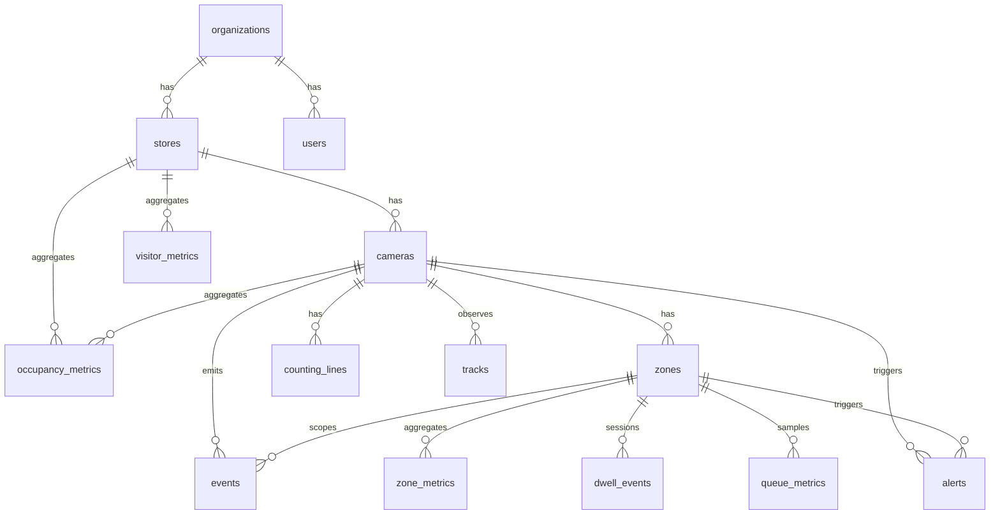

# Retail Analytics CV Platform — Project Status

**Last updated:** 2026-07-29 (Module 11 verified — Postgres on 5433, 8/8 DB tests green)
**Reference roadmap:** Retail_Analytics_Build_Roadmap.md

---

## Status Overview

| # | Module | Status |
|---|--------|--------|
| 0 | Environment & Repository Setup | ✅ Done |
| 1 | Video Ingestion Layer | ✅ Done |
| 2 | Person Detection | ✅ Done |
| 3 | Multi-Object Tracking | ✅ Done |
| 4 | Entry/Exit Counting Lines | ✅ Done |
| 5 | Occupancy Analytics | ✅ Done |
| 6 | Zone Management & Zone Analytics | ✅ Done |
| 7 | Dwell-Time Analytics | ✅ Done |
| 8 | Heatmap Generation | ✅ Done |
| 9 | Queue Analytics | ✅ Done |
| 10 | Event Architecture & Analytics Engine | ✅ Complete |
| 11 | Database & Event Storage | ✅ Complete |
| 12 | Backend REST API | ⬜ Not started |
| 13 | Frontend Web Dashboard | ⬜ Not started |
| 14 | Reports (CSV/PDF export) | ⬜ Not started |
| 15 | Alerting | ⬜ Not started |
| 16 | System Administration | ⬜ Not started |
| 17 | Dockerization & Deployment | ⬜ Not started |
| 18 | Testing, Evaluation & Accuracy Validation | ⬜ Not started |
| 19 | Scalability & Path to Multi-Camera/Multi-Store | ⬜ Not started |
| 20 | Final Demo Script | ⬜ Not started |

---

## ✅ Module 0 — Environment & Repository Setup — DONE

**Environment:** Windows, PowerShell, VS Code

### What was actually done

1. **Project folder created** at `retail-analytics/` (via `mkdir` + `cd`), confirmed with `pwd`.
2. **Git initialized** (`git init`), confirmed with `git status`.
3. **Folder structure created** exactly per plan:
frontend/ backend/ inference/ analytics/ database/
docker/ tests/ sample-data/ docs/
4. **README.md created** with a project structure table (module → purpose) and a simple architecture flow (Frontend → Backend API → Inference Engine → Analytics Engine → Database).
5. **.gitignore created**, covering Python (`__pycache__/`, `.venv/`), Node (`node_modules/`), `.env`, `.vscode/`, logs, and OS files (`.DS_Store`, `Thumbs.db`).
6. **Separate virtual environments created** (per the modularity/independent-maintainability reasoning from the roadmap):
   - `backend/.venv` — verified Python 3.11.x
   - `inference/.venv` — verified Python 3.11.x
7. **`inference/requirements.txt` created** with:
opencv-python
ultralytics
numpy
Installed inside `inference/.venv` via `pip install -r requirements.txt`. Confirmed via `pip list` that `opencv-python`, `numpy`, `ultralytics`, `torch`, and `torchvision` are present (torch/torchvision pulled in automatically as Ultralytics dependencies).
8. **Frontend scaffolded** with `npx create-next-app@latest .` inside `frontend/`, using:
   - TypeScript: Yes
   - ESLint: Yes
   - Tailwind: Yes
   - `src/` directory: No
   - App Router: Yes
   - Turbopack: Yes
   - Import alias: No
   Verified `npm run dev` serves the default app at `http://localhost:3000`.
9. **Backend placeholder created**: `backend/app/` with `api/`, `models/`, `services/`, `schemas/` subfolders and an empty `main.py`.
10. **Analytics skeleton created**: `analytics/zones/`, `analytics/dwell/`, `analytics/occupancy/`, `analytics/queues/`, `analytics/heatmaps/`.
11. **Database skeleton created**: `database/migrations/`, `database/schema/`.
12. **Docker folder created** with empty placeholders: `docker-compose.yml`, `Dockerfile.backend`, `Dockerfile.inference`, `Dockerfile.frontend` (not yet filled in — that's Module 17).
13. **Tests folder created**: `tests/scripts/`, `tests/videos/`.
14. **Sample videos added** to `sample-data/`:
    - `entrance.mp4`
    - `store-floor.mp4`
    - `checkout.mp4`
    - **⚠️ Note: all three sample videos are 30fps.** Flagging this now because it matters downstream:
      - Module 1 (Video Ingestion) frame-skipping/throttling logic should be calibrated against this actual 30fps source rate, not assumed.
      - Module 2's CPU Reality Check assumed a target processing rate of ~10fps — at 30fps source, that means skipping roughly every 3rd frame (process 1 of every 3).
      - If any sample video turns out to be variable frame rate (common with downloaded stock footage), confirm actual fps with `cv2.VideoCapture(...).get(cv2.CAP_PROP_FPS)` per file rather than trusting metadata alone, since Module 1's throttle logic reads this value directly.
15. **First commit made**: `git commit -m "Module 0: Initial project structure"`.
16. **Pushed to GitHub**: remote added, pushed to `main`.

### Deviations from the roadmap's original Module 0 instructions

- Roadmap originally suggested either per-service venvs or a single shared venv as an option — **per-service venvs were used** (`backend/.venv`, `inference/.venv`), consistent with the updated Module 0 guidance in the roadmap doc.
- Frontend was scaffolded with **Next.js** (App Router, Turbopack) as per the roadmap/PRD's recommended stack — no deviation here.
- No `analytics/.venv` was created separately; analytics code will run inside the same process/environment as `inference/` for now (this wasn't explicitly specified either way in Module 0 — worth deciding explicitly before Module 6).

### ✅ Test Checkpoint 0 — Verified

- [x] `git log` shows the initial commit with full folder structure.
- [x] `python --version` inside `inference/.venv` shows 3.11.x.
- [x] Sample video opens successfully via OpenCV (`cv2.VideoCapture`) — returns `True` and a valid frame shape.

---

## ✅ Module 1 — Video Ingestion Layer — DONE

A single `VideoSource` abstraction over files / RTSP / webcam so every downstream
module (detect, track, analytics) consumes one interface and never branches on
where the frame came from. This is the seam PRD §9 mandates.

### What was actually done

1. **`inference/video/` package** with a clean separation of concerns:
   - `base.py` — `VideoSource` ABC, `CameraState` enum (PRD §8), and the two
     cross-cutting helpers the task demanded live *here, not downstream*:
     - **Target-FPS throttling** — `compute_frame_interval(source_fps, target_fps)`
       picks which frames to hand off (30fps source / 10fps target → keep every
       3rd). Skipped frames use cheap `cv2.grab()` instead of a full decode.
     - **Downscale** — `resize_long_side(frame, 640)` via `cv2.INTER_AREA`.
   - `file_source.py` — `FileVideoSource` (mp4/avi/mov, `cv2.CAP_FFMPEG`,
     optional `loop=True` for dev).
   - `rtsp_source.py` — `RTSPVideoSource` with the full reconnect state machine:
     N consecutive failed reads → exponential backoff reopen → state
     `ONLINE→ERROR→PROCESSING→ONLINE`; after a full cycle is exhausted, retries
     on a cooldown so a recovering NVR is picked up. FFMPEG timeout options set
     so a dead NVR fails a read instead of hanging the pipeline. `read()` never
     raises on transient drops (real CCTV/NVR behavior, per PRD §8).
   - `webcam_source.py` — `WebcamVideoSource` (device index; `CAP_DSHOW` on
     Windows for faster opens).
   - `factory.py` — `create_video_source(spec)` routes by spec type (int →
     webcam, `rtsp(s)://`/`rtmp://` → RTSP, else → file). Downstream code never
     branches on source type.
   - `__init__.py` + `README.md` (public API + usage examples).
   - **Authoritative timestamps (2026-07-28)** — `get_last_timestamp()` returns
     media time for files (`source_frame_index / source_fps`) and wall clock for
     live sources. `get_effective_fps()` reports measured throughput;
     `get_media_duration()` on file sources. Downstream must not assume
     `kept_count / target_fps`.

2. **Tests** — `tests/test_video_source.py` + `tests/conftest.py`, **23 passed,
   1 skipped** (the live-RTSP test is gated behind an `RTSP_TEST_URL` env var
   since there's no NVR hardware here). Covers: known fps/resolution per sample
   file, downscale contract (long side ≤ 640, aspect preserved), throttle
   cadence (kept indices differ by exactly `interval`), factory routing, the
   `OFFLINE→PROCESSING→ONLINE→OFFLINE` state machine, EOF semantics, context
   manager, and the RTSP reconnect state machine (recover-from-drops,
   stays-in-error-on-exhaustion, recovers-after-cooldown, open-failure-raises).
   RTSP reconnect is unit-tested against an injected fake `VideoCapture` — no
   network needed. (Re-verified after Module 2's opencv downgrade — see
   Module 2's deviations below.)

3. **Smoke script** — `tests/scripts/smoke_video_source.py` (CLI over any
   source: file path / device index / `rtsp://` URL; prints fps, source vs
   output resolution, state transitions, mean/p95 read latency, effective fps).

4. **`inference/requirements.txt`** — added `pytest`.

### Verified against the real sample videos (not just unit tests)

| Video | Source fps | Source res | Output res (640 cap) | read() mean |
|---|---|---|---|---|
| entrance.mp4 | 29.97 | 2560×1440 | 640×360 | ~70 ms |
| store-floor.mp4 | 30.00 | 1920×1080 | 640×360 | ~37 ms |
| checkout.mp4 | 30.00 | 1920×1080 | 640×360 | ~34 ms |

Throttle scaling confirmed empirically: `--fps 5` (every 6th frame) → read()
mean ~74 ms; `--fps 30` (every frame) → read() mean ~14 ms.

### Decisions made

- **Target FPS default = 10** (PRD §33 says 10–15; chose the conservative end).
  At the verified ~30fps source rate, that's **process every 3rd frame** —
  exactly the heuristic flagged in Module 0's notes.
- **Long-side downscale default = 640px** (CPU reality check). `entrance.mp4`'s
  1440p and the 1080p clips all come out at 640×360, well under detection's
  needs and cheap to decode.
- **FFMPEG backend** for both file and RTSP sources — confirmed working in
  Module 0 and consistent across source types. If RTSP proves flaky on a real
  NVR, only `RTSPVideoSource._build_capture()` needs to swap to `CAP_GSTREAMER`
  or `ffmpeg-python`; no downstream module changes.
- **RTSP transport = TCP** by default (avoids UDP packet-loss tearing over
  Wi-Fi); 15s read timeout so a dead NVR can't hang the pipeline.
- **`CameraState` enum mirrors PRD §8** exactly (`Disabled/Offline/Error/
  Processing/Online`). The ingestion layer is the source of truth for the
  *true* state; Module 16's DB/UI will read `get_state()`.
- **Source-fps fallback = 30.0** when a stream reports 0/NaN (stock footage and
  some NVR exports do this).

### Deviations from the original Module 1 instructions

- Added a `retry_after_exhaustion` cooldown to RTSP: the task said "attempt to
  reopen with backoff" on N failures, but stopping permanently after one
  exhausted cycle would leave a briefly-offline NVR stuck in `Error` forever.
  Added a periodic post-exhaustion retry so a recovering NVR is picked up.
  Behavior is covered by `test_rtsp_recovers_after_exhaustion_cooldown`.
- Exposed `get_source_resolution()` in addition to the specified
  `get_resolution()` — downstream still sees the downscaled frame via the
  latter, but diagnostics / zone config (Module 6) will want the native size.

### Not in scope (deferred)

- DB persistence / full camera management UI → Module 16.
- Detection / tracking / zones → Modules 2+.
- Hardware/GPU decode acceleration → Module 17.

### ✅ Test Checkpoint 1 — Verified

- [x] `python -m pytest tests/` → 23 passed, 1 skipped.
- [x] Smoke script reads all 3 sample videos end to end (frames flow, correct
      fps/resolution, `Processing → Online` transition).
- [x] RTSP reconnect state machine unit-tested with no network (4 dedicated tests).

---

## ✅ Module 2 — Person Detection — DONE

A swappable-model person detection layer (PRD §10) so downstream modules
(tracking, counting, zones) call `detect(frame)` and never depend on whether
the model is PyTorch-YOLOv8n or an ONNX export.

### What was actually done

1. **`inference/detection/` package**, mirroring Module 1's layout for
   consistency:
   - `types.py` — `Detection` (frozen, slotted dataclass: `bbox`, `confidence`,
     `class_id`, `class_name`, `timestamp`, `camera_id` — PRD §10's full return
     contract) + `DetectionBackend` enum (`ULTRALYTICS`, `ONNX`).
   - `base.py` — `PersonDetector` ABC. Cross-cutting policy lives here, not in
     either backend: **person-only filtering** (COCO class 0, on by default —
     CCTV footage triggers on carts/mannequins/reflections otherwise) and
     **timestamp/camera_id stamping** (caller-authoritative, defaults to
     `time.time()`). `DEFAULT_CONF_THRESHOLD=0.4`, `DEFAULT_IOU_THRESHOLD=0.5`,
     `DEFAULT_INPUT_SIZE=640`.
   - `ultralytics_detector.py` — `UltralyticsDetector`, the reference backend
     (PyTorch via `ultralytics.YOLO`, CPU). Also owns `export_onnx()`, used
     once to produce the ONNX weights.
   - `onnx_detector.py` — `ONNXDetector`, the full hand-rolled pipeline
     (letterbox resize → normalize/NCHW → `session.run()` → decode the
     `(1,84,8400)` output grid → confidence filter → class filter → XYXY →
     `cv2.dnn.NMSBoxes`), running on ONNX Runtime's CPU execution provider.
   - `factory.py` — `create_detector(backend=..., model_path=..., ...)`, the
     single entry point. Resolves default model paths under
     `inference/models/` (gitignored) per backend.
   - `__init__.py` + `README.md`.

2. **Tests** — `tests/test_detection.py`, **21 passed** (13 fast, 8 gated
   behind `@pytest.mark.detection`). Covers: `Detection` immutability +
   derived properties (`center`, `width`, `height`); the ABC's filtering
   contract via a fake `_raw_infer` (person-only on/off, timestamp/camera_id
   stamping, empty-frame handling, context-manager release); factory routing
   + unknown-backend error; real inference on all 3 sample videos (both
   backends); a nearest-confidence backend-parity check (chosen over
   index-based pairing after confirming near-tied detections can swap sort
   rank between backends — same boxes, different order); and an end-to-end
   smoke test over 20 frames.

3. **`detection` pytest marker** registered in `tests/conftest.py` alongside
   Module 1's `slow`/`webcam`/`rtsp` markers.

4. **Demo/benchmark script** — `tests/scripts/run-detection-demo.py`.
   `--backend {ultralytics,onnx}`. Runs all 3 sample videos, draws
   bbox+class+confidence per frame, writes annotated mp4s to `tests/videos/`,
   and logs FPS to `tests/videos/detection_baseline.txt`. Reports two FPS
   numbers per video: **`infer_fps`** (`detector.detect()` only — the number
   that matters for downstream modules) and **`pipeline_fps`** (detect +
   annotation drawing + mp4 encoding — this script's own wall-clock cost, not
   representative of production). Runs one throwaway `detect()` call before
   timing starts so PyTorch/ONNX Runtime's first-call kernel-autotune /
   session-warmup cost doesn't skew whichever video happens to run first.

### Verified against the real sample videos (not just unit tests)

Detection counts, both backends, all 3 clips (warmed-up runs):

| Video | Frames | PyTorch detections (avg/frame) | ONNX detections (avg/frame) |
|---|---|---|---|
| entrance.mp4 | 197 | 253 (1.3) | 252 (1.3) |
| store-floor.mp4 | 113 | 1060 (9.4) | 1086 (9.6) |
| checkout.mp4 | 336 | 1123 (3.3) | 1093 (3.3) |

**Backend parity confirmed at both the single-frame and full-video level.**
On a single busy `store-floor.mp4` frame: both backends returned the same
11 detections, confidences within ~0.02 of each other, and bounding boxes
within ~1px once matched (a naive index-by-index diff falsely flagged 4 of
the 11 as mismatched — those were near-tied-confidence detections that swap
sort rank between backends; the actual boxes line up almost exactly). Across
full videos, total detection counts differ by ≤3% between backends.

**FPS baseline (CPU, warmed-up, `imgsz=640`):**

| Video | PyTorch infer FPS | ONNX infer FPS | PyTorch pipeline FPS* | ONNX pipeline FPS* |
|---|---|---|---|---|
| entrance.mp4 | 7.6 | 7.3 | 4.8 | 5.1 |
| store-floor.mp4 | 6.9 | 7.0 | 5.1 | 5.4 |
| checkout.mp4 | 7.3 | 6.9 | 5.3 | 5.4 |

\* *pipeline FPS includes annotation drawing + mp4 encoding from the demo
script itself and is not representative of production — downstream modules
only pay the infer-FPS cost.*

**⚠️ Target vs. measured: we're aiming for at least 10 FPS on CPU; measured
inference-only throughput is ~7 FPS (6.9–7.6 across backends/videos), a real
gap, not a measurement artifact** (confirmed after isolating and removing a
first-call warmup cost that had been skewing `entrance.mp4` low in earlier
runs). Likely contributing factors, not yet individually isolated:
- `imgsz=640` is the single biggest lever on CPU inference time for a nano
  model; it was pinned to 640 to match Module 1's downscale cap (no extra
  resize step), which is a deliberate design choice, not an oversight.
- CPU thread-pool sizing (`torch.set_num_threads`, ONNX Runtime's
  `intra_op_num_threads`) hasn't been explicitly tuned — both are currently
  running on library defaults, which may not be optimal for this hardware.
  Flagged as an unexplored, low-risk lever rather than a confirmed cause.
- ~7 FPS for YOLOv8n@640 on CPU is within the normal range for consumer
  hardware; the gap may partly reflect the 10 FPS target being optimistic
  for CPU-only inference at this resolution.

This gap is **not being closed in Module 2**. Per the original plan,
GPU/half-precision optimization is explicitly scoped to Module 17, and
threshold/accuracy tuning against real footage is scoped to Module 18 — both
are more appropriate places to revisit the 640px/CPU tradeoff with real
data than guessing at it here.

### Decisions made

- **Model: YOLOv8n** (nano) — per task spec, fast baseline on CPU.
- **Defaults: `conf_threshold=0.4`, `iou_threshold=0.5`, `person_only=True`,
  `input_size=640`.** Conf threshold intentionally left at a conservative
  starting point; precision/recall tuning against real footage is Module 18's
  job, not Module 2's.
- **Person-only filtering and timestamp/camera_id stamping live in the ABC**,
  not either backend — this is the actual swappability seam: changing model
  or backend never touches this shared logic.
- **`opencv-python` pinned to `4.10.0.84`** (was auto-upgraded to `5.0.0` at
  some point; downgraded as a Module 2 setup step since Module 1's FFMPEG/
  DirectShow wrapping was built and tested against 4.x). Module 1's full test
  suite (23 tests) was re-run after the downgrade to confirm no regression —
  still green.
- **`onnxruntime` (~1.27.0) added** as a runtime dependency for the ONNX
  backend. **`onnx` + `onnxslim` added as export-time-only dependencies** —
  needed to *produce* the `.onnx` file via `export_onnx()`, not to *run* the
  ONNX backend day-to-day. Kept this distinction explicit in
  `inference/requirements.txt` so the runtime dependency list doesn't grow
  unnecessarily.
- **Standardized on `create_detector()`** as the only supported construction
  path, including in tests and the demo script. Direct instantiation
  (`UltralyticsDetector()`/`ONNXDetector()` with no explicit path) resolves
  model paths relative to the *process's current working directory*, not
  `inference/models/`, which caused an exported `.onnx`/`.pt` to land in the
  repo root during initial testing until manually relocated. `create_detector()`
  routes through `factory.py`'s `DEFAULT_MODELS_DIR` resolution and avoids this
  entirely.
- **Corrected the ONNX backend's docstring speed claim.** It originally stated
  ONNX Runtime is "typically 20–40% faster than raw PyTorch on CPU" — the
  measured numbers above don't support that (ONNX is roughly on par with
  PyTorch on this hardware, sometimes marginally faster, sometimes marginally
  slower, per video). Docstring updated to point at the measured baseline
  above instead of a general claim.

### Deviations from the original Module 2 instructions

- `tests/conftest.py` was found to have been edited externally (added
  `from dotenv import load_dotenv` + a call to it) before Module 2 work
  started, which broke test collection entirely since `python-dotenv` wasn't
  installed. Made the import defensive (`try/except ImportError`) so the test
  suite doesn't hard-depend on it — this was necessary to unblock both the
  Module 1 regression check and Module 2's own tests, not an intentional
  Module 2 change.
- The demo/benchmark script required a warmup call (one throwaway `detect()`
  before timing starts) that wasn't in the original plan — without it, the
  first video processed absorbed PyTorch/ONNX Runtime's one-time kernel-
  autotune/session-warmup cost and looked artificially slower than the other
  two, independent of actual per-frame content or detection count.

### Not in scope (deferred)

- Quantitative precision/recall evaluation and confidence-threshold tuning
  against real footage → Module 18 (explicitly deferred there in the original
  task).
- Closing the ~7 FPS → 10 FPS gap: GPU/half-precision → Module 17;
  CPU thread-pool tuning and any `imgsz` tradeoff investigation → also
  reasonable to revisit in Module 17 or Module 18 once real accuracy data
  exists to weigh against a resolution reduction.
- Tracking, counting, zones → Modules 3–9.

### ✅ Test Checkpoint 2 — Verified

- [x] `pytest tests/test_detection.py` → 21 passed (fast suite, no model load).
- [x] `pytest tests/test_detection.py -m detection` → 8 passed (real inference,
      parity, smoke — gated).
- [x] `pytest tests/test_video_source.py` → 23 passed, 1 skipped (Module 1
      regression check after the opencv downgrade — clean).
- [x] `run-detection-demo.py` produced 3 annotated mp4s per backend (6 total)
      + FPS baseline log entries for both backends.
- [x] Manual eyeball review of annotated videos — [fill in after review:
      box tracking quality on entrance ~frame 13–15, store-floor ~frame 4–106,
      checkout ~frame 45].

---

## ✅ Module 3 — Multi-Object Tracking — DONE

Assigns temporary, anonymous track IDs to detected people so downstream modules
(counting, dwell, zones, heatmaps) reason about *individuals*, not per-frame
detection blobs (PRD §11).

### What was actually done

1. **`inference/tracking/` package**:
   - `types.py` — `PositionRecord` + `TrackedObject` (frozen, slotted:
     `track_id`, `bbox`, `class_id`, `class_name`, `confidence`, `camera_id`,
     `timestamp`, `position_history` capped at 30 frames).
   - `tracker.py` — `Tracker` wrapping `trackers.ByteTrackTracker` (Roboflow's
     maintained successor to deprecated `supervision.ByteTrack`). Pre-tracking
     confidence filter + IoU NMS via `supervision.Detections.with_nms()`.
     Confirmation gate (`min_confirmation_frames=2`) filters single-frame
     flicker. Per-track position deque for line-cross / dwell (Modules 4 & 7).
   - `__init__.py` + `README.md` (API, PRD §11 failure modes, known MVP
     limitations).

2. **Tests** — `tests/test_tracking.py`, **22 passed** fast + **5 passed**
   gated (`@pytest.mark.tracking`). Covers: type immutability + derived
   properties; pre-tracking NMS; synthetic motion (stable IDs, confirmation
   gate, history growth/cap, reset, multi-person); real detect+track on all 3
   sample videos.

3. **Demo script** — `tests/scripts/run-tracking-demo.py`. Runs detect +
   track over all 3 sample videos, draws bbox + track ID, writes annotated
   mp4s to `tests/videos/`.

4. **`inference/requirements.txt`** — added `supervision` + `trackers`.

### Decisions made

- **Algorithm: ByteTrack** via `trackers.ByteTrackTracker` — motion + IoU +
  Kalman filter only, no re-ID embedding model. CPU overhead on top of
  detection is negligible.
- **`track_buffer=30`** (lost-track memory) — tuned starting point for brief
  occlusions behind shelving; at Module 1's 10fps throttle that's ~3s wall
  time.
- **`min_confirmation_frames=2`** — tracks must appear in 2 consecutive
  processed frames before being returned. Positions from `tracker_id=-1`
  (pre-confirmation) frames are buffered and merged into history when the real
  ID appears, so early crossings are not lost.
- **`history_length=30`** — position buffer on each `TrackedObject` for
  line-crossing direction (Module 4) and dwell (Module 7).
- **Re-ID after long occlusion: documented, not solved** — ByteTrack may
  assign a new ID; full re-ID is Phase 2, per task spec.

### Known limitations (MVP)

1. No cross-camera re-ID — one `Tracker` per camera.
2. ID swap after occlusion longer than `track_buffer` processed frames.
3. Module 1's frame-skipping means the tracker sees every 3rd source frame at
   10fps; fast motion increases association errors.
4. **Low-resolution / heavily compressed CCTV** — tracking performance degrades
   when person detections are intermittent (common on noisy or low-bitrate
   feeds), causing more frequent ID switches and shorter track lifetimes.
   Detection and tracking thresholds will be evaluated and tuned across a
   representative dataset in Module 18.

### Not in scope (deferred)

- BoT-SORT / DeepSORT backends → future if ByteTrack accuracy insufficient.
- Appearance-based re-ID → Phase 2.
- DB persistence of tracks → Module 11.

### ✅ Test Checkpoint 3 — Verified

- [x] `pytest tests/test_tracking.py` → 18 passed (fast suite).
- [x] `pytest tests/test_tracking.py -m tracking` → 5 passed (real inference).
- [x] `pytest tests/test_detection.py tests/test_video_source.py` → Module 1/2
      regression clean (RTSP live test excluded — env-dependent).

---

## ✅ Module 4 — Entry/Exit Counting Lines — DONE

Virtual counting lines that emit structured **ENTRY** / **EXIT** events when
tracked people cross them (PRD §12). First structured analytics event — seeds
the PRD §27 schema for Module 10.

### What was actually done

1. **`analytics/counting/` package**:
   - `types.py` — `CountingLine` (two endpoints + `inside_side` flag in frame
     coords), `CrossingEvent` + `EventType` (`ENTRY`/`EXIT`) with
     `to_dict()` matching PRD §27 shape; JSON save/load.
   - `geometry.py` — tracking point (85% bbox height, tuned for low-res CCTV),
     foot-point helper, segment intersection, inside/outside side tests,
     `movement_crosses_line()` with endpoint margin + proximity tolerance.
   - `counter.py` — `LineCounter.update(tracks)` → `list[CrossingEvent]`.
     Scans every **new** consecutive pair in `position_history` each frame
     (bootstrap on first sight; rolling-buffer safe at 30-frame maxlen).
     Per-track debounce — first crossing accepts either direction (`ANY`), then
     alternates ENTRY/EXIT.
   - `line_editor.py` — MVP OpenCV click-to-define editor (2 endpoints + inside
     side click). Downscales to 640px long side; green tint shows inside side.
     Full admin UI → Module 16.
   - `__init__.py` + `README.md`.

2. **Line configs** — `tests/videos/entrance_line.json`,
   `tests/videos/CMMentrance_line.json` (drawn with `line_editor`; `camera_id`
   must match the video stem when using `--line-config`).

3. **Tests** — `tests/test_counting.py`, **16 passed** (15 fast + 1 gated
   `@pytest.mark.counting`). Covers: JSON roundtrip, geometry, ENTRY/EXIT
   direction, debounce, camera filter, reset, history-pair scan, `track_id=0`,
   full detect+track+count pipeline.

4. **Demo script** — `tests/scripts/run-counting-demo.py`. Runs detect +
   track + count; accepts `--line-config` JSON from the editor. `camera_id`
   comes from the line JSON when `--line-config` is set.

5. **Tracker integration** — `Tracker` pre-confirmation buffer (Module 3)
   merged so crossings during the 2-frame confirmation window are retained in
   `position_history`.

### Decisions made

- **Tracking point at 85% bbox height** — on low-res / compressed CCTV the
  bbox bottom lags the doorway; strict foot-point (100%) under-counted. 0.85
  balances foot accuracy with catching crossings when the upper body has passed
  the line. `foot_point_from_bbox()` kept for tests / future tuning.
- **Custom geometry** (not `supervision.LineZone`) — keeps the PRD §27 event
  schema and debounce logic explicit; same pattern will extend to zones.
- **Frame coordinates** — lines drawn on Module 1's downscaled frames (640px
  long side).
- **Debounce state machine** — per track: first crossing since track appeared
  may be ENTRY or EXIT; thereafter alternates (no duplicate ENTRY until EXIT).

### Known limitations (MVP)

1. **Line placement matters** — counting fires on geometric line crossing, not
   "person appeared near the door." The line must span where tracked footpaths
   actually cross; use `line_editor` green tint to confirm inside side.
2. **Not every visible person gets a track ID** — on `entrance.mp4` ByteTrack
   assigns 4 IDs; a 5th person in frame may never receive a confirmed track.
3. **Low-res CCTV** — intermittent detections and ID switches (Module 3 #4)
   still affect who gets counted; threshold tuning deferred to Module 18.

### Not in scope (deferred)

- Occupancy rollup → **Module 5** (`analytics/occupancy`).
- Event bus / DB persistence → Modules 10–11.
- Multi-line admin UI → Module 16.

### ✅ Test Checkpoint 4 — Verified

- [x] `pytest tests/test_counting.py` → 16 passed (15 fast + 1 gated).
- [x] Synthetic ENTRY/EXIT + debounce + `track_id=0` tests green.
- [x] End-to-end detect+track+count on `entrance.mp4` + `entrance_line.json`
      → **4 ENTRY** (tracks 0–3), 1 EXIT (track 2).

---

## ✅ Module 5 — Occupancy Analytics — DONE

First **pure analytics** module — dashboard metrics from Module 4 ENTRY/EXIT
events, no computer vision (PRD §13). Preview of the Analytics Engine
(Module 10).

### What was actually done

1. **`analytics/occupancy/` package**:
   - `types.py` — `OccupancyScope` (`camera` / `store` / `zone` for Module 6),
     `OccupancySnapshot` with PRD §13 fields + `to_dict()`.
   - `tracker.py` — `OccupancyTracker`: `current_occupancy = entries − exits`
     (floored at 0), `today_visitors`, `today_exits`, `peak_occupancy`,
     `peak_occupancy_time`; automatic midnight rollover (UTC default, IANA tz
     when `tzdata` installed).
   - `aggregator.py` — `StoreOccupancyAggregator` rolls up multiple entrance
     cameras to store-level metrics + store peak occupancy.
   - `__init__.py` + `README.md`.

2. **Tests** — `tests/test_occupancy.py`, **9 passed** (8 fast + 1 gated
   `@pytest.mark.occupancy`). Hand-worked event sequence, negative floor,
   midnight rollover, store rollup, counting-pipeline integration.

3. **Counting demo** — `run-counting-demo.py` prints final occupancy snapshot
   when crossing events are produced.

### Decisions made

- **In-memory counters** until Module 11 persistence; midnight rollover resets
  daily metrics (assumes empty store at local midnight for MVP).
- **Floor at zero (MVP)** — `current_occupancy` never negative when EXITS arrive
  without prior ENTRYs (people already inside when a clip/stream starts).
- **Sample clips vs live** — on offline sample videos, `current_occupancy` is an
  *event-derived estimate*, not ground truth. `today_visitors` / `today_exits`
  and peak are reliable relative to the clip. On live cameras, call
  `occupancy.reset()` when the stream starts on an empty store so occupancy
  tracks real people inside.
- **Store + zone extensibility** — per-camera trackers + store aggregator;
  `OccupancyScope.ZONE` reserved for Module 6 (not hardcoded single-camera).

### Known limitations (MVP)

1. No DB persistence — counters lost on process restart (Module 11).
2. Non-UTC store timezones require `pip install tzdata` on Windows.
3. Zone-level occupancy deferred to Module 6.

### Not in scope (deferred)

- Event bus / API exposure → Modules 10–12.
- Persisted daily rollups / historical peaks → Module 11.

### ✅ Test Checkpoint 5 — Verified

- [x] Hand-worked ENTRY/EXIT sequence → occupancy, peak, today's visitors match
      expected values.
- [x] Orphan EXITS floor `current_occupancy` at 0 (never negative).
- [x] `pytest tests/test_occupancy.py` → 9 passed (8 fast + 1 gated).

---

## ✅ Module 6 — Zone Management & Zone Analytics — DONE

Polygon-based zones with entry/exit/presence detection and analytics computed
from those events (PRD §14–§15). Generalizes Module 4's line-crossing pattern
into arbitrary regions — foundation for dwell-time (Module 7) and heatmaps
(Module 8).

### What was actually done

1. **`analytics/zones/` package**:
   - `types.py` — `Zone` (zone_id, zone_name, camera_id, polygon_coordinates,
     zone_type, analytics_enabled), `ZoneConfig` (multi-zone per camera),
     `ZoneEvent` + `ZoneEventType` (`ZONE_ENTER`/`ZONE_EXIT`/`ZONE_PRESENCE`).
   - `geometry.py` — `point_in_polygon()` via `cv2.pointPolygonTest()`, foot-point
     from bbox bottom-center.
   - `detector.py` — `ZoneDetector.update(tracks)` evaluates **all** enabled
     zones per camera per track per frame; mirrors `LineCounter` history-pair
     scan + debounce + **hysteresis buffer** (`hysteresis_frames=2` default —
     consecutive inside/outside readings required before confirming ENTER/EXIT).
   - `analytics.py` — `ZoneAnalytics` + `MultiZoneAnalytics`: zone visitors,
     current occupancy (via `OccupancyTracker` scope `ZONE`), total visits,
     avg/max/min dwell (ENTER→EXIT duration), traffic by hour.
   - `verify.py` — transition timeline extraction, event-type counts, flapping
     detection (rapid ENTER↔EXIT within N frames).
   - `polygon_editor.py` — MVP OpenCV click-to-define polygon editor (merge
     into `ZoneConfig` JSON). Full admin UI → Module 16.
   - `__init__.py` + `README.md`.

2. **Zone configs** — `tests/videos/town_zones.json` (store1 + store2 polygons
   on `town.mp4`, drawn with `polygon_editor`).

3. **Tests** — `tests/test_zones.py`, **24 passed** (23 fast + 1 gated
   `@pytest.mark.zones`). Covers: JSON roundtrip, point-in-polygon, enter/exit/
   presence, debounce, hysteresis (delayed enter + single-frame boundary
   suppression), multi-zone per camera, disabled zones, analytics (visitors,
   dwell, hourly traffic), flapping helper, full detect+track+zone pipeline.

4. **Demo script** — `tests/scripts/run-zones-demo.py`. Runs detect + track +
   zone detection + analytics; accepts `--zone-config` JSON from the editor.
   Flags for verification: `--transitions-only` (skip PRESENCE flood),
   `--hysteresis-frames`, `--flap-window`, per-type event counts, per-track
   ENTER/EXIT timeline, flapping warnings.

### Verified against real footage (not just unit tests)

Ran on `town.mp4` + `tests/videos/town_zones.json` (two overlapping store
polygons). Pipeline produced ~1030 zone events dominated by `ZONE_PRESENCE`
(people already inside zones when tracked); analytics summary confirmed
ENTER/EXIT transitions fired correctly:

| Zone | Visitors | Visits | Avg dwell | Current occ |
|------|----------|--------|-----------|-------------|
| store1 | 9 | 10 | 48.5s | 0 |
| store2 | 12 | 13 | 38.4s | 3 |

Use `--transitions-only` on the demo to inspect per-track ENTER/EXIT timelines
instead of the first 20 PRESENCE events.

### Tuning note — `shop.mp4` / `floor_main` (manual verification)

`run-zones-demo.py` on `shop.mp4` + `tests/videos/shop_zones.json` reported
**4 ENTER↔EXIT flapping pairs within &lt;1s** (tracks 1 and 2 showed sub-second
"visits"). Likely **polygon boundary jitter** — foot-points straddling the
`floor_main` edge at the default `hysteresis_frames=2`, not real floor visits.

**Mitigation:** re-run with higher hysteresis as the demo suggests:

```powershell
python tests/scripts/run-zones-demo.py sample-data/shop.mp4 --camera-id shop `
  --zone-config tests/videos/shop_zones.json --transitions-only `
  --hysteresis-frames 3
# or --hysteresis-frames 4 if flapping persists
```

Also consider redrawing `floor_main` **inset** from the frame edge so tracks
don't graze the polygon boundary. `run-zones-demo.py` exposes
`--hysteresis-frames`; dwell/queue/events demos currently hardcode `2` in
`ZoneDetector` — tune on zones-demo first, then mirror the value in those
scripts if flapping affects downstream metrics.

### Decisions made

- **Foot-point (100% bbox height)** for zone tests — PRD §14 specifies foot-
  point; line crossing (Module 4) uses 85% for CCTV slop but zones are area-
  based so strict foot-point is appropriate.
- **All zones per camera per frame** — one `ZoneDetector` takes a list of zones;
  each track is checked against every enabled zone on that camera (overlapping
  zones supported, e.g. Electronics + Checkout slice).
- **`ZONE_PRESENCE` with `dwell_delta`** — emitted on inside→inside history
  pairs for Module 7 to consume directly; completed visit dwell stats use
  ENTER→EXIT wall time in `ZoneAnalytics`.
- **Reuses `OccupancyTracker`** with `OccupancyScope.ZONE` for entries-minus-
  exits occupancy — same pattern as Module 5, not a parallel counter.
- **Hysteresis default = 2 frames** — matches the tracker's confirmation gate;
  suppresses boundary flapping when a foot-point briefly straddles a polygon
  edge. Tunable via `--hysteresis-frames` on the demo / `ZoneDetector(...,
  hysteresis_frames=N)`.

### Known limitations (MVP)

1. Dwell stats only finalize on `ZONE_EXIT` — people still inside at clip end
   are not counted in avg/max/min until they exit (e.g. store2 `current_occupancy=3`
   on `town.mp4` clip end).
2. ~~Demo timestamps use frame index as epoch seconds~~ **Fixed 2026-07-28** —
   demos use `VideoSource.get_last_timestamp()` (source media time for files,
   wall clock for live). `target_fps` only caps which frames are processed;
   faster GPU throughput does not inflate dwell or zone timing.
3. No DB persistence — counters lost on restart (Module 11).
4. Polygon editor saves one zone at a time (merges into config); multi-zone
   batch editing → Module 16.

### Not in scope (deferred)

- Heatmaps → **Module 8**
- Event bus / API exposure → Modules 10–12

### ✅ Test Checkpoint 6 — Verified

- [x] Synthetic ZONE_ENTER/EXIT/PRESENCE + debounce + multi-zone tests green.
- [x] Hysteresis delays ENTER and suppresses single-frame boundary blips.
- [x] Zone analytics: visitors, occupancy, dwell, hourly traffic match expected.
- [x] `pytest tests/test_zones.py` → 24 passed (23 fast + 1 gated).
- [x] `town.mp4` + `town_zones.json` end-to-end — visits/visitors/dwell plausible;
      `--transitions-only` confirms ENTER/EXIT timeline per track.

---

## ✅ Module 7 — Dwell-Time Analytics — DONE

Individual dwell sessions and per-zone aggregates from Module 6 zone events
(PRD §16). Direct consumer of `ZONE_ENTER` / `ZONE_EXIT` / `ZONE_PRESENCE` —
mostly arithmetic once Module 6 is solid.

### What was actually done

1. **`analytics/dwell/` package**:
   - `types.py` — `DwellEvent` (maps to PRD §31 DwellEvents entity),
     `DwellThresholdEvent` (`DWELL_THRESHOLD`, PRD §27), `DwellAggregatesSnapshot`,
     histogram buckets (`0-30s` / `30-60s` / `1-3min` / `3-10min` / `10min+`).
   - `tracker.py` — `DwellTracker`: records sessions on `ZONE_ENTER`, closes on
     `ZONE_EXIT` with `dwell_seconds = exit − enter`, updates `last_seen` on
     `ZONE_PRESENCE`, `close_stale_sessions()` for track-loss approximation.
   - `aggregates.py` — `DwellAggregator`: avg / median / max + distribution
     from completed dwell events.
   - `__init__.py` + `README.md`.

2. **Tests** — `tests/test_dwell.py`, **13 passed** (12 fast + 1 gated
   `@pytest.mark.dwell`). Covers: dwell event on exit, avg/median/max across
   known durations, histogram buckets, track-loss timeout, threshold fires once
   per visit (not every frame), zone-pipeline integration.

3. **Demo script** — `tests/scripts/run-dwell-demo.py`. Full detect + track +
   zone + dwell pipeline; `--dwell-threshold` for manual alert testing,
   `--lost-track-timeout` and `--target-fps` tunable.

4. **Demo timestamp fix (2026-07-28)** — initial demos used `timestamp =
   frame_idx` (1 per processed frame), so a 30 s clip at 10 fps looked like
   ~300 s. All pipeline demos now call `src.get_last_timestamp()` after each
   `read()` — media time from the file (`frame_index / source_fps`), not
   `kept_count / target_fps`.

### Verified against `town.mp4` (manual run)

First run used frame-index timestamps (misleading dwells up to 79 "seconds" on a
30 s clip). After the fix, dwell values match source media time regardless of
processing throughput (e.g. 79 frames at 30 fps source ≈ 2.6 s media time).

### Decisions made

- **ENTER→EXIT wall time** for completed `DwellEvent.dwell_seconds` — same as
  Module 6 zone analytics; `ZONE_PRESENCE` `dwell_delta` used only for live
  threshold checks and Module 7 incremental state.
- **Track-loss policy** — if no zone event for `lost_track_timeout_seconds`
  (default **5 s**), close session at `last_seen_timestamp` with
  `close_reason: track_lost`. Documented as approximation for tracking failures,
  not a real exit. Slightly above ByteTrack `track_buffer` at 10 fps (~3 s).
- **`DWELL_THRESHOLD` fires once per visit** — `threshold_fired` flag reset on
  next `ZONE_ENTER`; checked on `ZONE_PRESENCE` when `dwell >= threshold`.
- **Per-zone thresholds** via `dwell_thresholds={zone_id: seconds}` dict —
  event built now for Module 15 (Alerting); no alert UI yet.
- **Demo timestamps = source media time** — `VideoSource.get_last_timestamp()`
  after each kept frame. All `dwell_seconds` and `dwell_threshold_seconds` are
  in real seconds; `target_fps` is a sampling cap only.

### Known limitations (MVP)

1. Open dwells at clip end need `close_stale_sessions()` or remain in
   `active_sessions` until timeout — demo calls both per-frame and at EOF.
2. No DB persistence — dwell events lost on restart (Module 11).
3. Threshold only evaluated on `ZONE_PRESENCE` — requires person to generate
   presence events while inside (normal once hysteresis confirms ENTER).

### Not in scope (deferred)

- Alert delivery UI → **Module 15**
- DwellEvents DB persistence → **Module 11**
- Dashboard distribution charts → **Module 13**

### ✅ Test Checkpoint 7 — In progress

Automated tests green (`pytest tests/test_dwell.py` → 13 passed).

- [ ] Stand in a defined zone for a known duration (stopwatch); confirm computed
      dwell within ~2 s of real time — **re-run `run-dwell-demo.py` after
      timestamp fix** (prior run inflated dwells by ~10× on 10 fps clips).
- [x] Confirm avg/median/max across several visits — unit tests with known
      durations (30 / 120 / 180 s → median 120 s).
- [x] `DWELL_THRESHOLD` fires once per visit, not every frame —
      `test_threshold_fires_once_per_visit` green; manual threshold re-test on
      `town.mp4` pending after timestamp fix (`--dwell-threshold 30` = 30 real
      seconds now, not 30 frames).

---

## ✅ Module 8 — Heatmap Generation — DONE

Visual heatmaps from foot-point density and trajectory paths, filterable by
camera / date / time range, overlaid on a static reference frame (PRD §17).
First purely visual analytics output.

### What was actually done

1. **`analytics/heatmaps/` package**:
   - `types.py` — `HeatmapFrameSpec`, `HourBucketKey` (camera + local date + hour).
   - `accumulator.py` — `HeatmapAccumulator`: foot-point density grid + trajectory
     raster at 1/4 frame resolution (`grid_scale=4` default); frame coords map to
     grid cells, upsampled on render for alignment.
   - `renderer.py` — Gaussian blur → normalize 0–255 → `COLORMAP_JET` density +
     `COLORMAP_HOT` trajectories → alpha-blend over reference BGR frame; rejects
     reference/ spec size mismatch.
   - `storage.py` — `HeatmapStore`: file-backed `.npz` hour buckets
     `{root}/{camera}/{YYYY-MM-DD}/{HH}.npz`; `merge_range()` sums buckets for
     time-window queries without reprocessing video.
   - `engine.py` — `HeatmapEngine`: `set_reference_frame()`, `update(tracks, ts)`,
     `flush()`, `render(start, end)`.
   - `__init__.py` + `README.md`.

2. **Tests** — `tests/test_heatmaps.py`, **11 passed** (10 fast + 1 gated
   `@pytest.mark.heatmaps`). Covers: grid mapping, merge, save/load, time-range
   filter produces different overlays, reference alignment, engine flush,
   video pipeline overlay.

3. **Demo script** — `tests/scripts/run-heatmap-demo.py`. File, RTSP, or webcam
   (`0`); `--duration` for live runs; `--preview-every` for periodic overlay.

### Decisions made

- **Foot-point** (bbox bottom-center) for density — same as zones (Module 6);
  centroid available on `TrackedObject` but feet are better for floor traffic.
- **1/4 resolution grid** — cheaper accumulation; upsampled to full reference
  size before blend so overlay aligns with no offset/scaling bug.
- **Hour buckets on disk** — not per-frame (PRD §31); query
  “Camera 3, Tuesday 2–4pm” = sum relevant `.npz` files.
- **Reference frame** — static empty-store still per camera, must match processed
  frame dimensions exactly; first demo frame used as placeholder until Module 16
  admin capture workflow exists.
- **UTC without tzdata** — `datetime.timezone.utc` fallback on Windows, same as
  Module 5/7.

### Known limitations (MVP)

1. Reference frame = first video frame in demo (not a dedicated empty-store
   capture workflow).
2. File-backed buckets under `data/heatmaps/` — not DB (Module 11).
3. Trajectory lines are rasterized into a grid (faint on render), not vector
   paths — sufficient groundwork for Phase 2 customer flow.

### Not in scope (deferred)

- Customer flow analytics → Phase 2 (PRD §18)
- Dashboard heatmap widget → **Module 13**
- DB-backed bucket storage → **Module 11**

### ✅ Test Checkpoint 8 — Ready for manual verification

- [x] Overlay shape matches reference frame; size mismatch raises error (unit test).
- [x] Lunch-hour vs full-day merge produces visibly different images (unit test).
- [ ] Eyeball overlay alignment on real footage (`run-heatmap-demo.py`).
- [ ] Confirm high-traffic areas match where people actually walked in sample video.

---

---

## ✅ Module 9 — Queue Analytics — DONE

Checkout/service queue metrics from Module 6 zone events (PRD §19). Queue zones
reuse polygon geometry — the novelty is interpreting zone occupancy as queue
length and deriving wait-time estimates from historical dwell.

### What was actually done

1. **`analytics/queues/` package**:
   - `types.py` — `QueueMetricsSnapshot`, `QueueThresholdEvent` (`QUEUE_THRESHOLD`,
     PRD §27), `is_queue_zone()`, `QUEUE_ZONE_TYPES`.
   - `aggregates.py` — `QueueLengthAggregator` (avg/max from occupancy samples).
   - `tracker.py` — `QueueTracker`: occupancy-based length, episode duration,
     estimated wait from completed dwells, length/duration thresholds.
   - `__init__.py` + `README.md` (includes PRD §34 camera placement note).

2. **`ZoneType.QUEUE`** added to `analytics/zones/types.py`; `checkout` and
   `waiting` types also qualify as queue zones.

3. **Tests** — `tests/test_queues.py`, **11 passed** (10 fast + 1 gated
   `@pytest.mark.queues`). Covers: length from enter/exit, avg/max samples,
   estimated wait, episode duration, length/duration thresholds, integration.

4. **Demo** — `tests/scripts/run-queues-demo.py` (file / RTSP / webcam).

### Decisions made

- **Queue zone = zone** — no parallel geometry layer; `zone_type` in
  `{queue, checkout, waiting}` selects queue analytics.
- **Current queue length** — `OccupancyTracker` entries−exits (Module 5/6).
- **Estimated wait (MVP)** — average completed dwell in the queue zone;
  documented as approximation; position-in-queue → Phase 2 (PRD §37).
- **Queue duration** — continuous non-empty episode (length > 0).
- **Thresholds** — mirror Module 7 dwell pattern; length resets when count
  drops below threshold; duration resets when queue clears.
- **Camera placement** — explicit in `analytics/queues/README.md`: queue must
  be fully visible; out-of-frame waiters undercount by design (PRD §34).

### Known limitations (MVP)

1. Estimated wait is historical average dwell, not position-in-queue.
2. No DB persistence — metrics lost on restart (Module 11).
3. Multi-lane = multiple zones per camera; no automatic cross-lane dedup.
4. No alert delivery UI (Module 15).

### Not in scope (deferred)

- Position-in-queue wait estimation → Phase 2 (PRD §37)
- API `GET /api/analytics/queues` → Module 12
- Dashboard queue widgets → Module 13

### ✅ Test Checkpoint 9 — Ready for manual verification

- [x] Unit tests green (`pytest tests/test_queues.py` → 11 passed).
- [ ] Draw queue polygon on `checkout.mp4`; confirm length rises when people
      stand in zone (`run-queues-demo.py`).
- [ ] `--length-threshold` / `--duration-threshold` fire `QUEUE_THRESHOLD` once
      per episode as expected.

---

---

## Module 10 — Event Architecture & Analytics Engine ✅

**PRD:** §27 (event types), §28 (pipeline diagram — Analytics Engine seam)

### What was built

1. **`analytics/events/`** — canonical event schema and bus:
   - `types.py` — `AnalyticsEvent` (Pydantic), `AnalyticsEventType` enum
   - `bus.py` — in-process `EventBus` (`queue.Queue` + sync subscribers)
   - `adapters.py` — convert module events → `AnalyticsEvent`
   - `engine.py` — `AnalyticsEngine` (single metric consumer)
   - `publisher.py` — `PersonDetectionSampler` (sampled `PERSON_DETECTED`)

2. **Producers refactored to emit on the bus:**
   - `LineCounter` — optional `event_bus` → `ENTRY` / `EXIT`
   - `RTSPVideoSource` — optional `event_bus` + `camera_id` → `CAMERA_OFFLINE` on reconnect exhaustion
   - Zone / dwell / queue thresholds published by `AnalyticsEngine.process_zone_event`

3. **Analytics Engine** reuses Modules 5–9 aggregation logic internally but is the
   only component demos/API should read metrics from.

### ✅ Test Checkpoint 10

- [x] Unit tests green (`pytest tests/test_events.py`)
- [x] Engine occupancy/zone/dwell/queue numbers match direct module trackers
- [x] `CAMERA_OFFLINE` fires when RTSP reconnect exhausts retries (unit test)
- [ ] Full pipeline demo on file: `run-events-demo.py` on `shop.mp4` + line/zone configs
- [ ] **Live camera full pipeline (pending — manual verification later):**
      `run-events-demo.py rtsp://… --camera-id shop-cam --line-config tests/videos/shop_line.json --zone-config tests/videos/shop_zones.json --duration 0 --log-events`
      — confirm all event types on bus and metrics match file-based runs
- [ ] **Live RTSP disconnect (pending):** disconnect camera/NVR during the run
      → confirm `CAMERA_OFFLINE` appears in event summary
- [ ] **`shop.mp4` zone tuning:** if `run-zones-demo` reports ENTER↔EXIT
      flapping on `floor_main`, try `--hysteresis-frames 3` or `4` before
      trusting dwell/queue metrics (see Module 6 tuning note above)

---

---

## ✅ Module 11 — Database & Event Storage — DONE

**PRD:** §31 (entities), §22 (historical analytics), §35 (retention / no raw detections)

### What was built

1. **`database/` package** — SQLModel schema, Alembic migrations, session helpers:
   - `models.py` — all PRD §31 entities (`organizations` … `alerts`)
   - `writer.py` — `AnalyticsDbWriter` subscribes to the event bus, persists raw
     analytics events, and rolls up `visitor_metrics`, `occupancy_metrics`,
     `zone_metrics`, `dwell_events`, `queue_metrics`, `alerts`
   - `cleanup.py` — scheduled pruning of raw `events` rows (default 90 days)
   - `seed.py` — demo org/store/cameras/zones + yesterday's hourly visitor pattern
   - `alembic/versions/001_initial_schema.py` — trackable initial migration
   - Time-range indexes: `(camera_id, timestamp)`, `(zone_id, timestamp)`,
     `(store_id, metric_date, hour)`

2. **Analytics Engine integration** — optional `db_writer` on
   `AnalyticsEngineConfig`; dwell completions and queue samples persist even when
   not on the bus.

3. **Docker** — `docker/docker-compose.yml` with `postgres:16` on **host port 5433**
   (avoids conflict with local PostgreSQL on 5432).

4. **Demo** — `run-events-demo.py --persist-db` writes to Postgres and prints row
   counts + "visitors by hour yesterday" query preview (Module 13 chart).

5. **Tests** — `tests/test_database.py` (**8 tests**, `@pytest.mark.database`).

6. **Dev ergonomics** (post-initial implementation):
   - `.env.example` — `DATABASE_URL`, `RAW_EVENT_RETENTION_DAYS`, optional `STORE_TIMEZONE`
   - `database/config.py` loads `.env` via `python-dotenv`
   - Root `README.md` — Module 11 quick-start (Docker, migrate, seed, `--persist-db`)
   - `database/writer.py` — Windows-safe timezone via `_normalize_timezone` (UTC without `tzdata`)
   - `AnalyticsDbWriter._reload_occupancy_from_db()` — restores counters from latest `occupancy_metrics` on startup
   - Tests use isolated ids / deltas for shared dev DB re-runs

### Database schema (14 tables)

PostgreSQL database: `retail_analytics`. All tables defined in `database/models.py`,
created via Alembic migration `001_initial_schema`.

#### Entity relationships



#### Reference / configuration tables

| Table | Primary key | Stores | Written by |
|-------|-------------|--------|------------|
| `organizations` | `id` | Tenant name (multi-store retail group) | `database.seed` (Module 16 admin later) |
| `stores` | `id` | Store name, address; belongs to one org | Seed / admin |
| `users` | `id` | Name, email, role (`admin`, `viewer`, …); belongs to one org | Seed / Module 16 |
| `cameras` | `id` | Camera name, location, RTSP URL, type, resolution, fps, online status; belongs to one store | Seed / Module 16 |
| `zones` | `id` | Polygon coordinates (JSON), zone type, analytics on/off; belongs to one camera | Seed / `polygon_editor` JSON |
| `counting_lines` | `id` | Line endpoints (`point_a`, `point_b`), crossing direction; belongs to one camera | Seed / `line_editor` JSON |

**FK chain:** `organizations` → `stores` → `cameras` → `zones` / `counting_lines` / `tracks` / `events`

#### Analytics event & session tables

| Table | Primary key | Stores | Written by |
|-------|-------------|--------|------------|
| `tracks` | `id` (auto) | Anonymous track id per camera, `first_seen`, `last_seen` (unique per `camera_id` + `track_id`) | `AnalyticsDbWriter` on bus events with `track_id` |
| `events` | `id` (auto) | Raw analytics bus events: `event_type`, `timestamp`, optional `zone_id` / `track_id`, JSON `metadata` | `AnalyticsDbWriter` on every bus event except `PERSON_DETECTED` |
| `dwell_events` | `id` (auto) | Completed zone visit: `enter_ts`, `exit_ts`, `dwell_seconds`, anonymous `track_id` | `AnalyticsDbWriter.on_dwell_event` (zone EXIT / track-lost) |
| `alerts` | `id` (auto) | Threshold / camera-offline alerts: `alert_type`, `severity`, `status`, JSON `metadata` | `AnalyticsDbWriter` on `DWELL_THRESHOLD`, `QUEUE_THRESHOLD`, `CAMERA_OFFLINE` |

**Retention:** `events` rows pruned after 90 days (`RAW_EVENT_RETENTION_DAYS`). All other tables kept.

#### Aggregated metric tables (dashboard-facing)

| Table | Grain | Stores | Written by |
|-------|-------|--------|------------|
| `visitor_metrics` | store × date × hour | Hourly `entries` / `exits` (foot traffic through counting lines) | ENTRY / EXIT bus events |
| `occupancy_metrics` | camera or store × timestamp | Point-in-time `current_occupancy` snapshot (append-only time series) | ENTRY / EXIT bus events |
| `zone_metrics` | zone × date × hour | Hourly `visitors`, rolling `avg_dwell` / `max_dwell` / `min_dwell`, `dwell_count` | ZONE_ENTER + completed dwells |
| `queue_metrics` | zone × timestamp | `queue_length`, `estimated_wait` samples | Queue zone events via engine |

**Unique constraints:** one row per `(store_id, date, hour)` in `visitor_metrics`; one row per `(zone_id, date, hour)` in `zone_metrics`.

#### What is *not* stored

- Raw frame-level detections (`PERSON_DETECTED` skipped by default — PRD §35)
- Video files (file paths only in `cameras.rtsp_url` for dev samples)
- Customer identity / biometrics

#### Seed data (dev)

`python -m database.seed` inserts:

- `org_demo` → `store_main` → cameras `entrance`, `town`, `shop`
- Zones from `tests/videos/town_zones.json` and `shop_zones.json`
- Counting line from `tests/videos/entrance_line.json`
- 24 hours of synthetic `visitor_metrics` for yesterday (dashboard chart smoke test)

Pipeline runs with `--persist-db` append live `events`, `dwell_events`, `zone_metrics`, `occupancy_metrics`, etc. on top of seed data.

### Decisions made

- **Store aggregates, not raw detections** — `PERSON_DETECTED` skipped by default.
- **String ids** for cameras/zones match pipeline configs (`entrance`, `town`, `store1`).
- **Raw event retention** — 90 days via `RAW_EVENT_RETENTION_DAYS`; hourly/daily
  metric tables kept indefinitely.
- **Occupancy time-series** — append row per ENTRY/EXIT (camera + store scope).
- **Writer reloads occupancy** from latest `occupancy_metrics` rows on startup so
  post-restart persistence stays consistent with historical state.
- **Docker host port 5433** — avoids conflict with a local PostgreSQL install (e.g.
  `postgresql-x64-18` on Windows binding 5432).

### Dev environment notes

- If Alembic fails with `password authentication failed for user "retail"`, another
  Postgres is likely bound to port 5432 — use Docker on **5433** and `copy .env.example .env`.
- Recreate container after port change: `docker compose -f docker/docker-compose.yml down && docker compose -f docker/docker-compose.yml up -d`
- Pipeline + DB writes use `inference/.venv`; Module 12 backend will use `backend/.venv`.

### ✅ Test Checkpoint 11 — Verified

Requires local Postgres (`docker compose -f docker/docker-compose.yml up -d` on port **5433**).
Copy `.env.example` → `.env` for `DATABASE_URL`.

```powershell
alembic -c database/alembic.ini upgrade head
python -m database.seed
python tests/scripts/run-events-demo.py sample-data/town.mp4 --camera-id town `
  --zone-config tests/videos/town_zones.json --persist-db
pytest tests/test_database.py -v   # 8 passed
```

- [x] Full pipeline → rows in `events`, `dwell_events`, `zone_metrics`, `occupancy_metrics`
- [x] Kill/restart pipeline — historical data survives, new events append
- [x] Manual SQL / `visitors_by_hour_yesterday` returns sensible numbers
- [x] `pytest tests/test_database.py` — 8/8 passed (including occupancy reload on restart)

---

## Next Up: Module 12 — Backend REST API